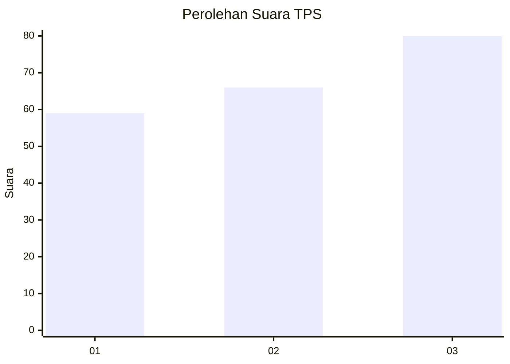
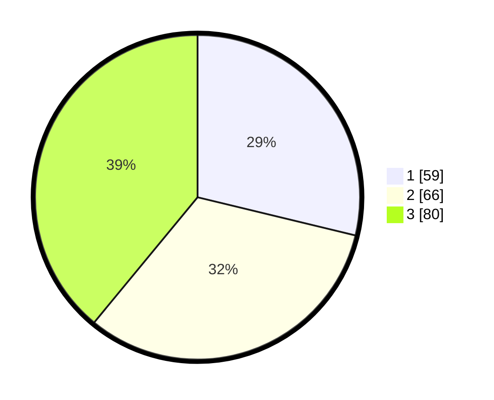

# Hasil

## Grafik

## Tabel

| No. | Nama Paslon    | Suara | Suara (raw) | Persentase |
|:--- |:-------------- | -----:| -----------:| ----------:|
| 1   | ANIES MUHAIMIN | 59    | [59][p-1]   | 28,78      |
| 2   | PRABOWO GIBRAN | 66    | [66][p-2]   | 32,20      |
| 3   | GANJAR MAHFUD  | 80    | [80][p-3]   | 39,02      |

[p-1]: https://github.com/gigit-pemilu/pemilu-2024/blob/main/pilpres/hitung-suara/sub/33-jawa-tengah/sub/26-pekalongan/sub/19-wonokerto/sub/2002-sijambe/sub/003-tps/sub/paslon-1.txt
[p-2]: https://github.com/gigit-pemilu/pemilu-2024/blob/main/pilpres/hitung-suara/sub/33-jawa-tengah/sub/26-pekalongan/sub/19-wonokerto/sub/2002-sijambe/sub/003-tps/sub/paslon-2.txt
[p-3]: https://github.com/gigit-pemilu/pemilu-2024/blob/main/pilpres/hitung-suara/sub/33-jawa-tengah/sub/26-pekalongan/sub/19-wonokerto/sub/2002-sijambe/sub/003-tps/sub/paslon-3.txt

## Foto C Plano

https://sirekap-obj-formc.kpu.go.id/13af/pemilu/ppwp/33/26/19/20/02/3326192002003-20240215-013437--da4ac3b3-405b-4432-8b8e-a39d67737973.jpg

https://sirekap-obj-formc.kpu.go.id/13af/pemilu/ppwp/33/26/19/20/02/3326192002003-20240215-013731--b83738c1-cd6c-4193-8772-5737e3cf60ab.jpg

https://sirekap-obj-formc.kpu.go.id/13af/pemilu/ppwp/33/26/19/20/02/3326192002003-20240215-011353--38e777fb-e63d-4691-82fb-9f186eebbb86.jpg

## Metadata

| Key        | Value               |
| ---------- | ------------------- |
| Time Stamp | 2024-02-15 22:30:27 |

