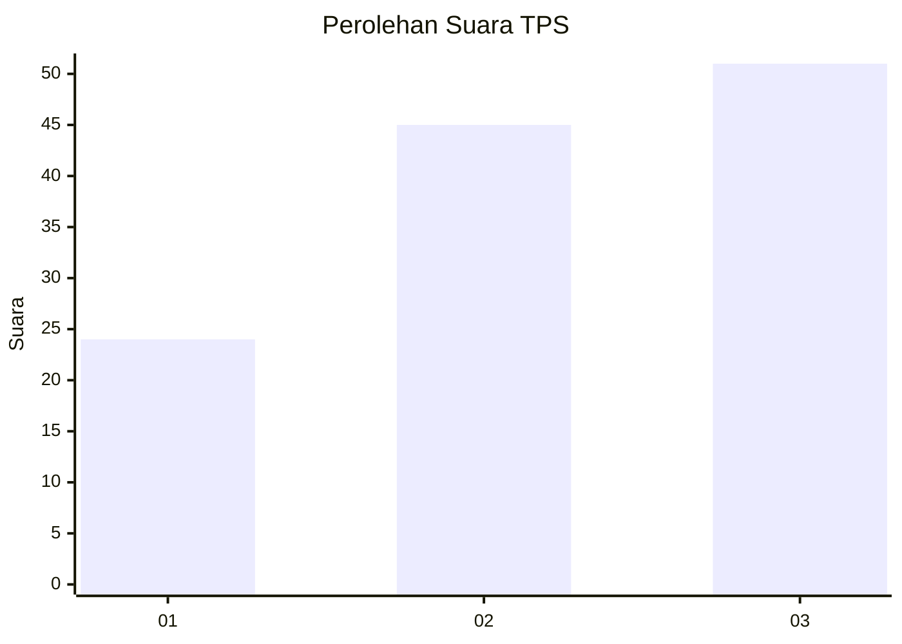
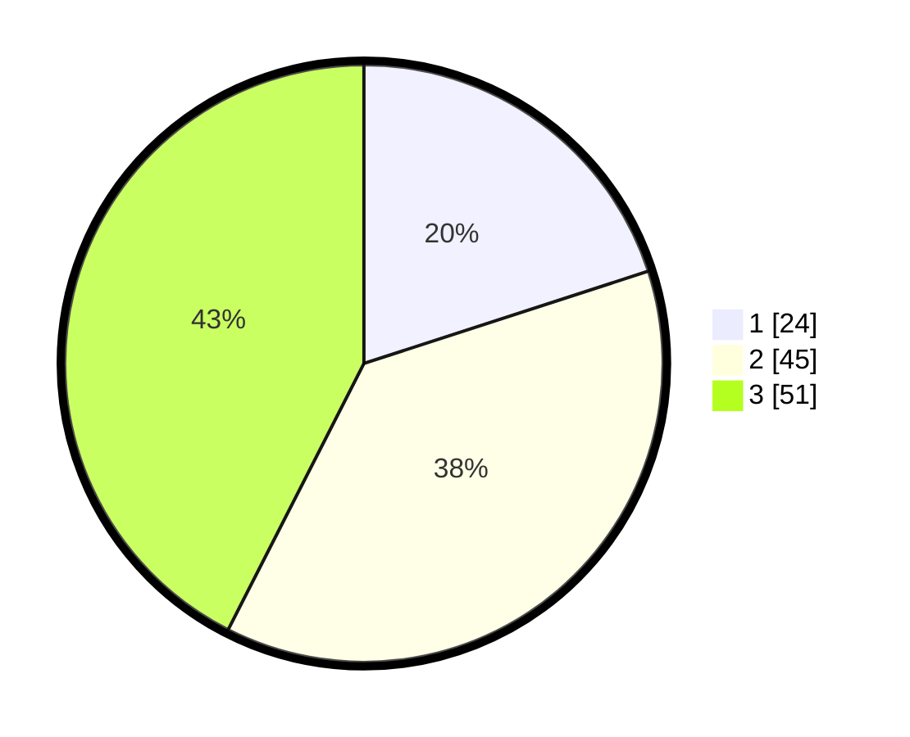

# Hasil

## Grafik

## Tabel

| No. | Nama Paslon    | Suara | Suara (raw) | Persentase |
|:--- |:-------------- | -----:| -----------:| ----------:|
| 1   | ANIES MUHAIMIN | 24    | [24][p-1]   | 20,00      |
| 2   | PRABOWO GIBRAN | 45    | [45][p-2]   | 37,50      |
| 3   | GANJAR MAHFUD  | 51    | [51][p-3]   | 42,50      |

[p-1]: https://github.com/gigit-pemilu/pemilu-2024/blob/main/pilpres/hitung-suara/sub/33-jawa-tengah/sub/27-pemalang/sub/01-moga/sub/2001-plakaran/sub/002-tps/sub/paslon-1.txt
[p-2]: https://github.com/gigit-pemilu/pemilu-2024/blob/main/pilpres/hitung-suara/sub/33-jawa-tengah/sub/27-pemalang/sub/01-moga/sub/2001-plakaran/sub/002-tps/sub/paslon-2.txt
[p-3]: https://github.com/gigit-pemilu/pemilu-2024/blob/main/pilpres/hitung-suara/sub/33-jawa-tengah/sub/27-pemalang/sub/01-moga/sub/2001-plakaran/sub/002-tps/sub/paslon-3.txt

## Foto C Plano

https://sirekap-obj-formc.kpu.go.id/7397/pemilu/ppwp/33/27/01/20/01/3327012001002-20240214-221830--6353ccc4-9681-4582-9ce0-51a410419bd1.jpg

https://sirekap-obj-formc.kpu.go.id/7397/pemilu/ppwp/33/27/01/20/01/3327012001002-20240214-221837--59b7c15d-5ef4-4da2-8002-2178e90330c0.jpg

https://sirekap-obj-formc.kpu.go.id/7397/pemilu/ppwp/33/27/01/20/01/3327012001002-20240214-221843--96a73a2c-cc79-4339-861d-d38726f7b5aa.jpg

## Metadata

| Key        | Value               |
| ---------- | ------------------- |
| Time Stamp | 2024-02-15 22:00:27 |

## DATA PEMILIH TETAP

Jumlah pemilih dalam DPT: **221**.
 * L: **113**.
 * P: **108**.

## DATA PENGGUNA HAK PILIH

Jumlah pengguna hak pilih dalam DPT: **124**.
 * L: **53**.
 * P: **71**.

Jumlah pengguna hak pilih dalam DPTb: **2**.
 * L: **1**.
 * P: **1**.

Jumlah pengguna hak pilih dalam DPK: **0**.
 * L: **0**.
 * P: **0**.

Jumlah pengguna hak pilih: **126**.
 * L: **54**.
 * P: **72**.

## JUMLAH SUARA SAH DAN TIDAK SAH

JUMLAH SELURUH SUARA SAH: **120**.

JUMLAH SUARA TIDAK SAH: **6**.

JUMLAH SELURUH SUARA SAH DAN SUARA TIDAK SAH: **126**.

