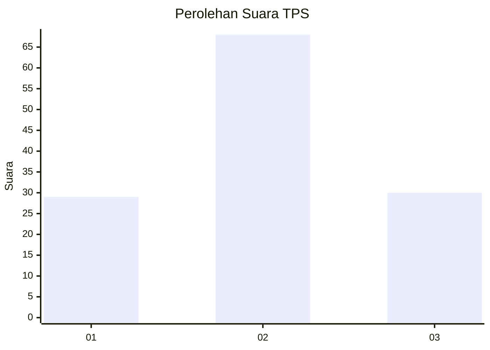
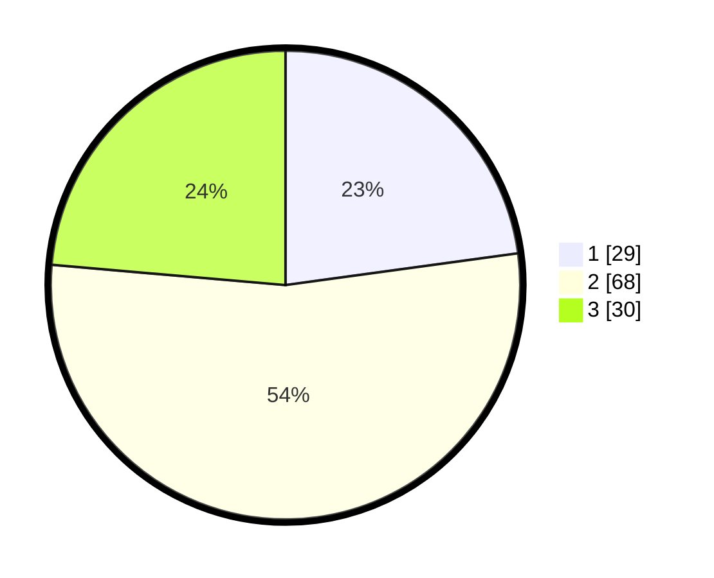

# Hasil

## Grafik

## Tabel

| No. | Nama Paslon    | Suara | Suara (raw) | Persentase |
|:--- |:-------------- | -----:| -----------:| ----------:|
| 1   | ANIES MUHAIMIN | 29    | [29][p-1]   | 22,83      |
| 2   | PRABOWO GIBRAN | 68    | [68][p-2]   | 53,54      |
| 3   | GANJAR MAHFUD  | 30    | [30][p-3]   | 23,62      |

[p-1]: https://github.com/gigit-pemilu/pemilu-2024-33-jawa-tengah/blob/main/pilpres/hitung-suara/sub/33-jawa-tengah/sub/27-pemalang/sub/01-moga/sub/2003-walangsanga/sub/022-tps/sub/paslon-1.txt
[p-2]: https://github.com/gigit-pemilu/pemilu-2024-33-jawa-tengah/blob/main/pilpres/hitung-suara/sub/33-jawa-tengah/sub/27-pemalang/sub/01-moga/sub/2003-walangsanga/sub/022-tps/sub/paslon-2.txt
[p-3]: https://github.com/gigit-pemilu/pemilu-2024-33-jawa-tengah/blob/main/pilpres/hitung-suara/sub/33-jawa-tengah/sub/27-pemalang/sub/01-moga/sub/2003-walangsanga/sub/022-tps/sub/paslon-3.txt

## Foto C Plano

https://sirekap-obj-formc.kpu.go.id/735e/pemilu/ppwp/33/27/01/20/03/3327012003022-20240214-155713--dea84026-01ea-459f-b290-e73ecfefc151.jpg

https://sirekap-obj-formc.kpu.go.id/735e/pemilu/ppwp/33/27/01/20/03/3327012003022-20240214-141229--721bc577-977a-432c-84e6-67660c42056b.jpg

https://sirekap-obj-formc.kpu.go.id/735e/pemilu/ppwp/33/27/01/20/03/3327012003022-20240214-141343--4e61c811-607f-404a-8847-5c8d4c02f8f5.jpg

## Metadata

| Key        | Value               |
| ---------- | ------------------- |
| Time Stamp | 2024-02-14 21:46:01 |

