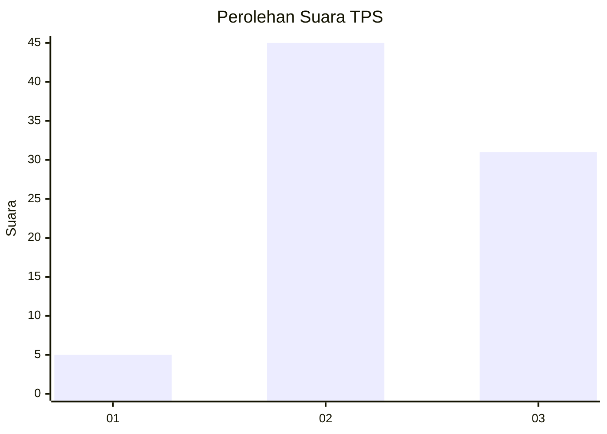
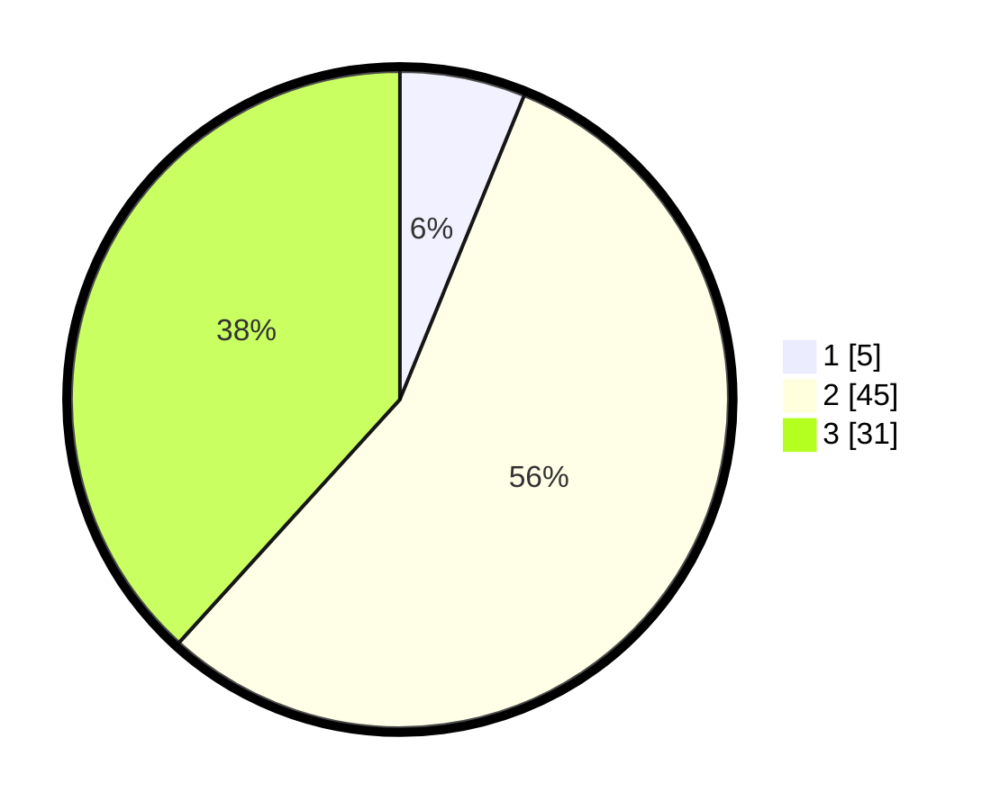

# Hasil

## Grafik

## Tabel

| No. | Nama Paslon    | Suara | Suara (raw) | Persentase |
|:--- |:-------------- | -----:| -----------:| ----------:|
| 1   | ANIES MUHAIMIN | 5     | [5][p-1]    | 6,17       |
| 2   | PRABOWO GIBRAN | 45    | [45][p-2]   | 55,56      |
| 3   | GANJAR MAHFUD  | 31    | [31][p-3]   | 38,27      |

[p-1]: https://github.com/gigit-pemilu/pemilu-2024/blob/main/pilpres/hitung-suara/sub/33-jawa-tengah/sub/27-pemalang/sub/03-belik/sub/2006-gunungjaya/sub/005-tps/sub/paslon-1.txt
[p-2]: https://github.com/gigit-pemilu/pemilu-2024/blob/main/pilpres/hitung-suara/sub/33-jawa-tengah/sub/27-pemalang/sub/03-belik/sub/2006-gunungjaya/sub/005-tps/sub/paslon-2.txt
[p-3]: https://github.com/gigit-pemilu/pemilu-2024/blob/main/pilpres/hitung-suara/sub/33-jawa-tengah/sub/27-pemalang/sub/03-belik/sub/2006-gunungjaya/sub/005-tps/sub/paslon-3.txt

## Foto C Plano

https://sirekap-obj-formc.kpu.go.id/0a04/pemilu/ppwp/33/27/03/20/06/3327032006005-20240214-140950--7b8b3807-2304-42a5-a6a4-ea9d4d55ef7b.jpg

https://sirekap-obj-formc.kpu.go.id/0a04/pemilu/ppwp/33/27/03/20/06/3327032006005-20240214-141604--7af71579-2acd-432d-811a-9aea8c6c8932.jpg

https://sirekap-obj-formc.kpu.go.id/0a04/pemilu/ppwp/33/27/03/20/06/3327032006005-20240214-141735--91ed67c1-6568-4802-900b-6dad3fbcd42a.jpg

## Metadata

| Key        | Value               |
| ---------- | ------------------- |
| Time Stamp | 2024-02-16 22:01:00 |

