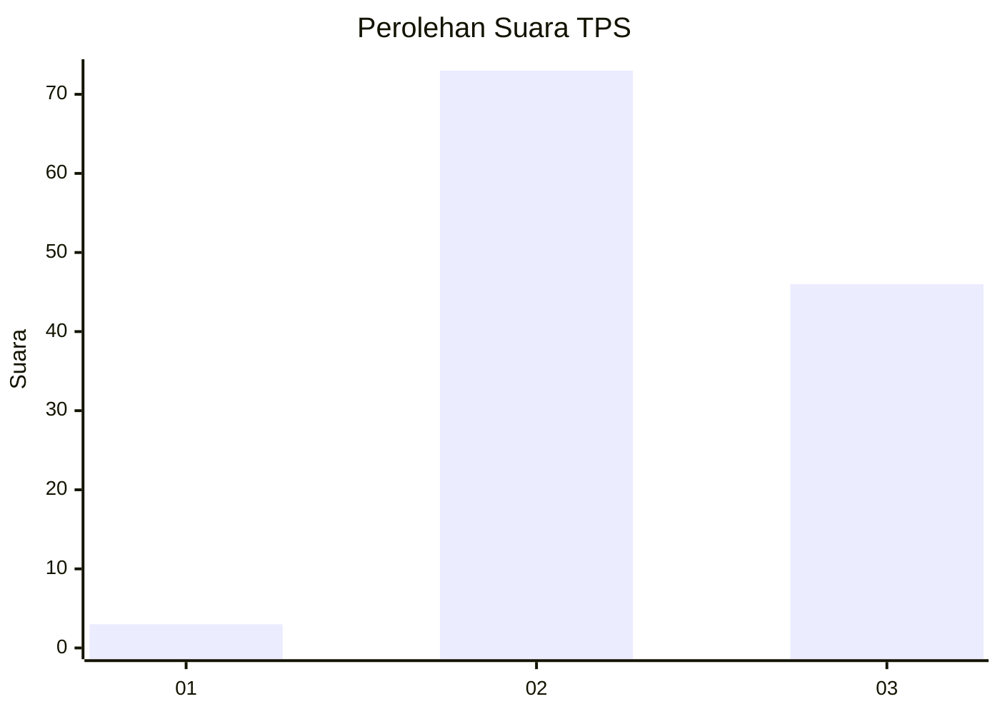
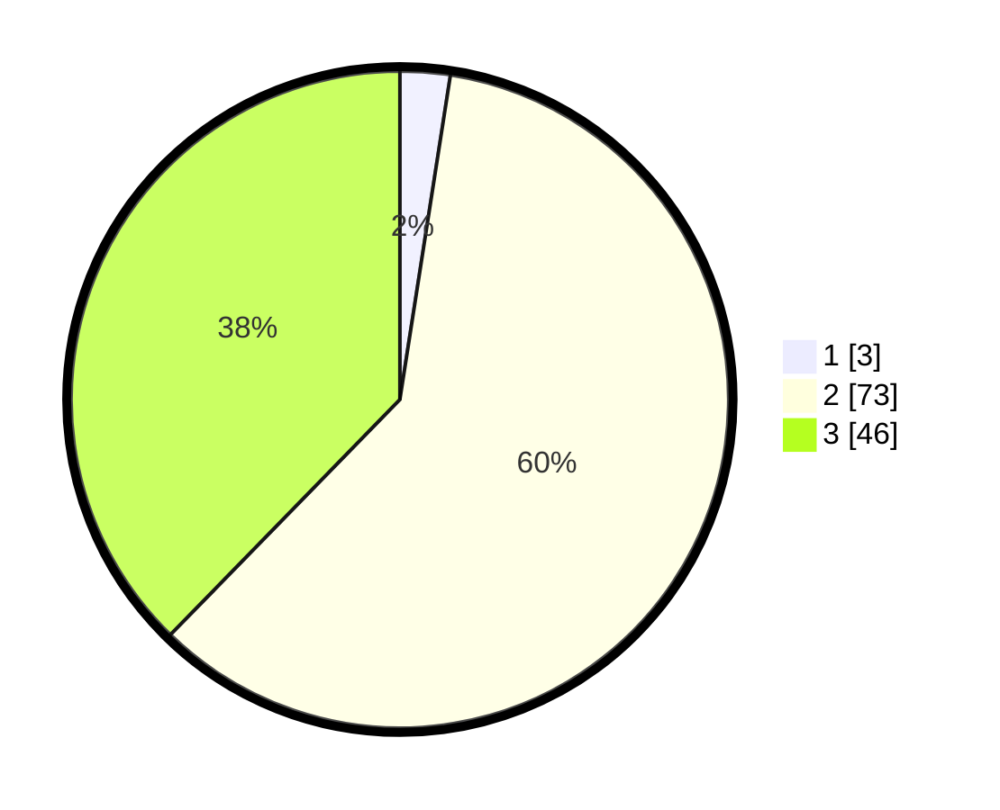

# Hasil

## Grafik

## Tabel

| No. | Nama Paslon    | Suara | Suara (raw) | Persentase |
|:--- |:-------------- | -----:| -----------:| ----------:|
| 1   | ANIES MUHAIMIN | 3     | [3][p-1]    | 2,46       |
| 2   | PRABOWO GIBRAN | 73    | [73][p-2]   | 59,84      |
| 3   | GANJAR MAHFUD  | 46    | [46][p-3]   | 37,70      |

[p-1]: https://github.com/gigit-pemilu/pemilu-2024/blob/main/pilpres/hitung-suara/sub/33-jawa-tengah/sub/27-pemalang/sub/03-belik/sub/2009-beluk/sub/036-tps/sub/paslon-1.txt
[p-2]: https://github.com/gigit-pemilu/pemilu-2024/blob/main/pilpres/hitung-suara/sub/33-jawa-tengah/sub/27-pemalang/sub/03-belik/sub/2009-beluk/sub/036-tps/sub/paslon-2.txt
[p-3]: https://github.com/gigit-pemilu/pemilu-2024/blob/main/pilpres/hitung-suara/sub/33-jawa-tengah/sub/27-pemalang/sub/03-belik/sub/2009-beluk/sub/036-tps/sub/paslon-3.txt

## Foto C Plano

https://sirekap-obj-formc.kpu.go.id/b529/pemilu/ppwp/33/27/03/20/09/3327032009036-20240217-174644--a0d1ad00-a3f0-4e6d-a5b4-ecc4df2def24.jpg

https://sirekap-obj-formc.kpu.go.id/b529/pemilu/ppwp/33/27/03/20/09/3327032009036-20240217-174728--7564ab53-2f2e-491e-9362-d90a9f551849.jpg

https://sirekap-obj-formc.kpu.go.id/b529/pemilu/ppwp/33/27/03/20/09/3327032009036-20240217-175436--3d821b46-c7cd-4f57-be8c-09f525e461e4.jpg

## Metadata

| Key        | Value               |
| ---------- | ------------------- |
| Time Stamp | 2024-02-17 18:00:00 |

