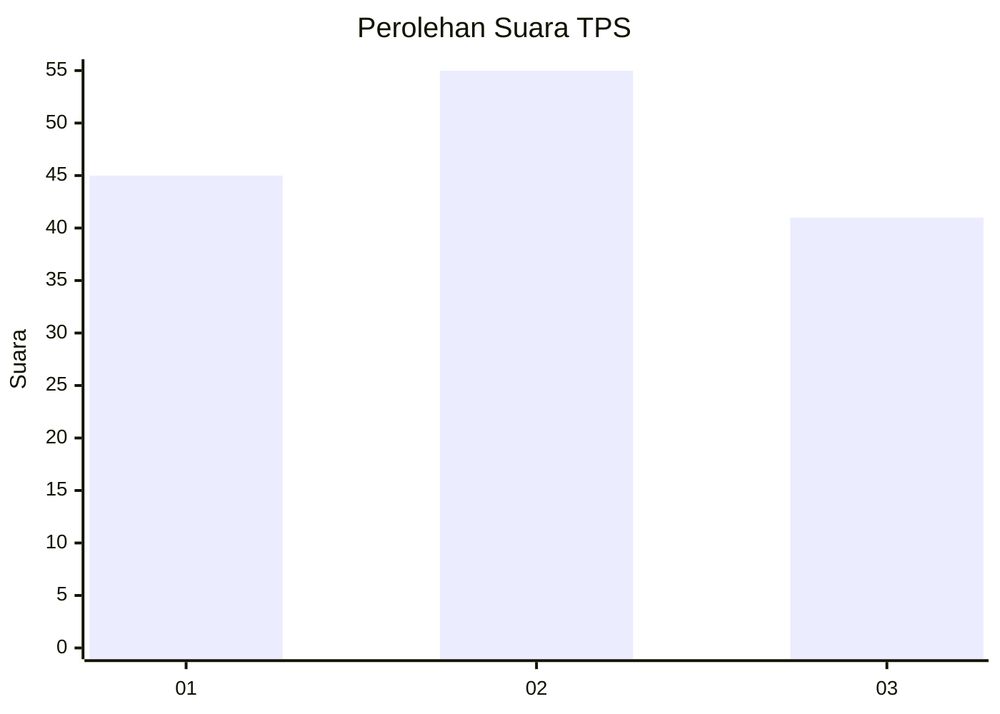
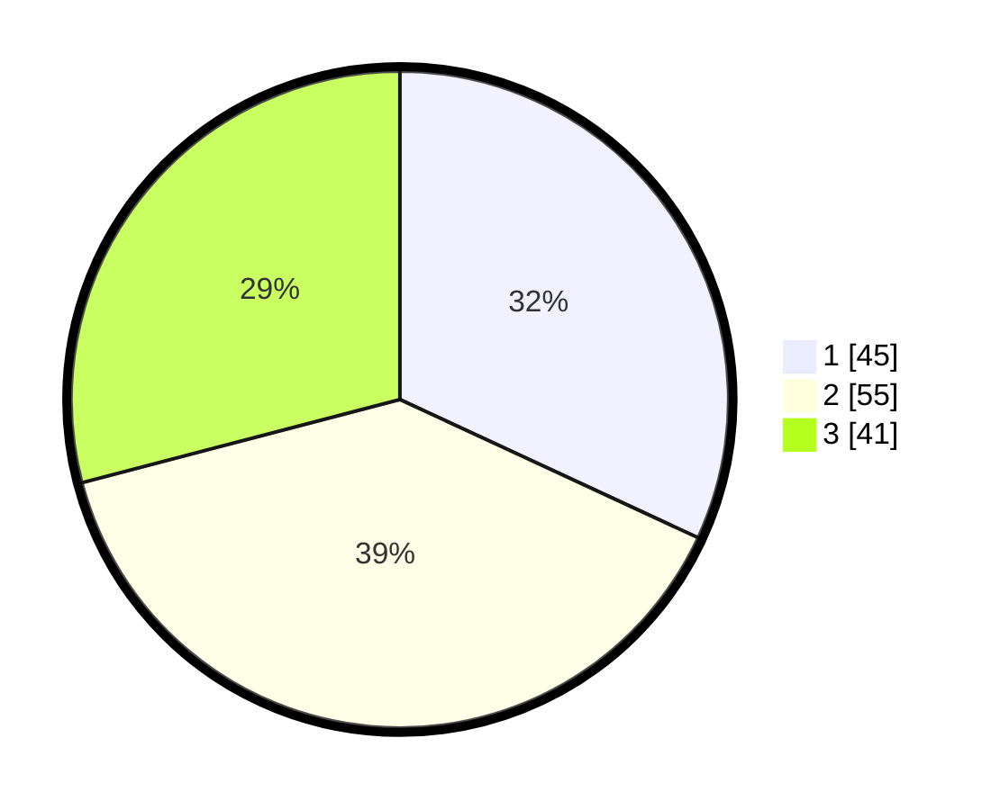

# Hasil

## Grafik

## Tabel

| No. | Nama Paslon    | Suara | Suara (raw) | Persentase |
|:--- |:-------------- | -----:| -----------:| ----------:|
| 1   | ANIES MUHAIMIN | 45    | [45][p-1]   | 31,91      |
| 2   | PRABOWO GIBRAN | 55    | [55][p-2]   | 39,01      |
| 3   | GANJAR MAHFUD  | 41    | [41][p-3]   | 29,08      |

[p-1]: https://github.com/gigit-pemilu/pemilu-2024/blob/main/pilpres/hitung-suara/sub/33-jawa-tengah/sub/27-pemalang/sub/03-belik/sub/2010-bulakan/sub/024-tps/sub/paslon-1.txt
[p-2]: https://github.com/gigit-pemilu/pemilu-2024/blob/main/pilpres/hitung-suara/sub/33-jawa-tengah/sub/27-pemalang/sub/03-belik/sub/2010-bulakan/sub/024-tps/sub/paslon-2.txt
[p-3]: https://github.com/gigit-pemilu/pemilu-2024/blob/main/pilpres/hitung-suara/sub/33-jawa-tengah/sub/27-pemalang/sub/03-belik/sub/2010-bulakan/sub/024-tps/sub/paslon-3.txt

## Foto C Plano

https://sirekap-obj-formc.kpu.go.id/2f07/pemilu/ppwp/33/27/03/20/10/3327032010024-20240220-091736--aaf79071-4a4b-4a1c-90f4-c165e6c9221a.jpg

https://sirekap-obj-formc.kpu.go.id/2f07/pemilu/ppwp/33/27/03/20/10/3327032010024-20240214-141304--e716cbb6-2933-4e9f-8eff-8da90d3e11bf.jpg

https://sirekap-obj-formc.kpu.go.id/2f07/pemilu/ppwp/33/27/03/20/10/3327032010024-20240220-092906--c9f749a4-bf11-4db6-8ec0-f13df6265182.jpg

## Metadata

| Key        | Value               |
| ---------- | ------------------- |
| Time Stamp | 2024-02-20 10:00:00 |

