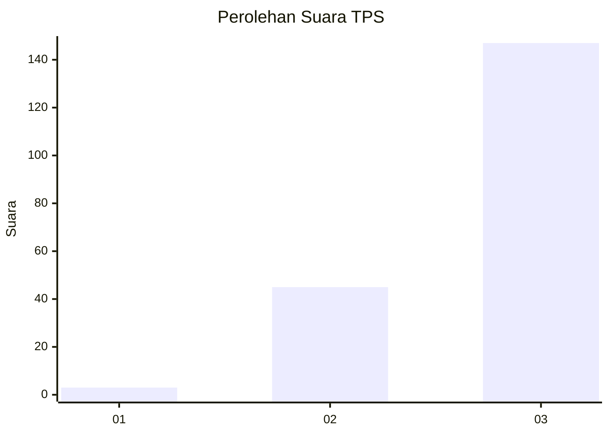
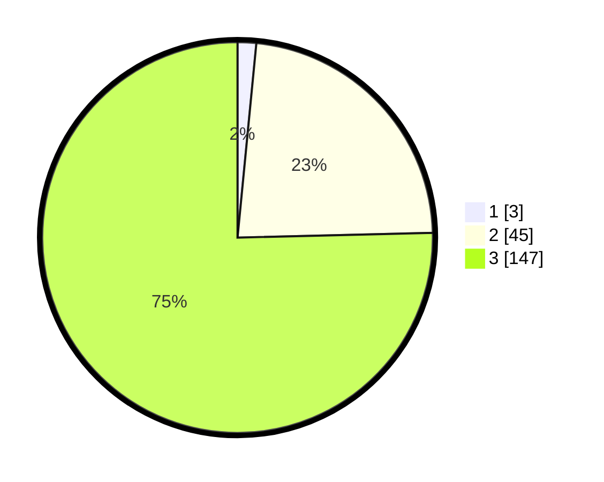

# Hasil

## Grafik

## Tabel

| No. | Nama Paslon    | Suara | Suara (raw) | Persentase |
|:--- |:-------------- | -----:| -----------:| ----------:|
| 1   | ANIES MUHAIMIN | 3     | [3][p-1]    | 1,54       |
| 2   | PRABOWO GIBRAN | 45    | [45][p-2]   | 23,08      |
| 3   | GANJAR MAHFUD  | 147   | [147][p-3]  | 75,38      |

[p-1]: https://github.com/gigit-pemilu/pemilu-2024-33-jawa-tengah/blob/main/pilpres/hitung-suara/sub/33-jawa-tengah/sub/27-pemalang/sub/04-watukumpul/sub/2001-tlagasana/sub/001-tps/sub/paslon-1.txt
[p-2]: https://github.com/gigit-pemilu/pemilu-2024-33-jawa-tengah/blob/main/pilpres/hitung-suara/sub/33-jawa-tengah/sub/27-pemalang/sub/04-watukumpul/sub/2001-tlagasana/sub/001-tps/sub/paslon-2.txt
[p-3]: https://github.com/gigit-pemilu/pemilu-2024-33-jawa-tengah/blob/main/pilpres/hitung-suara/sub/33-jawa-tengah/sub/27-pemalang/sub/04-watukumpul/sub/2001-tlagasana/sub/001-tps/sub/paslon-3.txt

## Foto C Plano

https://sirekap-obj-formc.kpu.go.id/ec07/pemilu/ppwp/33/27/04/20/01/3327042001001-20240215-144646--83c451ff-1baf-43a2-b5be-e1e185f5b97a.jpg

https://sirekap-obj-formc.kpu.go.id/ec07/pemilu/ppwp/33/27/04/20/01/3327042001001-20240215-144808--878cdb6c-d391-4c9c-bf44-51a2daedd5b8.jpg

https://sirekap-obj-formc.kpu.go.id/ec07/pemilu/ppwp/33/27/04/20/01/3327042001001-20240215-144910--3bdfb8ed-bee8-4372-a386-bf346168c016.jpg

## Metadata

| Key        | Value               |
| ---------- | ------------------- |
| Time Stamp | 2024-02-16 21:01:00 |

