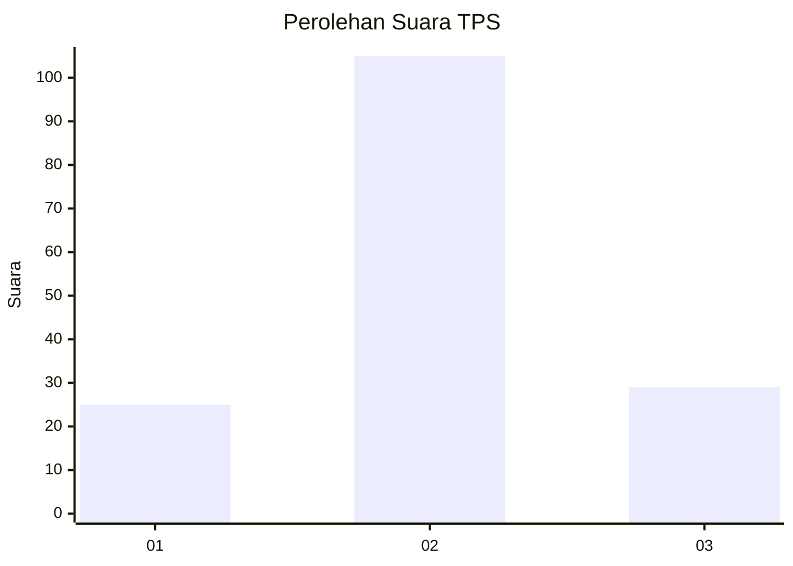
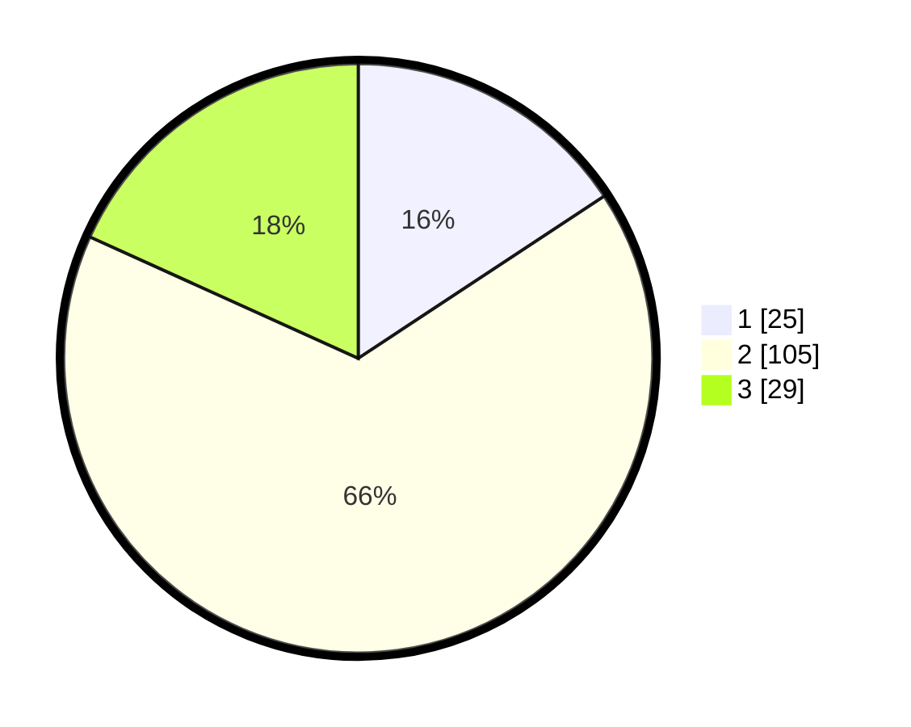

# Hasil

## Grafik

## Tabel

| No. | Nama Paslon    | Suara | Suara (raw) | Persentase |
|:--- |:-------------- | -----:| -----------:| ----------:|
| 1   | ANIES MUHAIMIN | 25    | [25][p-1]   | 15,72      |
| 2   | PRABOWO GIBRAN | 105   | [105][p-2]  | 66,04      |
| 3   | GANJAR MAHFUD  | 29    | [29][p-3]   | 18,24      |

[p-1]: https://github.com/gigit-pemilu/pemilu-2024-33-jawa-tengah/blob/main/pilpres/hitung-suara/sub/33-jawa-tengah/sub/27-pemalang/sub/04-watukumpul/sub/2001-tlagasana/sub/004-tps/sub/paslon-1.txt
[p-2]: https://github.com/gigit-pemilu/pemilu-2024-33-jawa-tengah/blob/main/pilpres/hitung-suara/sub/33-jawa-tengah/sub/27-pemalang/sub/04-watukumpul/sub/2001-tlagasana/sub/004-tps/sub/paslon-2.txt
[p-3]: https://github.com/gigit-pemilu/pemilu-2024-33-jawa-tengah/blob/main/pilpres/hitung-suara/sub/33-jawa-tengah/sub/27-pemalang/sub/04-watukumpul/sub/2001-tlagasana/sub/004-tps/sub/paslon-3.txt

## Foto C Plano

https://sirekap-obj-formc.kpu.go.id/42f9/pemilu/ppwp/33/27/04/20/01/3327042001004-20240215-130105--4e4f9ac9-c70a-44ac-a939-3b5d83ba4a69.jpg

https://sirekap-obj-formc.kpu.go.id/42f9/pemilu/ppwp/33/27/04/20/01/3327042001004-20240215-131626--efbfbe5e-b2fc-4be3-a412-22d4d5db8053.jpg

https://sirekap-obj-formc.kpu.go.id/42f9/pemilu/ppwp/33/27/04/20/01/3327042001004-20240215-131906--70391140-01a1-4a95-84af-9b681b5a2411.jpg

## Metadata

| Key        | Value               |
| ---------- | ------------------- |
| Time Stamp | 2024-02-16 21:01:00 |

