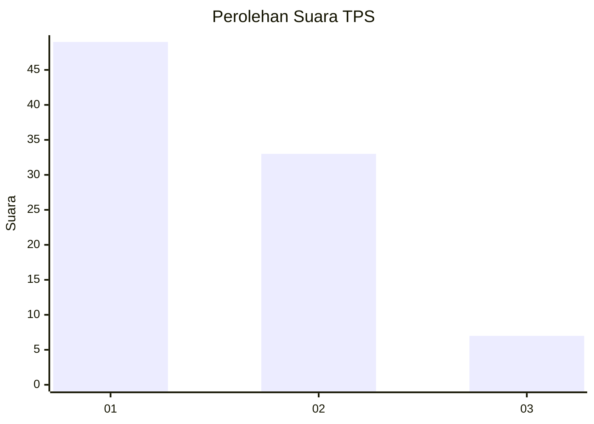
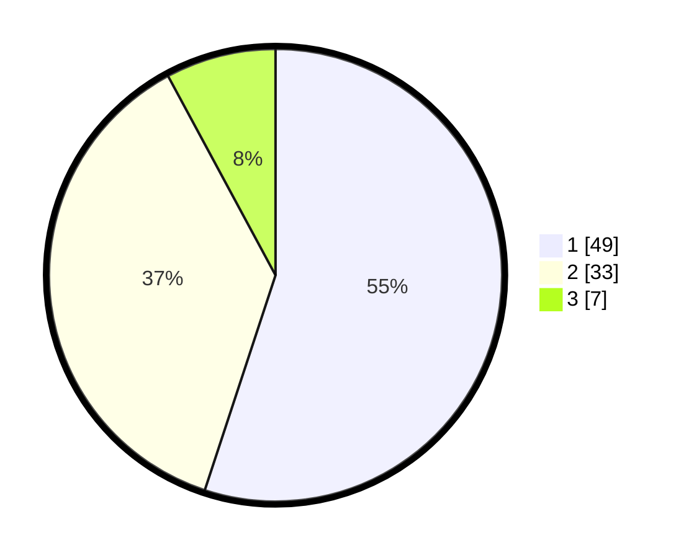

# Hasil

## Grafik

## Tabel

| No. | Nama Paslon    | Suara | Suara (raw) | Persentase |
|:--- |:-------------- | -----:| -----------:| ----------:|
| 1   | ANIES MUHAIMIN | 49    | [49][p-1]   | 55,06      |
| 2   | PRABOWO GIBRAN | 33    | [33][p-2]   | 37,08      |
| 3   | GANJAR MAHFUD  | 7     | [7][p-3]    | 7,87       |

[p-1]: https://github.com/gigit-pemilu/pemilu-2024-33-jawa-tengah/blob/main/pilpres/hitung-suara/sub/33-jawa-tengah/sub/27-pemalang/sub/04-watukumpul/sub/2001-tlagasana/sub/012-tps/sub/paslon-1.txt
[p-2]: https://github.com/gigit-pemilu/pemilu-2024-33-jawa-tengah/blob/main/pilpres/hitung-suara/sub/33-jawa-tengah/sub/27-pemalang/sub/04-watukumpul/sub/2001-tlagasana/sub/012-tps/sub/paslon-2.txt
[p-3]: https://github.com/gigit-pemilu/pemilu-2024-33-jawa-tengah/blob/main/pilpres/hitung-suara/sub/33-jawa-tengah/sub/27-pemalang/sub/04-watukumpul/sub/2001-tlagasana/sub/012-tps/sub/paslon-3.txt

## Foto C Plano

https://sirekap-obj-formc.kpu.go.id/0bea/pemilu/ppwp/33/27/04/20/01/3327042001012-20240215-010244--a712cc19-8933-40d4-8a8e-0a13240d1690.jpg

https://sirekap-obj-formc.kpu.go.id/0bea/pemilu/ppwp/33/27/04/20/01/3327042001012-20240215-010352--6e20cad9-3744-4d34-b476-d4924388efdb.jpg

https://sirekap-obj-formc.kpu.go.id/0bea/pemilu/ppwp/33/27/04/20/01/3327042001012-20240215-010458--0089a96f-3ecb-4c28-8ffa-496005796e49.jpg

## Metadata

| Key        | Value               |
| ---------- | ------------------- |
| Time Stamp | 2024-02-16 21:01:00 |

