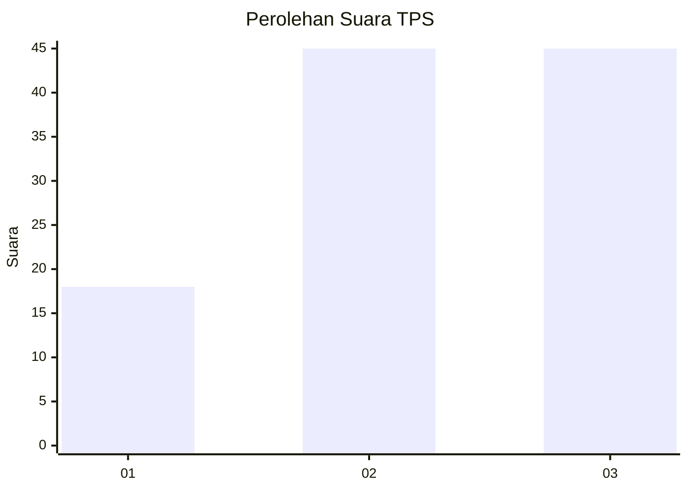
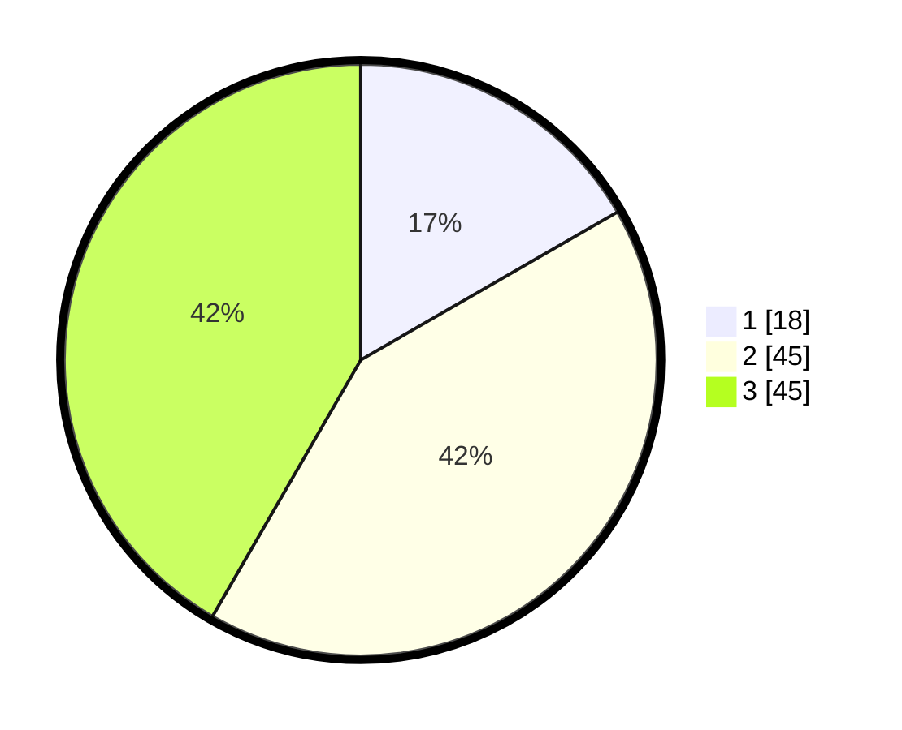

# Hasil

## Grafik

## Tabel

| No. | Nama Paslon    | Suara | Suara (raw) | Persentase |
|:--- |:-------------- | -----:| -----------:| ----------:|
| 1   | ANIES MUHAIMIN | 18    | [18][p-1]   | 16,67      |
| 2   | PRABOWO GIBRAN | 45    | [45][p-2]   | 41,67      |
| 3   | GANJAR MAHFUD  | 45    | [45][p-3]   | 41,67      |

[p-1]: https://github.com/gigit-pemilu/pemilu-2024-33-jawa-tengah/blob/main/pilpres/hitung-suara/sub/33-jawa-tengah/sub/27-pemalang/sub/04-watukumpul/sub/2001-tlagasana/sub/031-tps/sub/paslon-1.txt
[p-2]: https://github.com/gigit-pemilu/pemilu-2024-33-jawa-tengah/blob/main/pilpres/hitung-suara/sub/33-jawa-tengah/sub/27-pemalang/sub/04-watukumpul/sub/2001-tlagasana/sub/031-tps/sub/paslon-2.txt
[p-3]: https://github.com/gigit-pemilu/pemilu-2024-33-jawa-tengah/blob/main/pilpres/hitung-suara/sub/33-jawa-tengah/sub/27-pemalang/sub/04-watukumpul/sub/2001-tlagasana/sub/031-tps/sub/paslon-3.txt

## Foto C Plano

https://sirekap-obj-formc.kpu.go.id/69ea/pemilu/ppwp/33/27/04/20/01/3327042001031-20240216-212641--928ddde9-58a9-478d-88c9-9fea669350c5.jpg

https://sirekap-obj-formc.kpu.go.id/69ea/pemilu/ppwp/33/27/04/20/01/3327042001031-20240215-124235--4986fce8-b361-46c1-a76f-e253a8aa0238.jpg

https://sirekap-obj-formc.kpu.go.id/69ea/pemilu/ppwp/33/27/04/20/01/3327042001031-20240215-133041--80477728-0792-4a21-a511-d588c26cdc8f.jpg

## Metadata

| Key        | Value               |
| ---------- | ------------------- |
| Time Stamp | 2024-02-16 22:01:00 |

