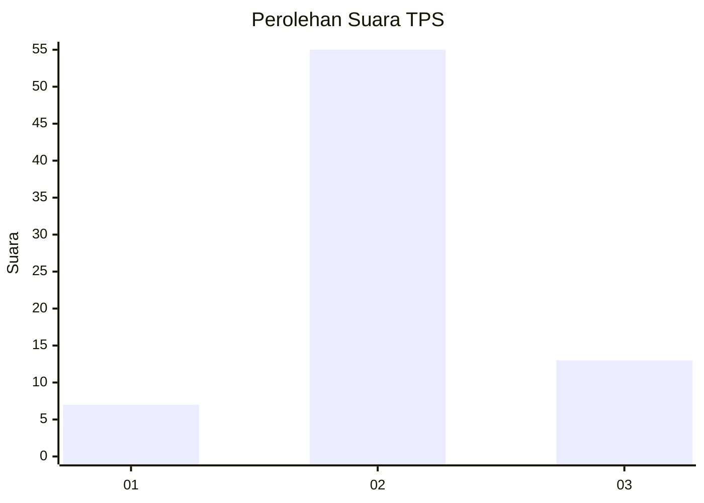

# Hasil

## Grafik

## Tabel

| No. | Nama Paslon    | Suara | Suara (raw) | Persentase |
|:--- |:-------------- | -----:| -----------:| ----------:|
| 1   | ANIES MUHAIMIN | 7     | [7][p-1]    | 9,33       |
| 2   | PRABOWO GIBRAN | 55    | [55][p-2]   | 73,33      |
| 3   | GANJAR MAHFUD  | 13    | [13][p-3]   | 17,33      |

[p-1]: https://github.com/gigit-pemilu/pemilu-2024-33-jawa-tengah/blob/main/pilpres/hitung-suara/sub/33-jawa-tengah/sub/27-pemalang/sub/04-watukumpul/sub/2002-tundagan/sub/011-tps/sub/paslon-1.txt
[p-2]: https://github.com/gigit-pemilu/pemilu-2024-33-jawa-tengah/blob/main/pilpres/hitung-suara/sub/33-jawa-tengah/sub/27-pemalang/sub/04-watukumpul/sub/2002-tundagan/sub/011-tps/sub/paslon-2.txt
[p-3]: https://github.com/gigit-pemilu/pemilu-2024-33-jawa-tengah/blob/main/pilpres/hitung-suara/sub/33-jawa-tengah/sub/27-pemalang/sub/04-watukumpul/sub/2002-tundagan/sub/011-tps/sub/paslon-3.txt

## Foto C Plano

https://sirekap-obj-formc.kpu.go.id/2110/pemilu/ppwp/33/27/04/20/02/3327042002011-20240214-234444--24e8025c-b44e-42b6-883f-ad1da11533f8.jpg

https://sirekap-obj-formc.kpu.go.id/2110/pemilu/ppwp/33/27/04/20/02/3327042002011-20240214-234714--c2354a4c-2175-4470-b4db-3d706155bdfe.jpg

https://sirekap-obj-formc.kpu.go.id/2110/pemilu/ppwp/33/27/04/20/02/3327042002011-20240214-234808--414e3855-f74d-4757-9b8f-6904ff7cef33.jpg

## Metadata

| Key        | Value               |
| ---------- | ------------------- |
| Time Stamp | 2024-02-16 21:01:00 |

