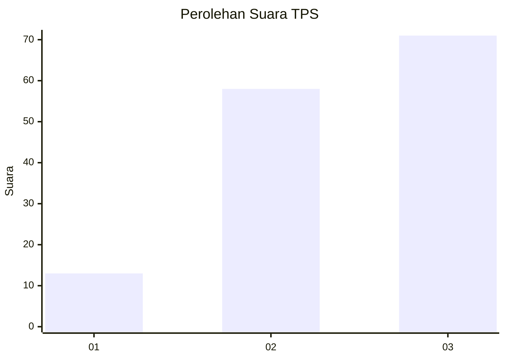
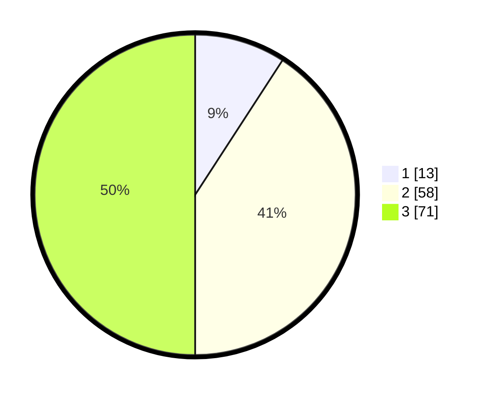

# Hasil

## Grafik

## Tabel

| No. | Nama Paslon    | Suara | Suara (raw) | Persentase |
|:--- |:-------------- | -----:| -----------:| ----------:|
| 1   | ANIES MUHAIMIN | 13    | [13][p-1]   | 9,15       |
| 2   | PRABOWO GIBRAN | 58    | [58][p-2]   | 40,85      |
| 3   | GANJAR MAHFUD  | 71    | [71][p-3]   | 50,00      |

[p-1]: https://github.com/gigit-pemilu/pemilu-2024/blob/main/pilpres/hitung-suara/sub/33-jawa-tengah/sub/27-pemalang/sub/04-watukumpul/sub/2002-tundagan/sub/020-tps/sub/paslon-1.txt
[p-2]: https://github.com/gigit-pemilu/pemilu-2024/blob/main/pilpres/hitung-suara/sub/33-jawa-tengah/sub/27-pemalang/sub/04-watukumpul/sub/2002-tundagan/sub/020-tps/sub/paslon-2.txt
[p-3]: https://github.com/gigit-pemilu/pemilu-2024/blob/main/pilpres/hitung-suara/sub/33-jawa-tengah/sub/27-pemalang/sub/04-watukumpul/sub/2002-tundagan/sub/020-tps/sub/paslon-3.txt

## Foto C Plano

https://sirekap-obj-formc.kpu.go.id/5e55/pemilu/ppwp/33/27/04/20/02/3327042002020-20240215-020907--efc188b2-5f9f-4058-b7a2-0e76a9f27faf.jpg

https://sirekap-obj-formc.kpu.go.id/5e55/pemilu/ppwp/33/27/04/20/02/3327042002020-20240215-021016--07164b96-ef56-4627-ac51-758a14388ca9.jpg

https://sirekap-obj-formc.kpu.go.id/5e55/pemilu/ppwp/33/27/04/20/02/3327042002020-20240215-021107--f26ba27f-19c1-47b5-a7e1-20294b0950a4.jpg

## Metadata

| Key        | Value               |
| ---------- | ------------------- |
| Time Stamp | 2024-02-16 22:30:00 |

