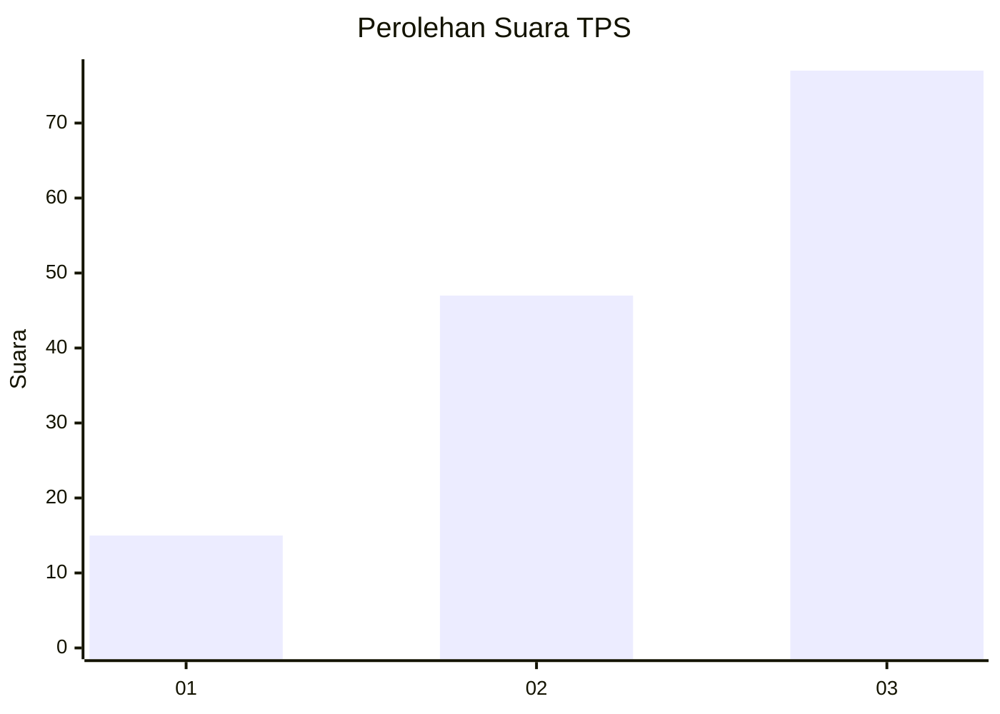
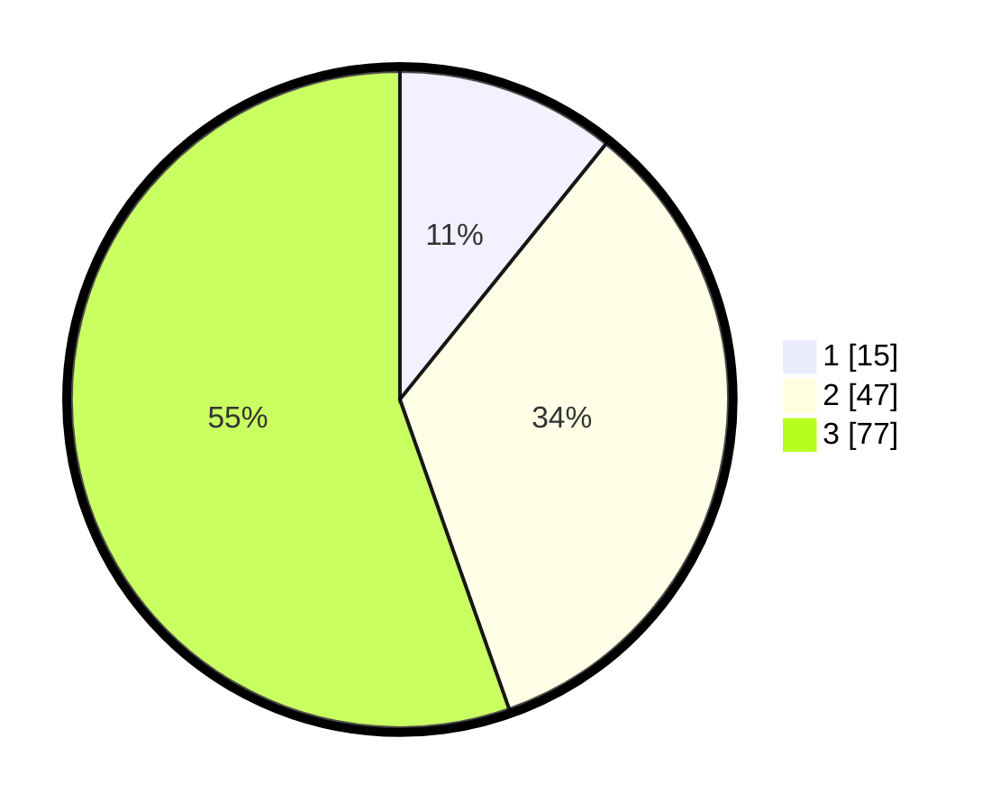

# Hasil

## Grafik

## Tabel

| No. | Nama Paslon    | Suara | Suara (raw) | Persentase |
|:--- |:-------------- | -----:| -----------:| ----------:|
| 1   | ANIES MUHAIMIN | 15    | [15][p-1]   | 10,79      |
| 2   | PRABOWO GIBRAN | 47    | [47][p-2]   | 33,81      |
| 3   | GANJAR MAHFUD  | 77    | [77][p-3]   | 55,40      |

[p-1]: https://github.com/gigit-pemilu/pemilu-2024-33-jawa-tengah/blob/main/pilpres/hitung-suara/sub/33-jawa-tengah/sub/27-pemalang/sub/04-watukumpul/sub/2004-cikadu/sub/003-tps/sub/paslon-1.txt
[p-2]: https://github.com/gigit-pemilu/pemilu-2024-33-jawa-tengah/blob/main/pilpres/hitung-suara/sub/33-jawa-tengah/sub/27-pemalang/sub/04-watukumpul/sub/2004-cikadu/sub/003-tps/sub/paslon-2.txt
[p-3]: https://github.com/gigit-pemilu/pemilu-2024-33-jawa-tengah/blob/main/pilpres/hitung-suara/sub/33-jawa-tengah/sub/27-pemalang/sub/04-watukumpul/sub/2004-cikadu/sub/003-tps/sub/paslon-3.txt

## Foto C Plano

https://sirekap-obj-formc.kpu.go.id/c7f6/pemilu/ppwp/33/27/04/20/04/3327042004003-20240215-015257--f532cfe5-d19a-482f-abc9-8f619ec68300.jpg

https://sirekap-obj-formc.kpu.go.id/c7f6/pemilu/ppwp/33/27/04/20/04/3327042004003-20240215-015409--780e122d-8fd8-4a8a-b073-fb68bb7be800.jpg

https://sirekap-obj-formc.kpu.go.id/c7f6/pemilu/ppwp/33/27/04/20/04/3327042004003-20240215-015537--baa33a4a-9cad-43e1-a80c-55417898d6ec.jpg

## Metadata

| Key        | Value               |
| ---------- | ------------------- |
| Time Stamp | 2024-02-15 04:00:24 |

