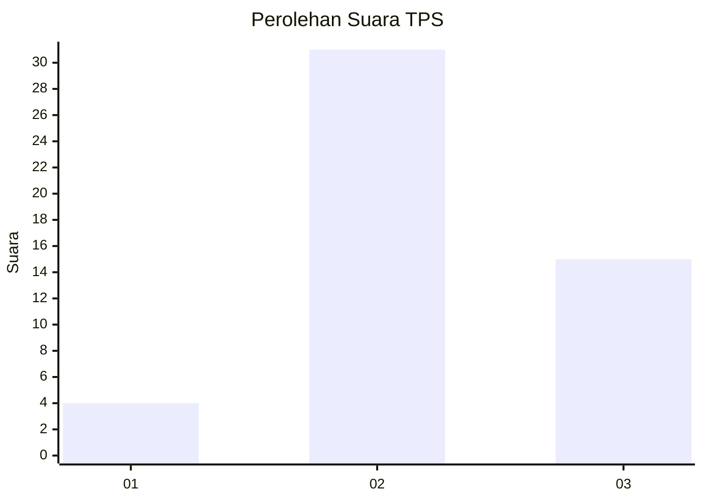
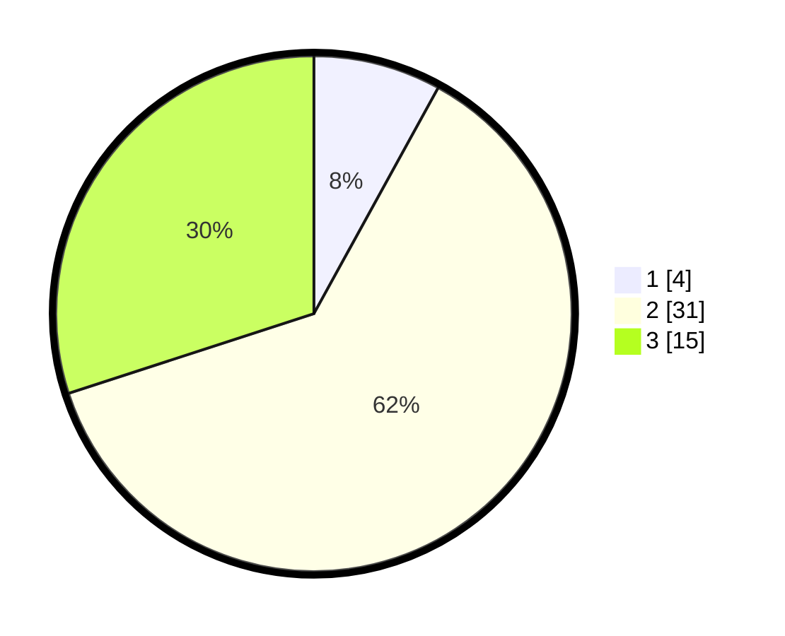

# Hasil

## Grafik

## Tabel

| No. | Nama Paslon    | Suara | Suara (raw) | Persentase |
|:--- |:-------------- | -----:| -----------:| ----------:|
| 1   | ANIES MUHAIMIN | 4     | [4][p-1]    | 8,00       |
| 2   | PRABOWO GIBRAN | 31    | [31][p-2]   | 62,00      |
| 3   | GANJAR MAHFUD  | 15    | [15][p-3]   | 30,00      |

[p-1]: https://github.com/gigit-pemilu/pemilu-2024/blob/main/pilpres/hitung-suara/sub/33-jawa-tengah/sub/27-pemalang/sub/04-watukumpul/sub/2008-bodas/sub/006-tps/sub/paslon-1.txt
[p-2]: https://github.com/gigit-pemilu/pemilu-2024/blob/main/pilpres/hitung-suara/sub/33-jawa-tengah/sub/27-pemalang/sub/04-watukumpul/sub/2008-bodas/sub/006-tps/sub/paslon-2.txt
[p-3]: https://github.com/gigit-pemilu/pemilu-2024/blob/main/pilpres/hitung-suara/sub/33-jawa-tengah/sub/27-pemalang/sub/04-watukumpul/sub/2008-bodas/sub/006-tps/sub/paslon-3.txt

## Foto C Plano

https://sirekap-obj-formc.kpu.go.id/49f6/pemilu/ppwp/33/27/04/20/08/3327042008006-20240214-141032--68cb33fc-d9dc-4332-8094-81e87a96e50a.jpg

https://sirekap-obj-formc.kpu.go.id/49f6/pemilu/ppwp/33/27/04/20/08/3327042008006-20240214-141018--9d7c6560-0e79-494e-8320-27def8ebe49d.jpg

https://sirekap-obj-formc.kpu.go.id/49f6/pemilu/ppwp/33/27/04/20/08/3327042008006-20240214-140955--a05d46c9-a770-4c88-ad8e-f00a753273ec.jpg

## Metadata

| Key        | Value               |
| ---------- | ------------------- |
| Time Stamp | 2024-02-16 23:30:00 |

