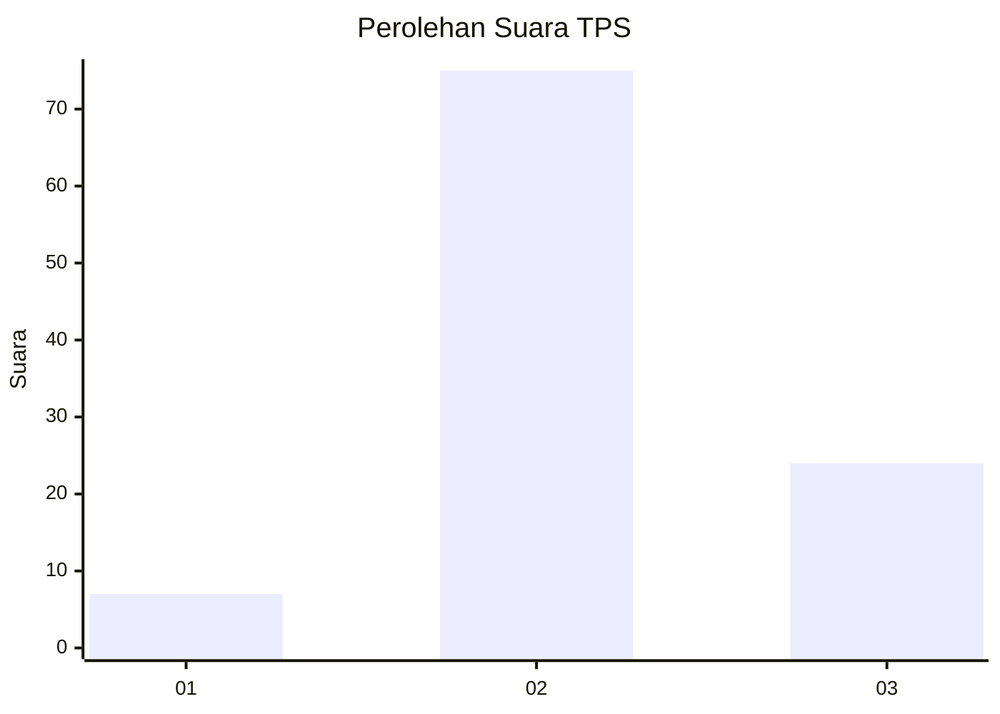
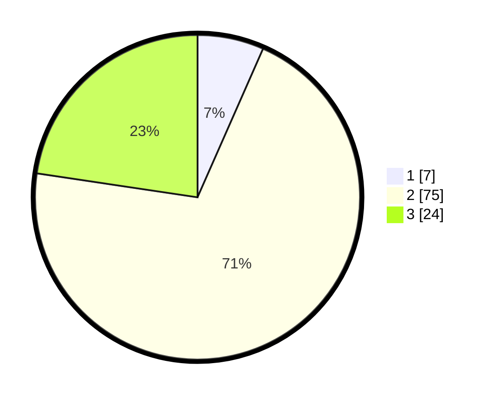

# Hasil

## Grafik

## Tabel

| No. | Nama Paslon    | Suara | Suara (raw) | Persentase |
|:--- |:-------------- | -----:| -----------:| ----------:|
| 1   | ANIES MUHAIMIN | 7     | [7][p-1]    | 6,60       |
| 2   | PRABOWO GIBRAN | 75    | [75][p-2]   | 70,75      |
| 3   | GANJAR MAHFUD  | 24    | [24][p-3]   | 22,64      |

[p-1]: https://github.com/gigit-pemilu/pemilu-2024/blob/main/pilpres/hitung-suara/sub/33-jawa-tengah/sub/27-pemalang/sub/04-watukumpul/sub/2008-bodas/sub/011-tps/sub/paslon-1.txt
[p-2]: https://github.com/gigit-pemilu/pemilu-2024/blob/main/pilpres/hitung-suara/sub/33-jawa-tengah/sub/27-pemalang/sub/04-watukumpul/sub/2008-bodas/sub/011-tps/sub/paslon-2.txt
[p-3]: https://github.com/gigit-pemilu/pemilu-2024/blob/main/pilpres/hitung-suara/sub/33-jawa-tengah/sub/27-pemalang/sub/04-watukumpul/sub/2008-bodas/sub/011-tps/sub/paslon-3.txt

## Foto C Plano

https://sirekap-obj-formc.kpu.go.id/2354/pemilu/ppwp/33/27/04/20/08/3327042008011-20240214-222355--566145fd-d3c1-4787-87db-7018c3dae84a.jpg

https://sirekap-obj-formc.kpu.go.id/2354/pemilu/ppwp/33/27/04/20/08/3327042008011-20240214-230702--4463c3a6-fe14-4c22-8060-876f8fef5a1a.jpg

https://sirekap-obj-formc.kpu.go.id/2354/pemilu/ppwp/33/27/04/20/08/3327042008011-20240214-215620--fe153192-d1f9-4ab8-a9cc-b455f1551f5c.jpg

## Metadata

| Key        | Value               |
| ---------- | ------------------- |
| Time Stamp | 2024-02-16 22:01:00 |

