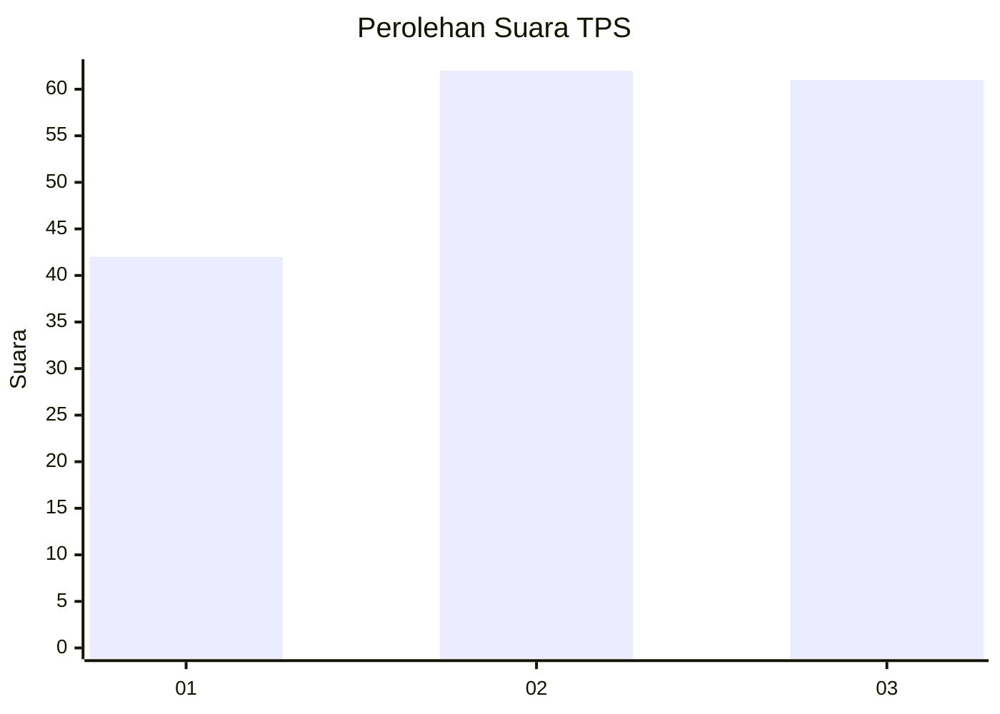
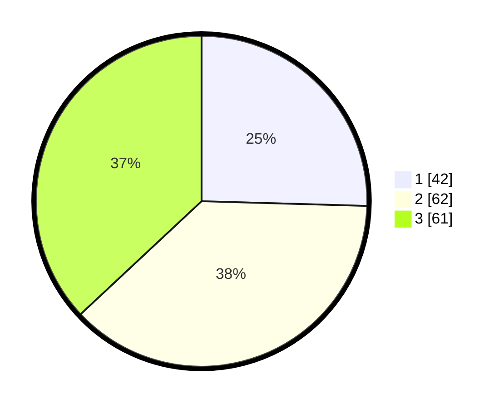

# Hasil

## Grafik

## Tabel

| No. | Nama Paslon    | Suara | Suara (raw) | Persentase |
|:--- |:-------------- | -----:| -----------:| ----------:|
| 1   | ANIES MUHAIMIN | 42    | [42][p-1]   | 25,45      |
| 2   | PRABOWO GIBRAN | 62    | [62][p-2]   | 37,58      |
| 3   | GANJAR MAHFUD  | 61    | [61][p-3]   | 36,97      |

[p-1]: https://github.com/gigit-pemilu/pemilu-2024/blob/main/pilpres/hitung-suara/sub/33-jawa-tengah/sub/27-pemalang/sub/05-bodeh/sub/2001-longkeyang/sub/004-tps/sub/paslon-1.txt
[p-2]: https://github.com/gigit-pemilu/pemilu-2024/blob/main/pilpres/hitung-suara/sub/33-jawa-tengah/sub/27-pemalang/sub/05-bodeh/sub/2001-longkeyang/sub/004-tps/sub/paslon-2.txt
[p-3]: https://github.com/gigit-pemilu/pemilu-2024/blob/main/pilpres/hitung-suara/sub/33-jawa-tengah/sub/27-pemalang/sub/05-bodeh/sub/2001-longkeyang/sub/004-tps/sub/paslon-3.txt

## Foto C Plano

https://sirekap-obj-formc.kpu.go.id/7400/pemilu/ppwp/33/27/05/20/01/3327052001004-20240215-010656--c37affc8-c9f6-4680-8bbf-fa867353e70b.jpg

https://sirekap-obj-formc.kpu.go.id/7400/pemilu/ppwp/33/27/05/20/01/3327052001004-20240215-010817--0a1d114b-daf2-4455-a955-11b5cd04c4dd.jpg

https://sirekap-obj-formc.kpu.go.id/7400/pemilu/ppwp/33/27/05/20/01/3327052001004-20240215-011015--879d0e15-7957-4a0e-b477-c6fceccf11db.jpg

## Metadata

| Key        | Value               |
| ---------- | ------------------- |
| Time Stamp | 2024-02-16 22:01:00 |

