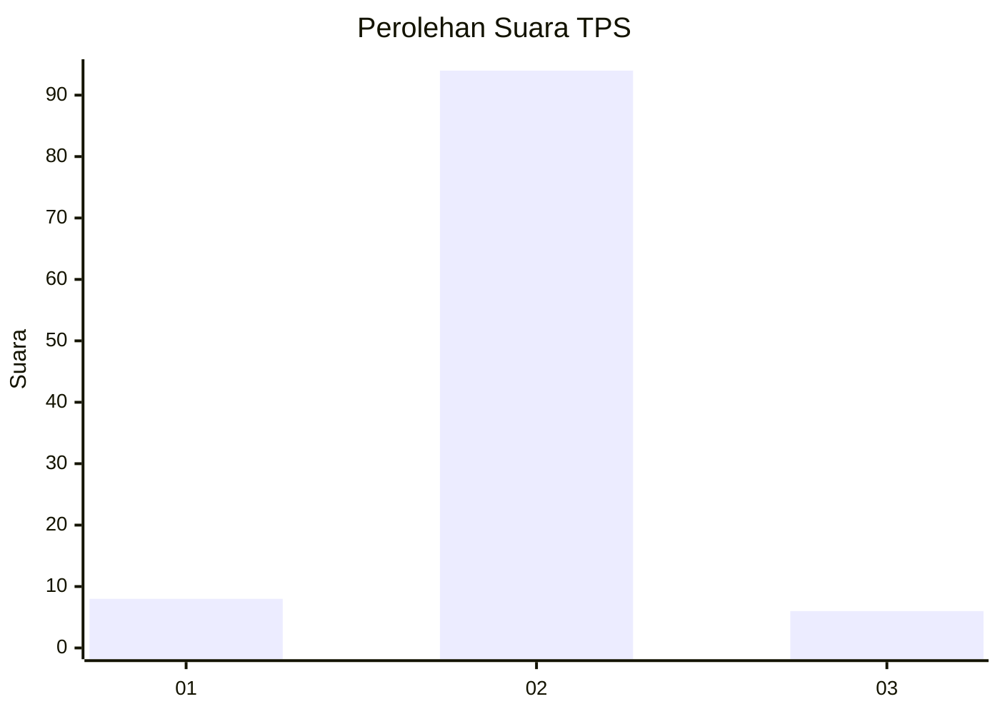
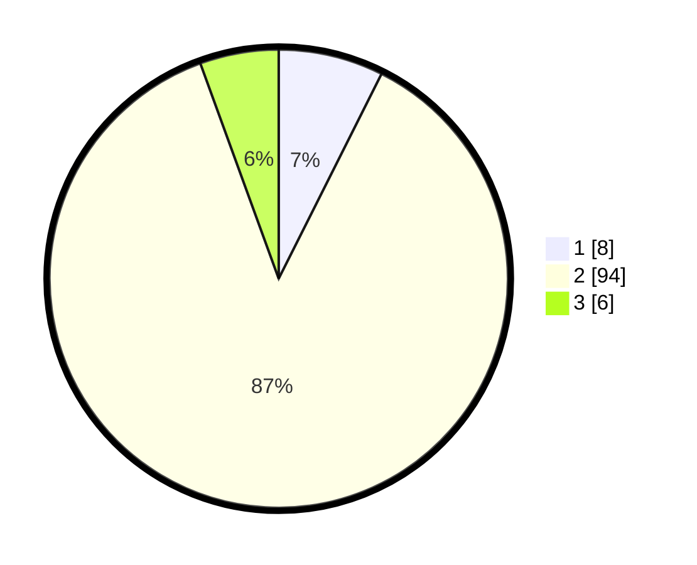

# Hasil

## Grafik

## Tabel

| No. | Nama Paslon    | Suara | Suara (raw) | Persentase |
|:--- |:-------------- | -----:| -----------:| ----------:|
| 1   | ANIES MUHAIMIN | 8     | [8][p-1]    | 7,41       |
| 2   | PRABOWO GIBRAN | 94    | [94][p-2]   | 87,04      |
| 3   | GANJAR MAHFUD  | 6     | [6][p-3]    | 5,56       |

[p-1]: https://github.com/gigit-pemilu/pemilu-2024-33-jawa-tengah/blob/main/pilpres/hitung-suara/sub/33-jawa-tengah/sub/27-pemalang/sub/05-bodeh/sub/2002-jatingarang/sub/001-tps/sub/paslon-1.txt
[p-2]: https://github.com/gigit-pemilu/pemilu-2024-33-jawa-tengah/blob/main/pilpres/hitung-suara/sub/33-jawa-tengah/sub/27-pemalang/sub/05-bodeh/sub/2002-jatingarang/sub/001-tps/sub/paslon-2.txt
[p-3]: https://github.com/gigit-pemilu/pemilu-2024-33-jawa-tengah/blob/main/pilpres/hitung-suara/sub/33-jawa-tengah/sub/27-pemalang/sub/05-bodeh/sub/2002-jatingarang/sub/001-tps/sub/paslon-3.txt

## Foto C Plano

https://sirekap-obj-formc.kpu.go.id/05b6/pemilu/ppwp/33/27/05/20/02/3327052002001-20240214-224400--80fce5e0-f40f-4f84-b488-23fcb6909331.jpg

https://sirekap-obj-formc.kpu.go.id/05b6/pemilu/ppwp/33/27/05/20/02/3327052002001-20240214-224403--4e9846a0-d525-4608-8de8-9cb05b1a64df.jpg

https://sirekap-obj-formc.kpu.go.id/05b6/pemilu/ppwp/33/27/05/20/02/3327052002001-20240214-224408--a97f83a9-6d1a-4384-8733-21ef49e5c31d.jpg

## Metadata

| Key        | Value               |
| ---------- | ------------------- |
| Time Stamp | 2024-02-16 22:01:00 |

