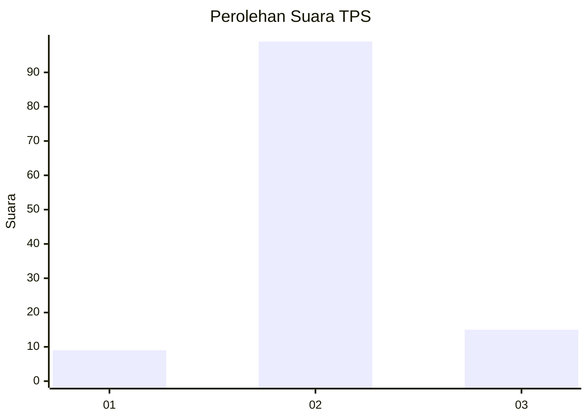
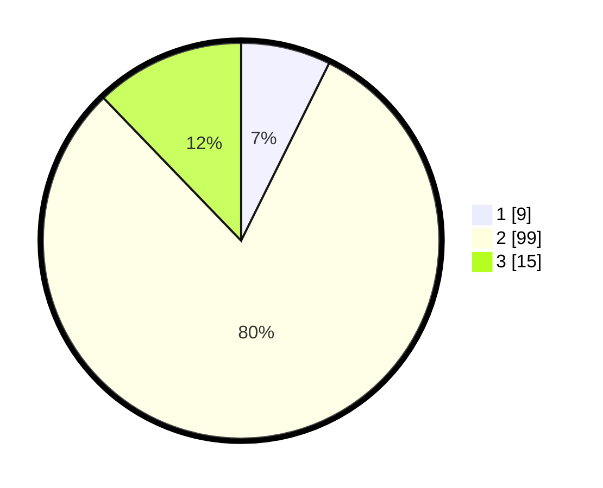

# Hasil

## Grafik

## Tabel

| No. | Nama Paslon    | Suara | Suara (raw) | Persentase |
|:--- |:-------------- | -----:| -----------:| ----------:|
| 1   | ANIES MUHAIMIN | 9     | [9][p-1]    | 7,32       |
| 2   | PRABOWO GIBRAN | 99    | [99][p-2]   | 80,49      |
| 3   | GANJAR MAHFUD  | 15    | [15][p-3]   | 12,20      |

[p-1]: https://github.com/gigit-pemilu/pemilu-2024-33-jawa-tengah/blob/main/pilpres/hitung-suara/sub/33-jawa-tengah/sub/27-pemalang/sub/05-bodeh/sub/2002-jatingarang/sub/004-tps/sub/paslon-1.txt
[p-2]: https://github.com/gigit-pemilu/pemilu-2024-33-jawa-tengah/blob/main/pilpres/hitung-suara/sub/33-jawa-tengah/sub/27-pemalang/sub/05-bodeh/sub/2002-jatingarang/sub/004-tps/sub/paslon-2.txt
[p-3]: https://github.com/gigit-pemilu/pemilu-2024-33-jawa-tengah/blob/main/pilpres/hitung-suara/sub/33-jawa-tengah/sub/27-pemalang/sub/05-bodeh/sub/2002-jatingarang/sub/004-tps/sub/paslon-3.txt

## Foto C Plano

https://sirekap-obj-formc.kpu.go.id/09f6/pemilu/ppwp/33/27/05/20/02/3327052002004-20240215-021639--919c5fed-62dd-41d6-a773-57bbc4ea9f9e.jpg

https://sirekap-obj-formc.kpu.go.id/09f6/pemilu/ppwp/33/27/05/20/02/3327052002004-20240217-133330--0dacf223-6de9-4836-8146-bcf789e2cadb.jpg

https://sirekap-obj-formc.kpu.go.id/09f6/pemilu/ppwp/33/27/05/20/02/3327052002004-20240215-021912--dcf536c5-2eb9-4664-a9d7-b3c5dd7c2b4e.jpg

## Metadata

| Key        | Value               |
| ---------- | ------------------- |
| Time Stamp | 2024-02-17 13:43:59 |

