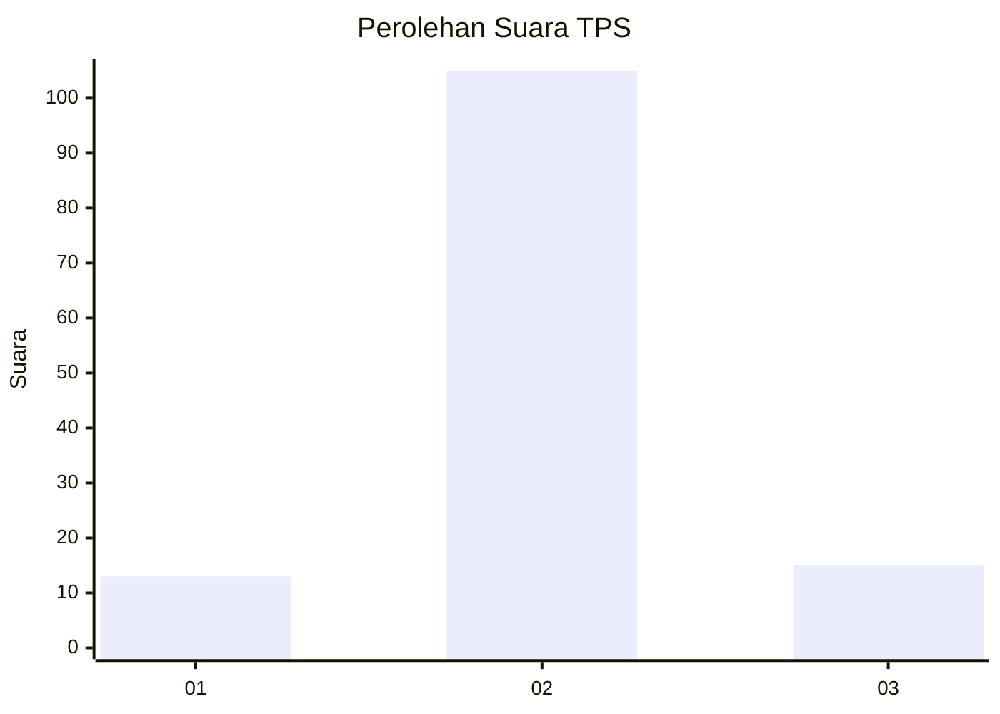
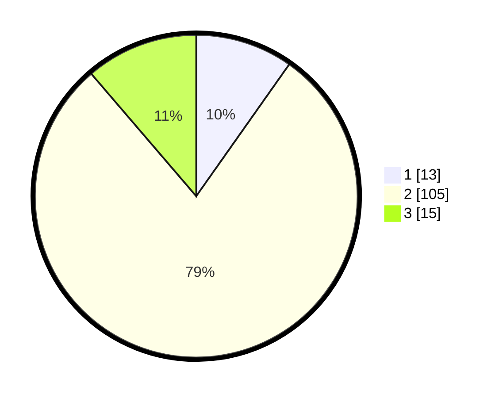

# Hasil

## Grafik

## Tabel

| No. | Nama Paslon    | Suara | Suara (raw) | Persentase |
|:--- |:-------------- | -----:| -----------:| ----------:|
| 1   | ANIES MUHAIMIN | 13    | [13][p-1]   | 9,77       |
| 2   | PRABOWO GIBRAN | 105   | [105][p-2]  | 78,95      |
| 3   | GANJAR MAHFUD  | 15    | [15][p-3]   | 11,28      |

[p-1]: https://github.com/gigit-pemilu/pemilu-2024/blob/main/pilpres/hitung-suara/sub/33-jawa-tengah/sub/27-pemalang/sub/05-bodeh/sub/2002-jatingarang/sub/005-tps/sub/paslon-1.txt
[p-2]: https://github.com/gigit-pemilu/pemilu-2024/blob/main/pilpres/hitung-suara/sub/33-jawa-tengah/sub/27-pemalang/sub/05-bodeh/sub/2002-jatingarang/sub/005-tps/sub/paslon-2.txt
[p-3]: https://github.com/gigit-pemilu/pemilu-2024/blob/main/pilpres/hitung-suara/sub/33-jawa-tengah/sub/27-pemalang/sub/05-bodeh/sub/2002-jatingarang/sub/005-tps/sub/paslon-3.txt

## Foto C Plano

https://sirekap-obj-formc.kpu.go.id/68b9/pemilu/ppwp/33/27/05/20/02/3327052002005-20240214-221453--6550c8f0-f2ce-4f81-9033-a4cb267e39e1.jpg

https://sirekap-obj-formc.kpu.go.id/68b9/pemilu/ppwp/33/27/05/20/02/3327052002005-20240217-133651--d07cc96e-79fb-4595-8e1b-e9234bfd4ebf.jpg

https://sirekap-obj-formc.kpu.go.id/68b9/pemilu/ppwp/33/27/05/20/02/3327052002005-20240217-133710--c5c90d16-1795-4fdd-8b50-fcfbcbee53b2.jpg

## Metadata

| Key        | Value               |
| ---------- | ------------------- |
| Time Stamp | 2024-02-17 14:45:18 |

