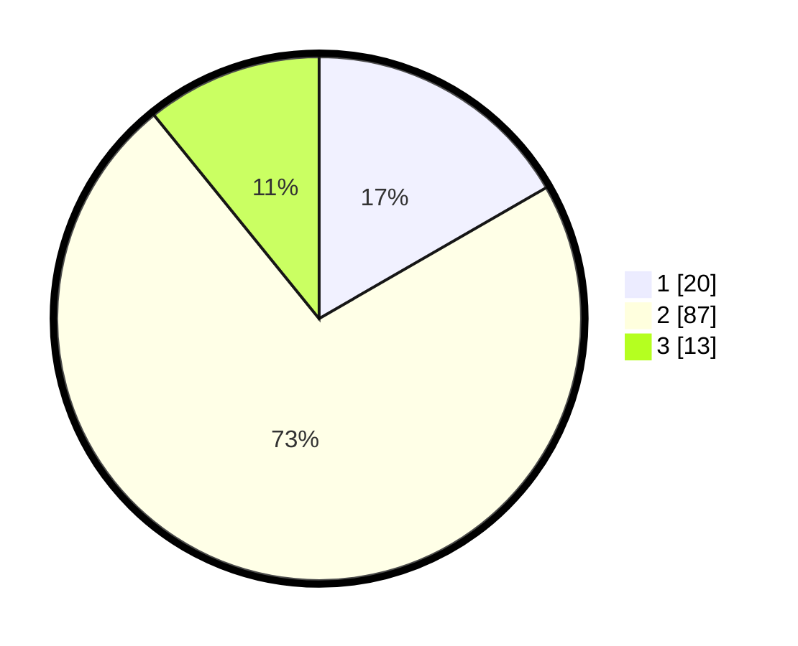

# Hasil

## Grafik

## Tabel

| No. | Nama Paslon    | Suara | Suara (raw) | Persentase |
|:--- |:-------------- | -----:| -----------:| ----------:|
| 1   | ANIES MUHAIMIN | 20    | [20][p-1]   | 16,67      |
| 2   | PRABOWO GIBRAN | 87    | [87][p-2]   | 72,50      |
| 3   | GANJAR MAHFUD  | 13    | [13][p-3]   | 10,83      |

[p-1]: https://github.com/gigit-pemilu/pemilu-2024/blob/main/pilpres/hitung-suara/sub/33-jawa-tengah/sub/27-pemalang/sub/05-bodeh/sub/2002-jatingarang/sub/022-tps/sub/paslon-1.txt
[p-2]: https://github.com/gigit-pemilu/pemilu-2024/blob/main/pilpres/hitung-suara/sub/33-jawa-tengah/sub/27-pemalang/sub/05-bodeh/sub/2002-jatingarang/sub/022-tps/sub/paslon-2.txt
[p-3]: https://github.com/gigit-pemilu/pemilu-2024/blob/main/pilpres/hitung-suara/sub/33-jawa-tengah/sub/27-pemalang/sub/05-bodeh/sub/2002-jatingarang/sub/022-tps/sub/paslon-3.txt

## Foto C Plano

https://sirekap-obj-formc.kpu.go.id/2c1a/pemilu/ppwp/33/27/05/20/02/3327052002022-20240217-163207--0aed4ba9-1e73-44de-b48c-e139c43a4bab.jpg

https://sirekap-obj-formc.kpu.go.id/2c1a/pemilu/ppwp/33/27/05/20/02/3327052002022-20240217-163315--173030c3-74dc-4ee0-8338-2cb0811f3d71.jpg

https://sirekap-obj-formc.kpu.go.id/2c1a/pemilu/ppwp/33/27/05/20/02/3327052002022-20240217-163440--7cc770e2-adba-40ee-bbfe-ed00f2c54026.jpg

## Metadata

| Key        | Value               |
| ---------- | ------------------- |
| Time Stamp | 2024-02-17 16:52:47 |

