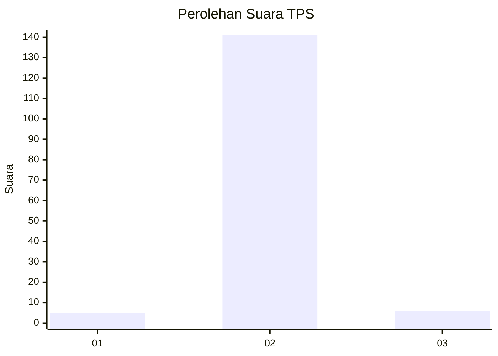
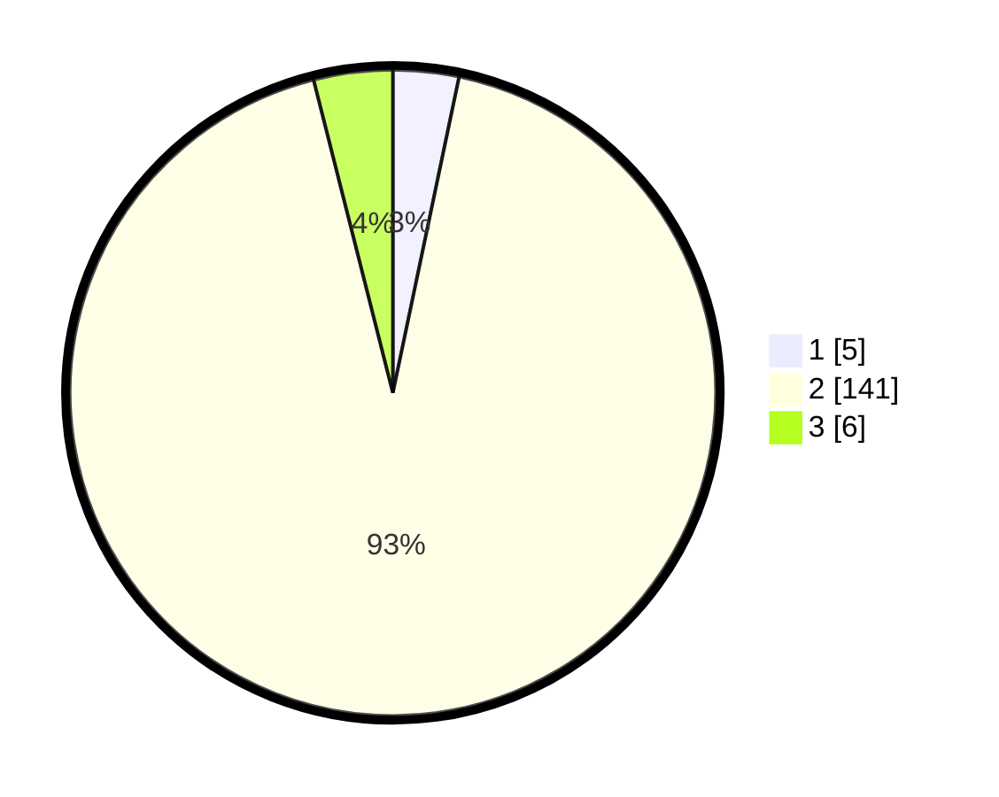

# Hasil

## Grafik

## Tabel

| No. | Nama Paslon    | Suara | Suara (raw) | Persentase |
|:--- |:-------------- | -----:| -----------:| ----------:|
| 1   | ANIES MUHAIMIN | 5     | [5][p-1]    | 3,29       |
| 2   | PRABOWO GIBRAN | 141   | [141][p-2]  | 92,76      |
| 3   | GANJAR MAHFUD  | 6     | [6][p-3]    | 3,95       |

[p-1]: https://github.com/gigit-pemilu/pemilu-2024/blob/main/pilpres/hitung-suara/sub/33-jawa-tengah/sub/27-pemalang/sub/05-bodeh/sub/2004-pasir/sub/007-tps/sub/paslon-1.txt
[p-2]: https://github.com/gigit-pemilu/pemilu-2024/blob/main/pilpres/hitung-suara/sub/33-jawa-tengah/sub/27-pemalang/sub/05-bodeh/sub/2004-pasir/sub/007-tps/sub/paslon-2.txt
[p-3]: https://github.com/gigit-pemilu/pemilu-2024/blob/main/pilpres/hitung-suara/sub/33-jawa-tengah/sub/27-pemalang/sub/05-bodeh/sub/2004-pasir/sub/007-tps/sub/paslon-3.txt

## Foto C Plano

https://sirekap-obj-formc.kpu.go.id/4e26/pemilu/ppwp/33/27/05/20/04/3327052004007-20240217-110126--0bf820af-32dc-4041-8420-77e4217cd8b0.jpg

https://sirekap-obj-formc.kpu.go.id/4e26/pemilu/ppwp/33/27/05/20/04/3327052004007-20240215-051727--20a47649-63f4-481d-8c26-8edfe0211225.jpg

https://sirekap-obj-formc.kpu.go.id/4e26/pemilu/ppwp/33/27/05/20/04/3327052004007-20240215-051854--295e3243-8a8c-44ba-82f2-4a8d77558afb.jpg

## Metadata

| Key        | Value               |
| ---------- | ------------------- |
| Time Stamp | 2024-02-17 11:30:03 |

