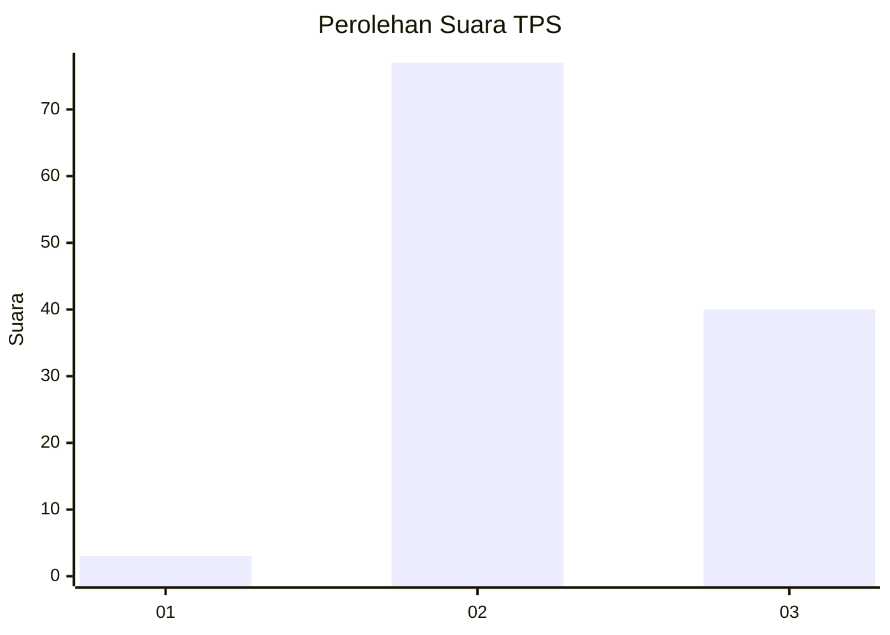
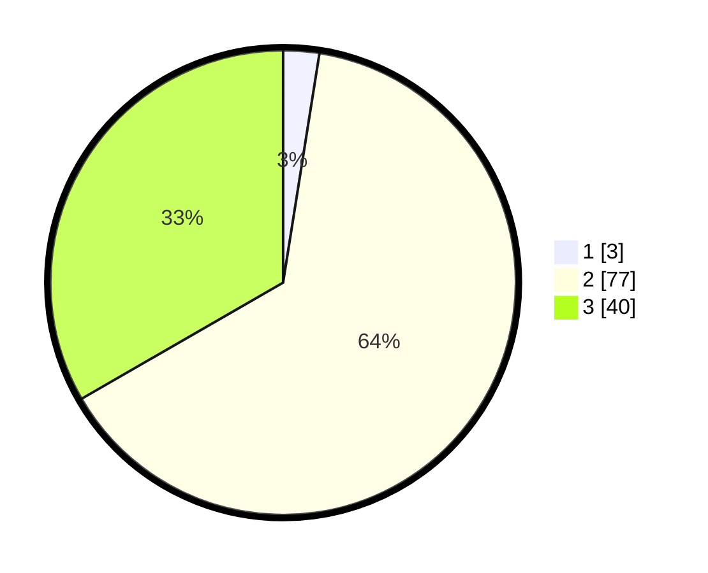

# Hasil

## Grafik

## Tabel

| No. | Nama Paslon    | Suara | Suara (raw) | Persentase |
|:--- |:-------------- | -----:| -----------:| ----------:|
| 1   | ANIES MUHAIMIN | 3     | [3][p-1]    | 2,50       |
| 2   | PRABOWO GIBRAN | 77    | [77][p-2]   | 64,17      |
| 3   | GANJAR MAHFUD  | 40    | [40][p-3]   | 33,33      |

[p-1]: https://github.com/gigit-pemilu/pemilu-2024/blob/main/pilpres/hitung-suara/sub/33-jawa-tengah/sub/27-pemalang/sub/05-bodeh/sub/2006-jatiroyom/sub/012-tps/sub/paslon-1.txt
[p-2]: https://github.com/gigit-pemilu/pemilu-2024/blob/main/pilpres/hitung-suara/sub/33-jawa-tengah/sub/27-pemalang/sub/05-bodeh/sub/2006-jatiroyom/sub/012-tps/sub/paslon-2.txt
[p-3]: https://github.com/gigit-pemilu/pemilu-2024/blob/main/pilpres/hitung-suara/sub/33-jawa-tengah/sub/27-pemalang/sub/05-bodeh/sub/2006-jatiroyom/sub/012-tps/sub/paslon-3.txt

## Foto C Plano

https://sirekap-obj-formc.kpu.go.id/a601/pemilu/ppwp/33/27/05/20/06/3327052006012-20240214-201008--ca986199-e8d4-43cb-9c20-b8a717d07eb7.jpg

https://sirekap-obj-formc.kpu.go.id/a601/pemilu/ppwp/33/27/05/20/06/3327052006012-20240214-201127--06ecaab1-f261-458c-88de-27d012f4ae30.jpg

https://sirekap-obj-formc.kpu.go.id/a601/pemilu/ppwp/33/27/05/20/06/3327052006012-20240214-201234--968e0e64-08ce-49e2-b32c-5819e4b48cec.jpg

## Metadata

| Key        | Value               |
| ---------- | ------------------- |
| Time Stamp | 2024-02-17 00:28:35 |

