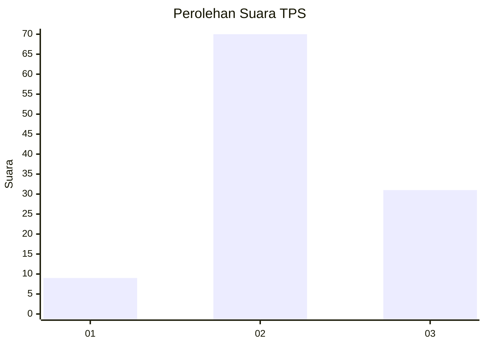
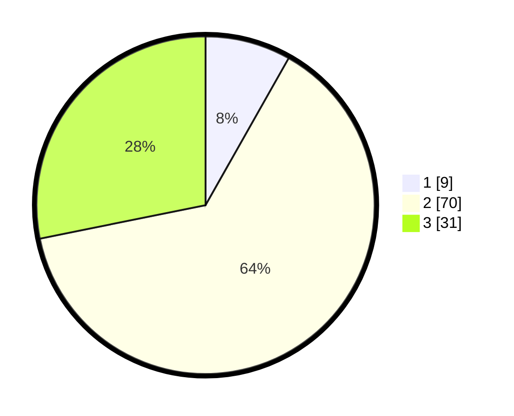

# Hasil

## Grafik

## Tabel

| No. | Nama Paslon    | Suara | Suara (raw) | Persentase |
|:--- |:-------------- | -----:| -----------:| ----------:|
| 1   | ANIES MUHAIMIN | 9     | [9][p-1]    | 8,18       |
| 2   | PRABOWO GIBRAN | 70    | [70][p-2]   | 63,64      |
| 3   | GANJAR MAHFUD  | 31    | [31][p-3]   | 28,18      |

[p-1]: https://github.com/gigit-pemilu/pemilu-2024-33-jawa-tengah/blob/main/pilpres/hitung-suara/sub/33-jawa-tengah/sub/27-pemalang/sub/05-bodeh/sub/2008-payung/sub/007-tps/sub/paslon-1.txt
[p-2]: https://github.com/gigit-pemilu/pemilu-2024-33-jawa-tengah/blob/main/pilpres/hitung-suara/sub/33-jawa-tengah/sub/27-pemalang/sub/05-bodeh/sub/2008-payung/sub/007-tps/sub/paslon-2.txt
[p-3]: https://github.com/gigit-pemilu/pemilu-2024-33-jawa-tengah/blob/main/pilpres/hitung-suara/sub/33-jawa-tengah/sub/27-pemalang/sub/05-bodeh/sub/2008-payung/sub/007-tps/sub/paslon-3.txt

## Foto C Plano

https://sirekap-obj-formc.kpu.go.id/ec23/pemilu/ppwp/33/27/05/20/08/3327052008007-20240214-141231--092e5406-029c-4f3a-bca8-042f2d2ecd5f.jpg

https://sirekap-obj-formc.kpu.go.id/ec23/pemilu/ppwp/33/27/05/20/08/3327052008007-20240214-202301--b58da33c-158a-4e8e-8b49-b3d974423d62.jpg

https://sirekap-obj-formc.kpu.go.id/ec23/pemilu/ppwp/33/27/05/20/08/3327052008007-20240214-141316--6a28da48-5e6d-4a9a-8f3b-f5b86c5d1bac.jpg

## Metadata

| Key        | Value               |
| ---------- | ------------------- |
| Time Stamp | 2024-02-16 22:01:00 |

