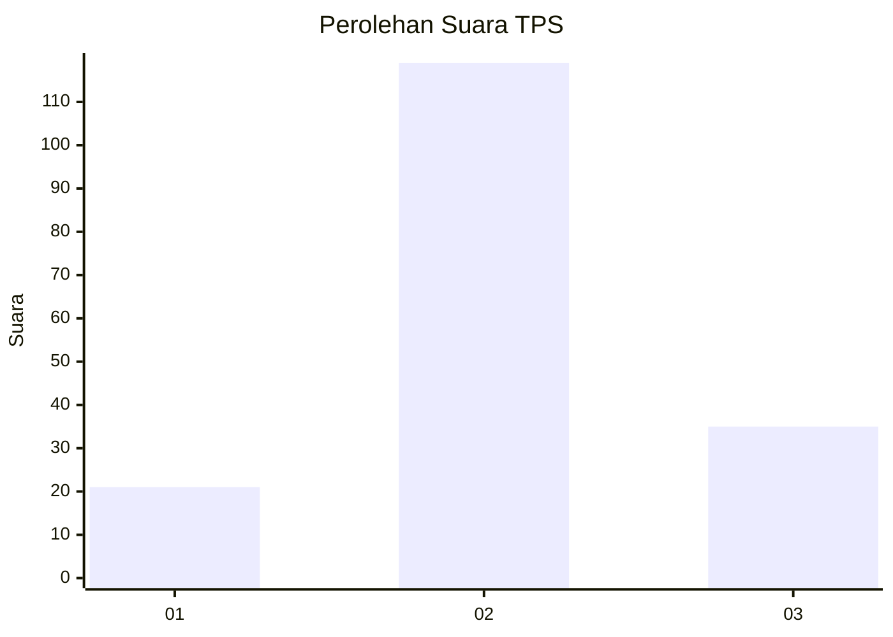
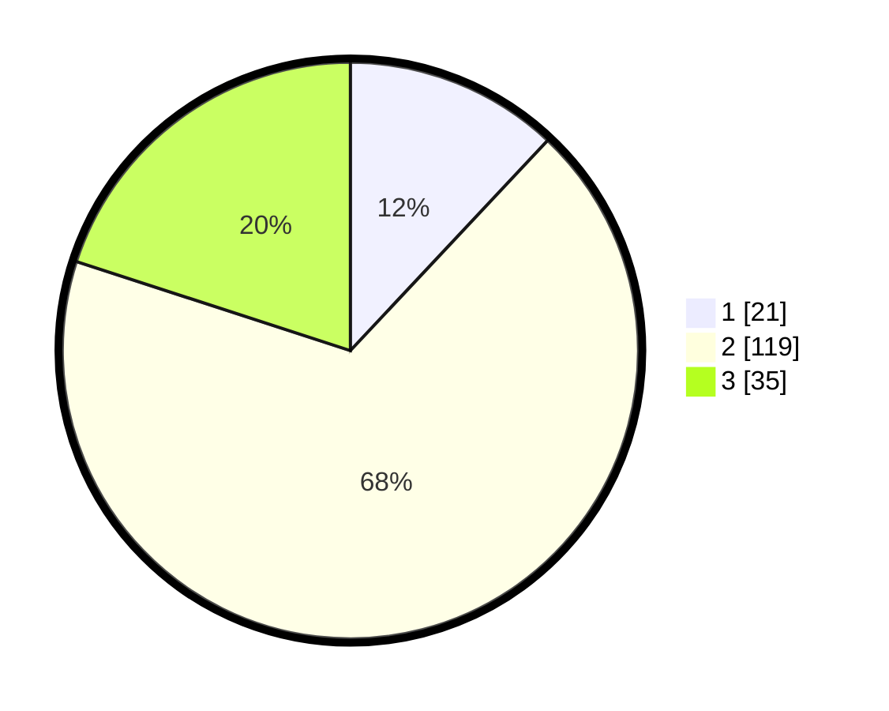

# Hasil

## Grafik

## Tabel

| No. | Nama Paslon    | Suara | Suara (raw) | Persentase |
|:--- |:-------------- | -----:| -----------:| ----------:|
| 1   | ANIES MUHAIMIN | 21    | [21][p-1]   | 12,00      |
| 2   | PRABOWO GIBRAN | 119   | [119][p-2]  | 68,00      |
| 3   | GANJAR MAHFUD  | 35    | [35][p-3]   | 20,00      |

[p-1]: https://github.com/gigit-pemilu/pemilu-2024/blob/main/pilpres/hitung-suara/sub/33-jawa-tengah/sub/27-pemalang/sub/05-bodeh/sub/2013-karangbrai/sub/001-tps/sub/paslon-1.txt
[p-2]: https://github.com/gigit-pemilu/pemilu-2024/blob/main/pilpres/hitung-suara/sub/33-jawa-tengah/sub/27-pemalang/sub/05-bodeh/sub/2013-karangbrai/sub/001-tps/sub/paslon-2.txt
[p-3]: https://github.com/gigit-pemilu/pemilu-2024/blob/main/pilpres/hitung-suara/sub/33-jawa-tengah/sub/27-pemalang/sub/05-bodeh/sub/2013-karangbrai/sub/001-tps/sub/paslon-3.txt

## Foto C Plano

https://sirekap-obj-formc.kpu.go.id/60e5/pemilu/ppwp/33/27/05/20/13/3327052013001-20240216-182259--733c6151-6da5-4b57-a32b-a92601c5b928.jpg

https://sirekap-obj-formc.kpu.go.id/60e5/pemilu/ppwp/33/27/05/20/13/3327052013001-20240216-190551--81fd2604-776a-4b1c-99c5-1c3d47a0e62c.jpg

https://sirekap-obj-formc.kpu.go.id/60e5/pemilu/ppwp/33/27/05/20/13/3327052013001-20240216-182519--8dc99ead-0019-499d-9dd7-8e08f8bcf245.jpg

## Metadata

| Key        | Value               |
| ---------- | ------------------- |
| Time Stamp | 2024-02-17 00:00:00 |

