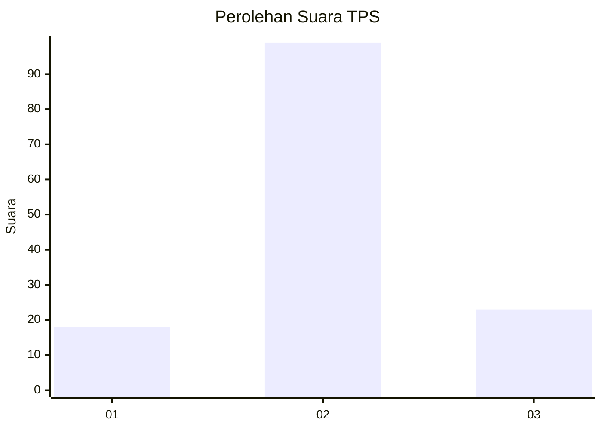
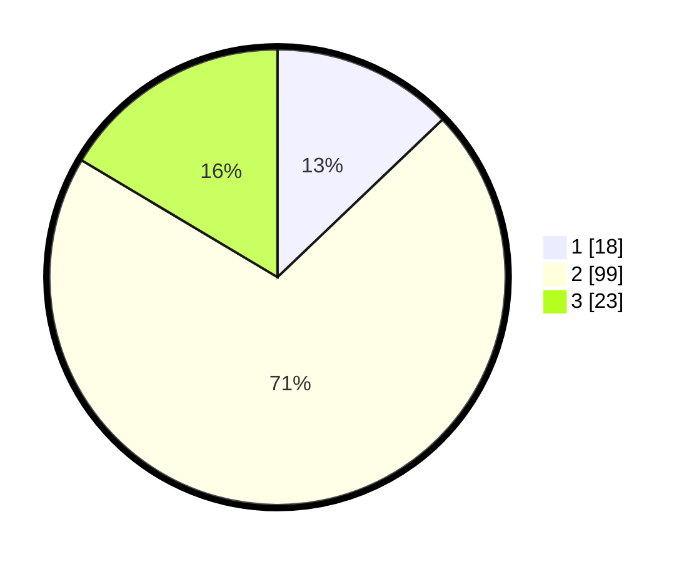

# Hasil

## Grafik

## Tabel

| No. | Nama Paslon    | Suara | Suara (raw) | Persentase |
|:--- |:-------------- | -----:| -----------:| ----------:|
| 1   | ANIES MUHAIMIN | 18    | [18][p-1]   | 12,86      |
| 2   | PRABOWO GIBRAN | 99    | [99][p-2]   | 70,71      |
| 3   | GANJAR MAHFUD  | 23    | [23][p-3]   | 16,43      |

[p-1]: https://github.com/gigit-pemilu/pemilu-2024/blob/main/pilpres/hitung-suara/sub/33-jawa-tengah/sub/27-pemalang/sub/05-bodeh/sub/2014-jraganan/sub/005-tps/sub/paslon-1.txt
[p-2]: https://github.com/gigit-pemilu/pemilu-2024/blob/main/pilpres/hitung-suara/sub/33-jawa-tengah/sub/27-pemalang/sub/05-bodeh/sub/2014-jraganan/sub/005-tps/sub/paslon-2.txt
[p-3]: https://github.com/gigit-pemilu/pemilu-2024/blob/main/pilpres/hitung-suara/sub/33-jawa-tengah/sub/27-pemalang/sub/05-bodeh/sub/2014-jraganan/sub/005-tps/sub/paslon-3.txt

## Foto C Plano

https://sirekap-obj-formc.kpu.go.id/1f20/pemilu/ppwp/33/27/05/20/14/3327052014005-20240214-225622--22f588c9-61fc-4e6a-bb97-389fbe9a7d52.jpg

https://sirekap-obj-formc.kpu.go.id/1f20/pemilu/ppwp/33/27/05/20/14/3327052014005-20240214-200729--ed48b3ec-2644-4b97-b4a2-759cd12060d7.jpg

https://sirekap-obj-formc.kpu.go.id/1f20/pemilu/ppwp/33/27/05/20/14/3327052014005-20240214-200921--a7860490-f603-4aa5-81d9-41528c8e686e.jpg

## Metadata

| Key        | Value               |
| ---------- | ------------------- |
| Time Stamp | 2024-02-15 15:00:29 |

