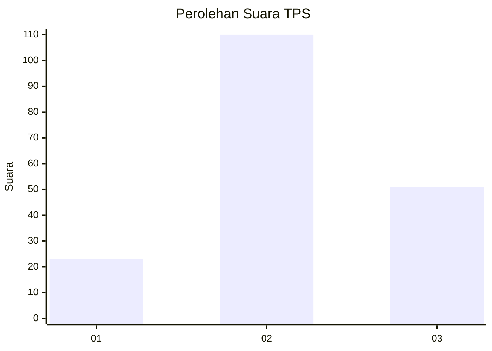
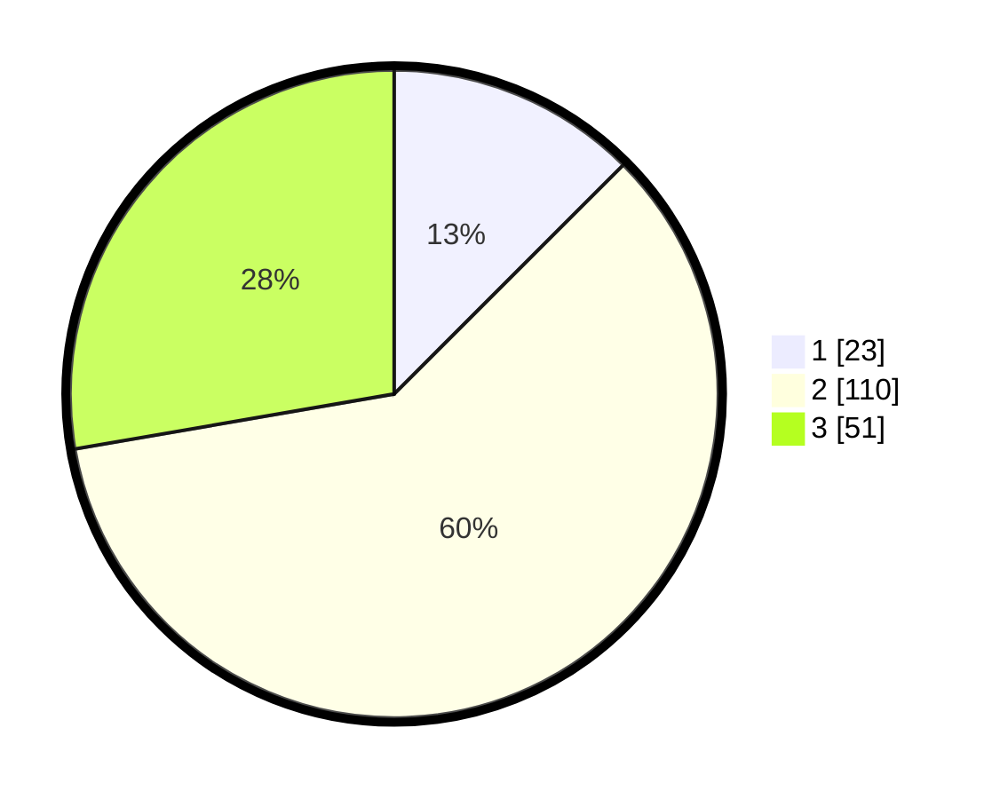

# Hasil

## Grafik

## Tabel

| No. | Nama Paslon    | Suara | Suara (raw) | Persentase |
|:--- |:-------------- | -----:| -----------:| ----------:|
| 1   | ANIES MUHAIMIN | 23    | [23][p-1]   | 12,50      |
| 2   | PRABOWO GIBRAN | 110   | [110][p-2]  | 59,78      |
| 3   | GANJAR MAHFUD  | 51    | [51][p-3]   | 27,72      |

[p-1]: https://github.com/gigit-pemilu/pemilu-2024-33-jawa-tengah/blob/main/pilpres/hitung-suara/sub/33-jawa-tengah/sub/27-pemalang/sub/07-randudongkal/sub/2003-mejagong/sub/003-tps/sub/paslon-1.txt
[p-2]: https://github.com/gigit-pemilu/pemilu-2024-33-jawa-tengah/blob/main/pilpres/hitung-suara/sub/33-jawa-tengah/sub/27-pemalang/sub/07-randudongkal/sub/2003-mejagong/sub/003-tps/sub/paslon-2.txt
[p-3]: https://github.com/gigit-pemilu/pemilu-2024-33-jawa-tengah/blob/main/pilpres/hitung-suara/sub/33-jawa-tengah/sub/27-pemalang/sub/07-randudongkal/sub/2003-mejagong/sub/003-tps/sub/paslon-3.txt

## Foto C Plano

https://sirekap-obj-formc.kpu.go.id/af2b/pemilu/ppwp/33/27/07/20/03/3327072003003-20240214-204255--d68f25f0-616c-4cd2-bb93-a3e6df09066d.jpg

https://sirekap-obj-formc.kpu.go.id/af2b/pemilu/ppwp/33/27/07/20/03/3327072003003-20240214-194952--99c8a6d8-fffd-4c8a-9a79-4ee6f33efb66.jpg

https://sirekap-obj-formc.kpu.go.id/af2b/pemilu/ppwp/33/27/07/20/03/3327072003003-20240214-195138--893feeaf-c5de-4f2c-9ec2-cd1c86064cbf.jpg

## Metadata

| Key        | Value               |
| ---------- | ------------------- |
| Time Stamp | 2024-02-19 06:16:00 |

## DATA PEMILIH TETAP

Jumlah pemilih dalam DPT: **261**.
 * L: **858**.
 * P: **337**.

## DATA PENGGUNA HAK PILIH

Jumlah pengguna hak pilih dalam DPT: **887**.
 * L: **386**.
 * P: **306**.

Jumlah pengguna hak pilih dalam DPTb: **488**.
 * L: **858**.
 * P: **888**.

Jumlah pengguna hak pilih dalam DPK: **332**.
 * L: **381**.
 * P: **488**.

Jumlah pengguna hak pilih: **589**.
 * L: **482**.
 * P: **107**.

## JUMLAH SUARA SAH DAN TIDAK SAH

JUMLAH SELURUH SUARA SAH: **184**.

JUMLAH SUARA TIDAK SAH: **5**.

JUMLAH SELURUH SUARA SAH DAN SUARA TIDAK SAH: **189**.

