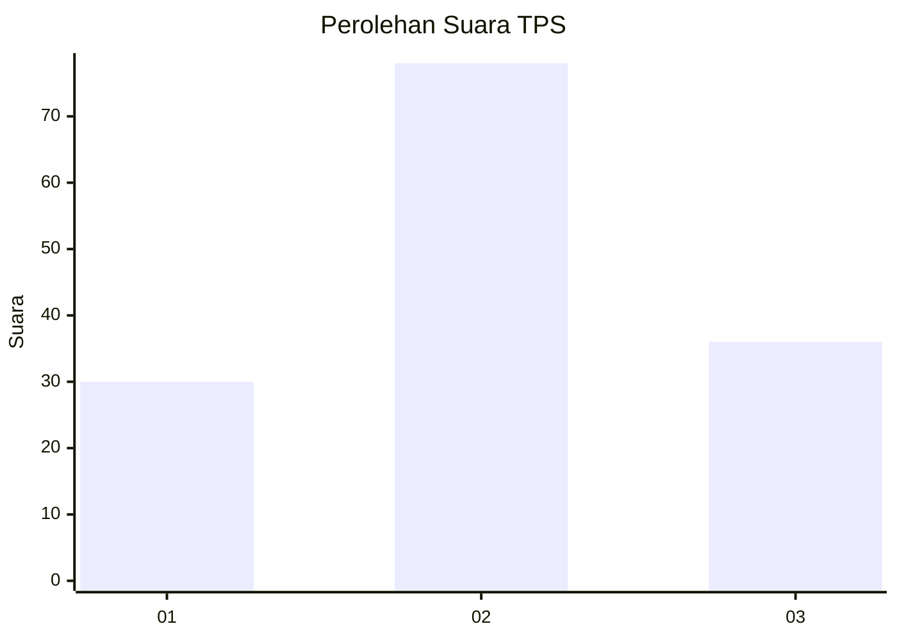
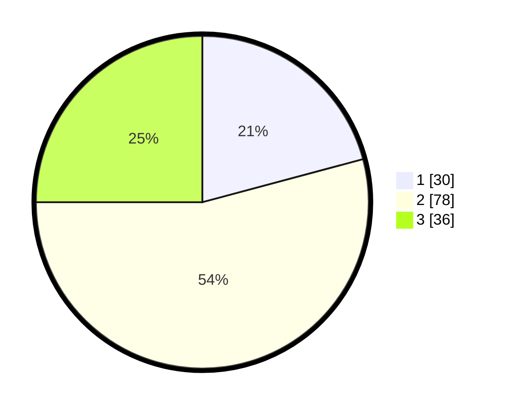

# Hasil

## Grafik

## Tabel

| No. | Nama Paslon    | Suara | Suara (raw) | Persentase |
|:--- |:-------------- | -----:| -----------:| ----------:|
| 1   | ANIES MUHAIMIN | 30    | [30][p-1]   | 20,83      |
| 2   | PRABOWO GIBRAN | 78    | [78][p-2]   | 54,17      |
| 3   | GANJAR MAHFUD  | 36    | [36][p-3]   | 25,00      |

[p-1]: https://github.com/gigit-pemilu/pemilu-2024/blob/main/pilpres/hitung-suara/sub/33-jawa-tengah/sub/27-pemalang/sub/07-randudongkal/sub/2008-semingkir/sub/027-tps/sub/paslon-1.txt
[p-2]: https://github.com/gigit-pemilu/pemilu-2024/blob/main/pilpres/hitung-suara/sub/33-jawa-tengah/sub/27-pemalang/sub/07-randudongkal/sub/2008-semingkir/sub/027-tps/sub/paslon-2.txt
[p-3]: https://github.com/gigit-pemilu/pemilu-2024/blob/main/pilpres/hitung-suara/sub/33-jawa-tengah/sub/27-pemalang/sub/07-randudongkal/sub/2008-semingkir/sub/027-tps/sub/paslon-3.txt

## Foto C Plano

https://sirekap-obj-formc.kpu.go.id/cc6c/pemilu/ppwp/33/27/07/20/08/3327072008027-20240214-214030--3fe2e6e1-ee66-487f-9410-a915b5a60995.jpg

https://sirekap-obj-formc.kpu.go.id/cc6c/pemilu/ppwp/33/27/07/20/08/3327072008027-20240214-215058--2e738602-9d76-43b3-a5ba-a728b053fd94.jpg

https://sirekap-obj-formc.kpu.go.id/cc6c/pemilu/ppwp/33/27/07/20/08/3327072008027-20240214-215147--b065627d-5467-483a-acfb-706f8784ac92.jpg

## Metadata

| Key        | Value               |
| ---------- | ------------------- |
| Time Stamp | 2024-02-16 22:01:00 |

