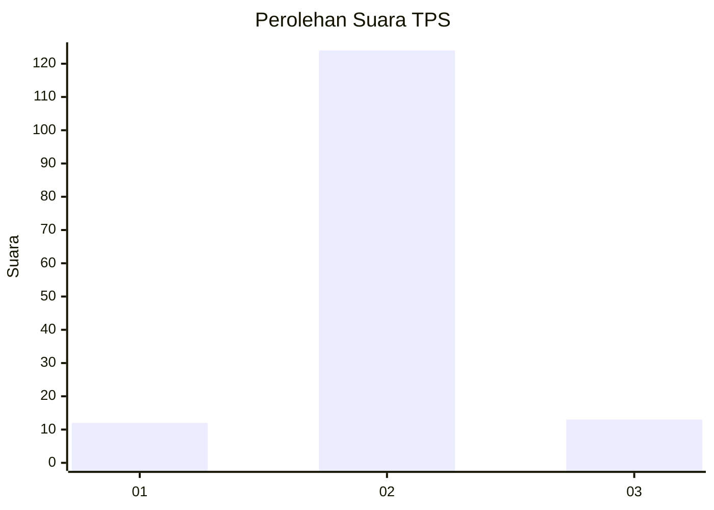
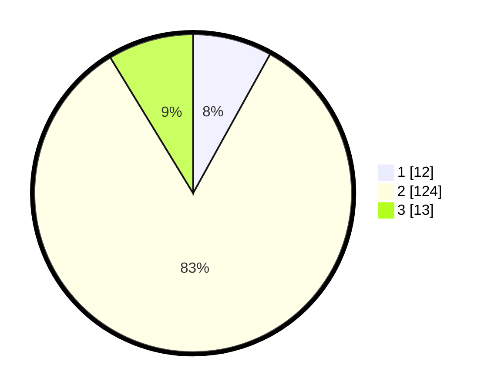

# Hasil

## Grafik

## Tabel

| No. | Nama Paslon    | Suara | Suara (raw) | Persentase |
|:--- |:-------------- | -----:| -----------:| ----------:|
| 1   | ANIES MUHAIMIN | 12    | [12][p-1]   | 8,05       |
| 2   | PRABOWO GIBRAN | 124   | [124][p-2]  | 83,22      |
| 3   | GANJAR MAHFUD  | 13    | [13][p-3]   | 8,72       |

[p-1]: https://github.com/gigit-pemilu/pemilu-2024/blob/main/pilpres/hitung-suara/sub/33-jawa-tengah/sub/27-pemalang/sub/07-randudongkal/sub/2016-kalitorong/sub/003-tps/sub/paslon-1.txt
[p-2]: https://github.com/gigit-pemilu/pemilu-2024/blob/main/pilpres/hitung-suara/sub/33-jawa-tengah/sub/27-pemalang/sub/07-randudongkal/sub/2016-kalitorong/sub/003-tps/sub/paslon-2.txt
[p-3]: https://github.com/gigit-pemilu/pemilu-2024/blob/main/pilpres/hitung-suara/sub/33-jawa-tengah/sub/27-pemalang/sub/07-randudongkal/sub/2016-kalitorong/sub/003-tps/sub/paslon-3.txt

## Foto C Plano

https://sirekap-obj-formc.kpu.go.id/9d45/pemilu/ppwp/33/27/07/20/16/3327072016003-20240214-194946--3c04b124-a214-4bdd-8231-e2a418859562.jpg

https://sirekap-obj-formc.kpu.go.id/9d45/pemilu/ppwp/33/27/07/20/16/3327072016003-20240215-005310--5695cf4f-b548-42f1-9669-d4d23e2c56d4.jpg

https://sirekap-obj-formc.kpu.go.id/9d45/pemilu/ppwp/33/27/07/20/16/3327072016003-20240214-195314--b23a739d-f079-4ef0-aa4a-1c560f17a6c8.jpg

## Metadata

| Key        | Value               |
| ---------- | ------------------- |
| Time Stamp | 2024-02-16 22:01:00 |

