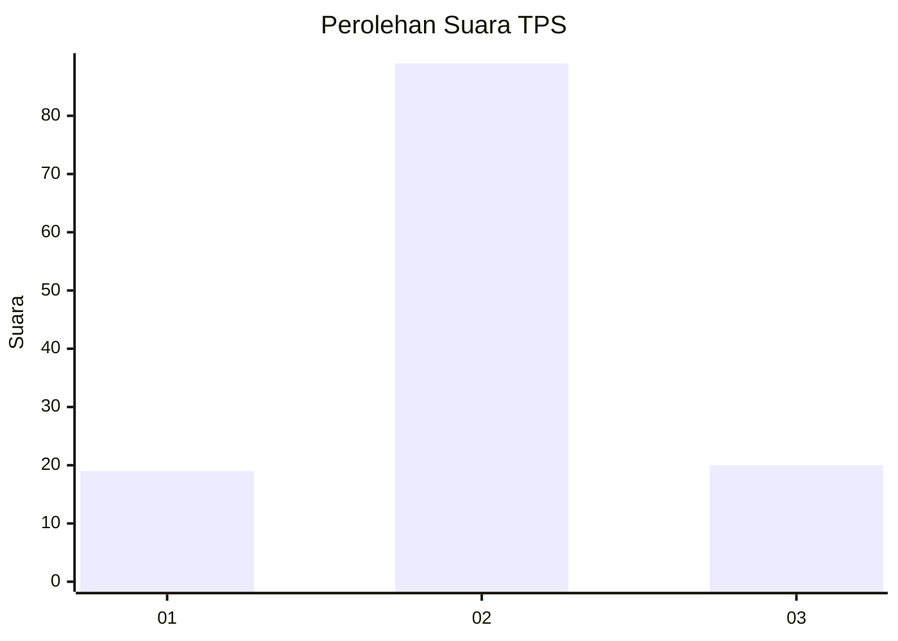
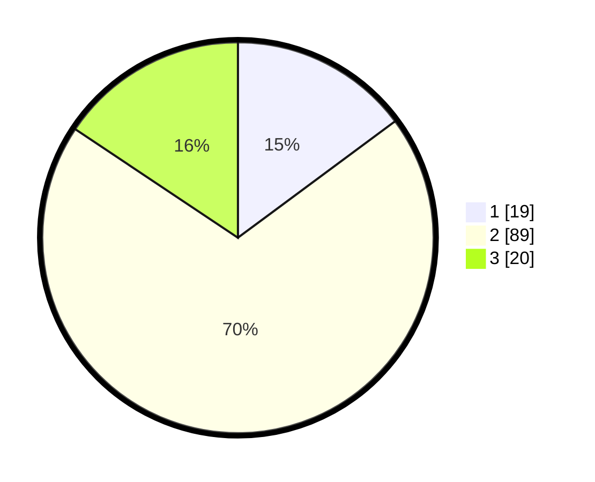

# Hasil

## Grafik

## Tabel

| No. | Nama Paslon    | Suara | Suara (raw) | Persentase |
|:--- |:-------------- | -----:| -----------:| ----------:|
| 1   | ANIES MUHAIMIN | 19    | [19][p-1]   | 14,84      |
| 2   | PRABOWO GIBRAN | 89    | [89][p-2]   | 69,53      |
| 3   | GANJAR MAHFUD  | 20    | [20][p-3]   | 15,63      |

[p-1]: https://github.com/gigit-pemilu/pemilu-2024/blob/main/pilpres/hitung-suara/sub/33-jawa-tengah/sub/27-pemalang/sub/07-randudongkal/sub/2016-kalitorong/sub/012-tps/sub/paslon-1.txt
[p-2]: https://github.com/gigit-pemilu/pemilu-2024/blob/main/pilpres/hitung-suara/sub/33-jawa-tengah/sub/27-pemalang/sub/07-randudongkal/sub/2016-kalitorong/sub/012-tps/sub/paslon-2.txt
[p-3]: https://github.com/gigit-pemilu/pemilu-2024/blob/main/pilpres/hitung-suara/sub/33-jawa-tengah/sub/27-pemalang/sub/07-randudongkal/sub/2016-kalitorong/sub/012-tps/sub/paslon-3.txt

## Foto C Plano

https://sirekap-obj-formc.kpu.go.id/fb0f/pemilu/ppwp/33/27/07/20/16/3327072016012-20240215-005555--b41bba0f-98ad-46c7-98c1-10f47138c5a5.jpg

https://sirekap-obj-formc.kpu.go.id/fb0f/pemilu/ppwp/33/27/07/20/16/3327072016012-20240215-010226--eaa8587c-62c4-4c96-bfcb-581bbd7d0be9.jpg

https://sirekap-obj-formc.kpu.go.id/fb0f/pemilu/ppwp/33/27/07/20/16/3327072016012-20240215-010313--bc5b0adc-85c6-407e-8c21-eb593ac7f4d3.jpg

## Metadata

| Key        | Value               |
| ---------- | ------------------- |
| Time Stamp | 2024-02-16 22:01:00 |

