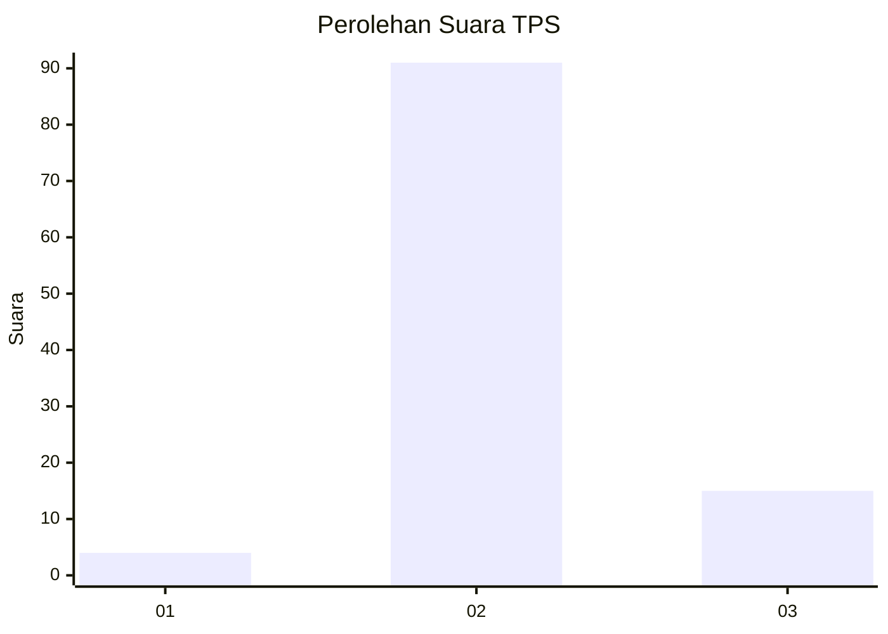
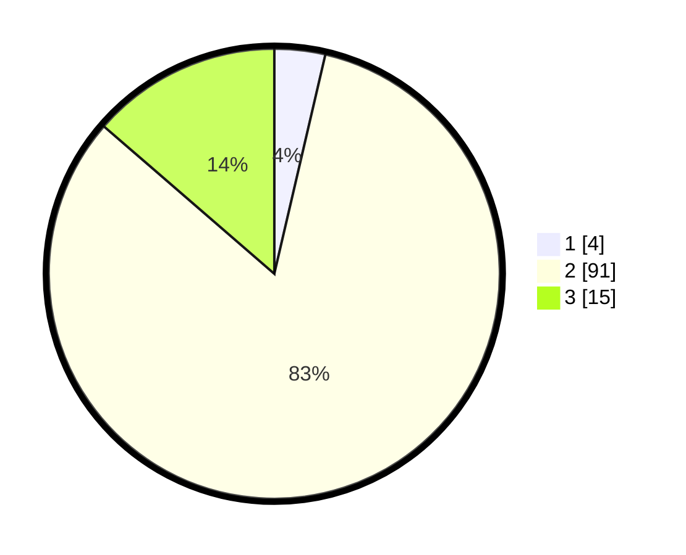

# Hasil

## Grafik

## Tabel

| No. | Nama Paslon    | Suara | Suara (raw) | Persentase |
|:--- |:-------------- | -----:| -----------:| ----------:|
| 1   | ANIES MUHAIMIN | 4     | [4][p-1]    | 3,64       |
| 2   | PRABOWO GIBRAN | 91    | [91][p-2]   | 82,73      |
| 3   | GANJAR MAHFUD  | 15    | [15][p-3]   | 13,64      |

[p-1]: https://github.com/gigit-pemilu/pemilu-2024/blob/main/pilpres/hitung-suara/sub/33-jawa-tengah/sub/27-pemalang/sub/07-randudongkal/sub/2017-kejene/sub/026-tps/sub/paslon-1.txt
[p-2]: https://github.com/gigit-pemilu/pemilu-2024/blob/main/pilpres/hitung-suara/sub/33-jawa-tengah/sub/27-pemalang/sub/07-randudongkal/sub/2017-kejene/sub/026-tps/sub/paslon-2.txt
[p-3]: https://github.com/gigit-pemilu/pemilu-2024/blob/main/pilpres/hitung-suara/sub/33-jawa-tengah/sub/27-pemalang/sub/07-randudongkal/sub/2017-kejene/sub/026-tps/sub/paslon-3.txt

## Foto C Plano

https://sirekap-obj-formc.kpu.go.id/eea1/pemilu/ppwp/33/27/07/20/17/3327072017026-20240214-215623--2e0dd352-f4f4-4a37-883f-6dded2d06db1.jpg

https://sirekap-obj-formc.kpu.go.id/eea1/pemilu/ppwp/33/27/07/20/17/3327072017026-20240214-215832--9caf49fc-2119-41b6-bd84-e172cf1f9595.jpg

https://sirekap-obj-formc.kpu.go.id/eea1/pemilu/ppwp/33/27/07/20/17/3327072017026-20240215-090315--6a1132ee-e0bd-4a79-aa88-835d7a4fbaf3.jpg

## Metadata

| Key        | Value               |
| ---------- | ------------------- |
| Time Stamp | 2024-02-16 22:01:00 |

