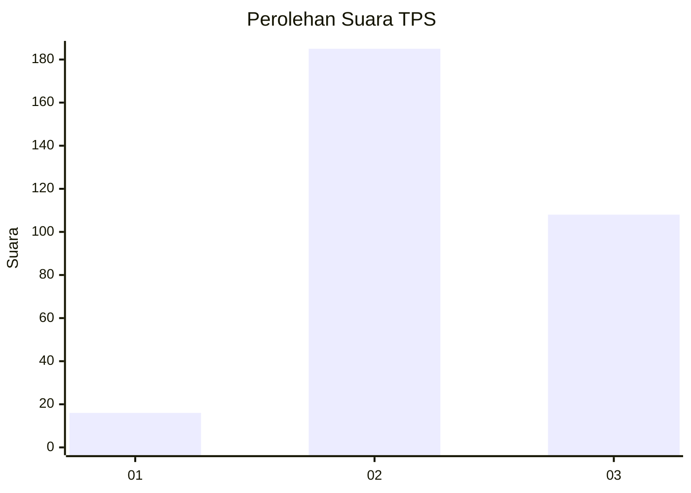
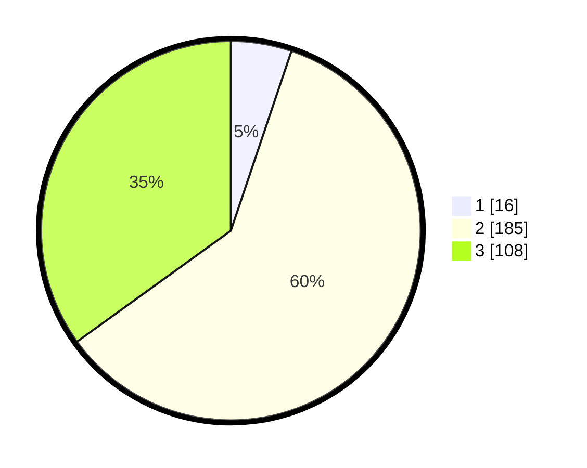

# Hasil

## Grafik

## Tabel

| No. | Nama Paslon    | Suara | Suara (raw) | Persentase |
|:--- |:-------------- | -----:| -----------:| ----------:|
| 1   | ANIES MUHAIMIN | 16    | [16][p-1]   | 5,18       |
| 2   | PRABOWO GIBRAN | 185   | [185][p-2]  | 59,87      |
| 3   | GANJAR MAHFUD  | 108   | [108][p-3]  | 34,95      |

[p-1]: https://github.com/gigit-pemilu/pemilu-2024/blob/main/pilpres/hitung-suara/sub/33-jawa-tengah/sub/27-pemalang/sub/08-pemalang/sub/1013-kebondalem/sub/901-tps/sub/paslon-1.txt
[p-2]: https://github.com/gigit-pemilu/pemilu-2024/blob/main/pilpres/hitung-suara/sub/33-jawa-tengah/sub/27-pemalang/sub/08-pemalang/sub/1013-kebondalem/sub/901-tps/sub/paslon-2.txt
[p-3]: https://github.com/gigit-pemilu/pemilu-2024/blob/main/pilpres/hitung-suara/sub/33-jawa-tengah/sub/27-pemalang/sub/08-pemalang/sub/1013-kebondalem/sub/901-tps/sub/paslon-3.txt

## Foto C Plano

https://sirekap-obj-formc.kpu.go.id/3ad5/pemilu/ppwp/33/27/08/10/13/3327081013901-20240217-153311--6d91ce37-e6cc-479d-af6f-6393671b5394.jpg

https://sirekap-obj-formc.kpu.go.id/3ad5/pemilu/ppwp/33/27/08/10/13/3327081013901-20240217-153321--0edb1180-6e52-43d3-a0a9-d72733b95c18.jpg

https://sirekap-obj-formc.kpu.go.id/3ad5/pemilu/ppwp/33/27/08/10/13/3327081013901-20240217-153336--07e81f95-e312-44f1-a0a9-343821bc0e9c.jpg

## Metadata

| Key        | Value               |
| ---------- | ------------------- |
| Time Stamp | 2024-02-17 16:00:02 |

## DATA PEMILIH TETAP

Jumlah pemilih dalam DPT: **247**.
 * L: **237**.
 * P: **10**.

## DATA PENGGUNA HAK PILIH

Jumlah pengguna hak pilih dalam DPT: **123**.
 * L: **118**.
 * P: **5**.

Jumlah pengguna hak pilih dalam DPTb: **189**.
 * L: **179**.
 * P: **10**.

Jumlah pengguna hak pilih dalam DPK: **0**.
 * L: **0**.
 * P: **0**.

Jumlah pengguna hak pilih: **312**.
 * L: **297**.
 * P: **15**.

## JUMLAH SUARA SAH DAN TIDAK SAH

JUMLAH SELURUH SUARA SAH: **309**.

JUMLAH SUARA TIDAK SAH: **3**.

JUMLAH SELURUH SUARA SAH DAN SUARA TIDAK SAH: **312**.

