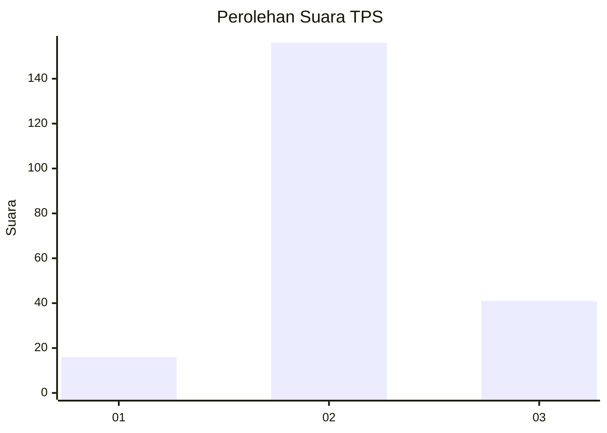
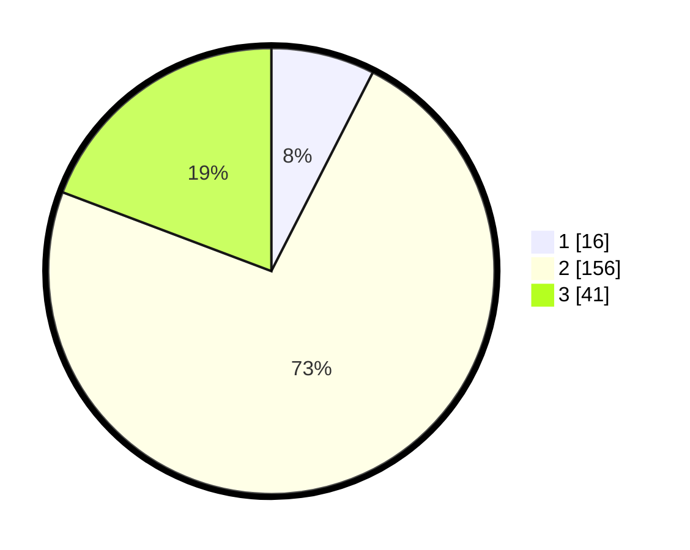

# Hasil

## Grafik

## Tabel

| No. | Nama Paslon    | Suara | Suara (raw) | Persentase |
|:--- |:-------------- | -----:| -----------:| ----------:|
| 1   | ANIES MUHAIMIN | 16    | [16][p-1]   | 7,51       |
| 2   | PRABOWO GIBRAN | 156   | [156][p-2]  | 73,24      |
| 3   | GANJAR MAHFUD  | 41    | [41][p-3]   | 19,25      |

[p-1]: https://github.com/gigit-pemilu/pemilu-2024-33-jawa-tengah/blob/main/pilpres/hitung-suara/sub/33-jawa-tengah/sub/27-pemalang/sub/09-taman/sub/2020-wanarejan-utara/sub/010-tps/sub/paslon-1.txt
[p-2]: https://github.com/gigit-pemilu/pemilu-2024-33-jawa-tengah/blob/main/pilpres/hitung-suara/sub/33-jawa-tengah/sub/27-pemalang/sub/09-taman/sub/2020-wanarejan-utara/sub/010-tps/sub/paslon-2.txt
[p-3]: https://github.com/gigit-pemilu/pemilu-2024-33-jawa-tengah/blob/main/pilpres/hitung-suara/sub/33-jawa-tengah/sub/27-pemalang/sub/09-taman/sub/2020-wanarejan-utara/sub/010-tps/sub/paslon-3.txt

## Foto C Plano

https://sirekap-obj-formc.kpu.go.id/f9f6/pemilu/ppwp/33/27/09/20/20/3327092020010-20240217-143323--f1bfcc24-5690-41a3-bf54-2c2aa824b3c3.jpg

https://sirekap-obj-formc.kpu.go.id/f9f6/pemilu/ppwp/33/27/09/20/20/3327092020010-20240215-001243--9171593b-1f74-49ad-bc8e-be44faafb91a.jpg

https://sirekap-obj-formc.kpu.go.id/f9f6/pemilu/ppwp/33/27/09/20/20/3327092020010-20240215-001326--bf3bf427-b13e-476d-9d08-e2960bc9c7e9.jpg

## Metadata

| Key        | Value               |
| ---------- | ------------------- |
| Time Stamp | 2024-02-17 14:45:18 |

## DATA PEMILIH TETAP

Jumlah pemilih dalam DPT: **491**.
 * L: **777**.
 * P: **777**.

## DATA PENGGUNA HAK PILIH

Jumlah pengguna hak pilih dalam DPT: **991**.
 * L: **777**.
 * P: **770**.

Jumlah pengguna hak pilih dalam DPTb: **777**.
 * L: **0**.
 * P: **77**.

Jumlah pengguna hak pilih dalam DPK: **774**.
 * L: **0**.
 * P: **77**.

Jumlah pengguna hak pilih: **444**.
 * L: **29**.
 * P: **124**.

## JUMLAH SUARA SAH DAN TIDAK SAH

JUMLAH SELURUH SUARA SAH: **213**.

JUMLAH SUARA TIDAK SAH: **9**.

JUMLAH SELURUH SUARA SAH DAN SUARA TIDAK SAH: **222**.

