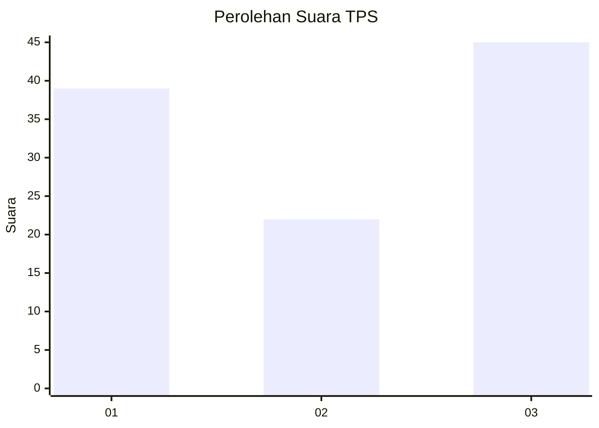
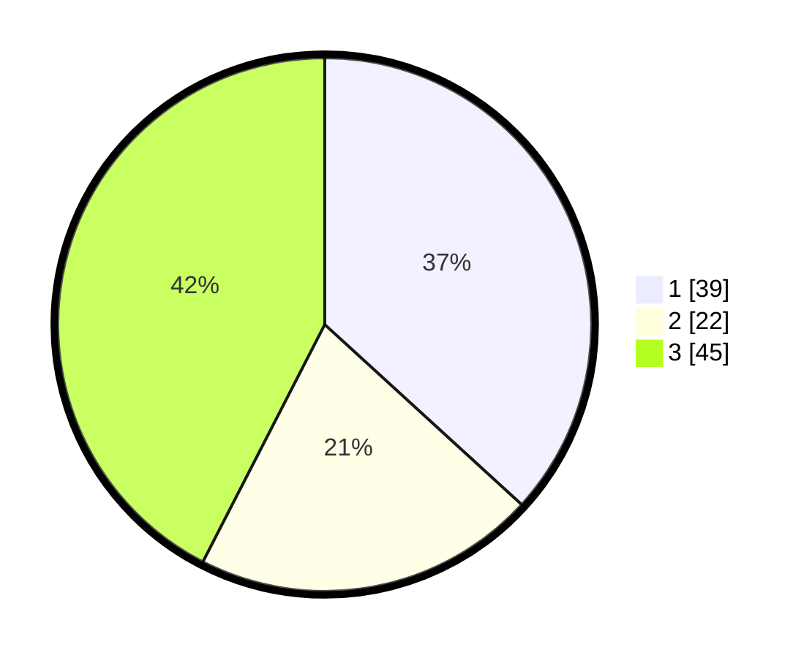

# Hasil

## Grafik

## Tabel

| No. | Nama Paslon    | Suara | Suara (raw) | Persentase |
|:--- |:-------------- | -----:| -----------:| ----------:|
| 1   | ANIES MUHAIMIN | 39    | [39][p-1]   | 36,79      |
| 2   | PRABOWO GIBRAN | 22    | [22][p-2]   | 20,75      |
| 3   | GANJAR MAHFUD  | 45    | [45][p-3]   | 42,45      |

[p-1]: https://github.com/gigit-pemilu/pemilu-2024-33-jawa-tengah/blob/main/pilpres/hitung-suara/sub/33-jawa-tengah/sub/27-pemalang/sub/09-taman/sub/2020-wanarejan-utara/sub/013-tps/sub/paslon-1.txt
[p-2]: https://github.com/gigit-pemilu/pemilu-2024-33-jawa-tengah/blob/main/pilpres/hitung-suara/sub/33-jawa-tengah/sub/27-pemalang/sub/09-taman/sub/2020-wanarejan-utara/sub/013-tps/sub/paslon-2.txt
[p-3]: https://github.com/gigit-pemilu/pemilu-2024-33-jawa-tengah/blob/main/pilpres/hitung-suara/sub/33-jawa-tengah/sub/27-pemalang/sub/09-taman/sub/2020-wanarejan-utara/sub/013-tps/sub/paslon-3.txt

## Foto C Plano

https://sirekap-obj-formc.kpu.go.id/8bb3/pemilu/ppwp/33/27/09/20/20/3327092020013-20240217-120739--110cad3b-ce38-4aa4-b1c7-09f5171580a4.jpg

https://sirekap-obj-formc.kpu.go.id/8bb3/pemilu/ppwp/33/27/09/20/20/3327092020013-20240214-234738--04890c1a-2eff-4f8c-8217-485f42bc3ad3.jpg

https://sirekap-obj-formc.kpu.go.id/8bb3/pemilu/ppwp/33/27/09/20/20/3327092020013-20240214-225256--1a15e15f-f0f1-4a58-ab6a-ce41589dec52.jpg

## Metadata

| Key        | Value               |
| ---------- | ------------------- |
| Time Stamp | 2024-02-17 19:00:04 |

