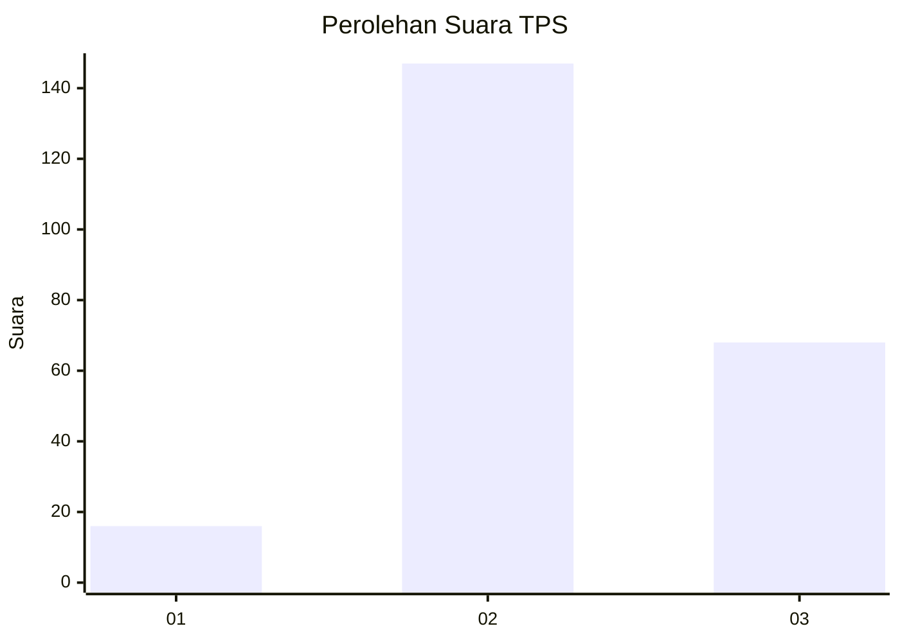
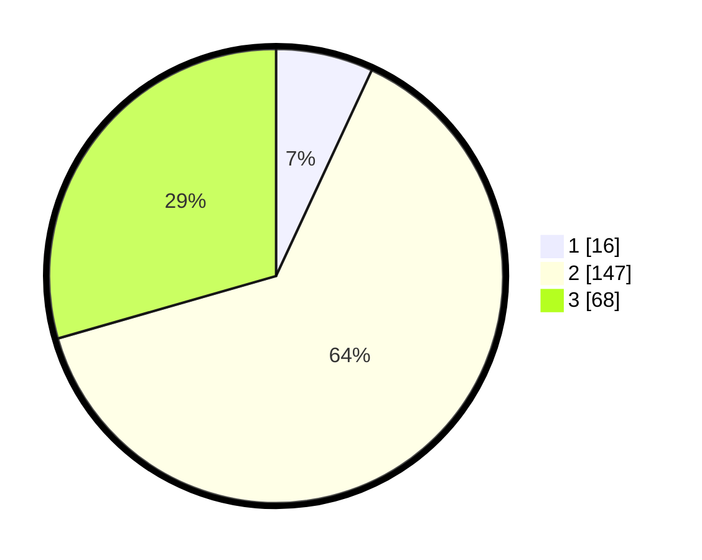

# Hasil

## Grafik

## Tabel

| No. | Nama Paslon    | Suara | Suara (raw) | Persentase |
|:--- |:-------------- | -----:| -----------:| ----------:|
| 1   | ANIES MUHAIMIN | 16    | [16][p-1]   | 6,93       |
| 2   | PRABOWO GIBRAN | 147   | [147][p-2]  | 63,64      |
| 3   | GANJAR MAHFUD  | 68    | [68][p-3]   | 29,44      |

[p-1]: https://github.com/gigit-pemilu/pemilu-2024/blob/main/pilpres/hitung-suara/sub/33-jawa-tengah/sub/27-pemalang/sub/09-taman/sub/2020-wanarejan-utara/sub/018-tps/sub/paslon-1.txt
[p-2]: https://github.com/gigit-pemilu/pemilu-2024/blob/main/pilpres/hitung-suara/sub/33-jawa-tengah/sub/27-pemalang/sub/09-taman/sub/2020-wanarejan-utara/sub/018-tps/sub/paslon-2.txt
[p-3]: https://github.com/gigit-pemilu/pemilu-2024/blob/main/pilpres/hitung-suara/sub/33-jawa-tengah/sub/27-pemalang/sub/09-taman/sub/2020-wanarejan-utara/sub/018-tps/sub/paslon-3.txt

## Foto C Plano

https://sirekap-obj-formc.kpu.go.id/a6ff/pemilu/ppwp/33/27/09/20/20/3327092020018-20240217-170722--d6021f15-04d6-4fa1-92db-1148b2b832de.jpg

https://sirekap-obj-formc.kpu.go.id/a6ff/pemilu/ppwp/33/27/09/20/20/3327092020018-20240217-170828--d42590be-e3a4-4fa5-a10c-53fa679d8b7d.jpg

https://sirekap-obj-formc.kpu.go.id/a6ff/pemilu/ppwp/33/27/09/20/20/3327092020018-20240217-171511--587b173d-500c-4770-ba49-b0b0f5abdeba.jpg

## Metadata

| Key        | Value               |
| ---------- | ------------------- |
| Time Stamp | 2024-02-17 18:30:00 |

## DATA PEMILIH TETAP

Jumlah pemilih dalam DPT: **550**.
 * L: **550**.
 * P: **550**.

## DATA PENGGUNA HAK PILIH

Jumlah pengguna hak pilih dalam DPT: **551**.
 * L: **17**.
 * P: **753**.

Jumlah pengguna hak pilih dalam DPTb: **1**.
 * L: **0**.
 * P: **5**.

Jumlah pengguna hak pilih dalam DPK: **551**.
 * L: **350**.
 * P: **66**.

Jumlah pengguna hak pilih: **651**.
 * L: **50**.
 * P: **744**.

## JUMLAH SUARA SAH DAN TIDAK SAH

JUMLAH SELURUH SUARA SAH: **231**.

JUMLAH SUARA TIDAK SAH: **7**.

JUMLAH SELURUH SUARA SAH DAN SUARA TIDAK SAH: **238**.

