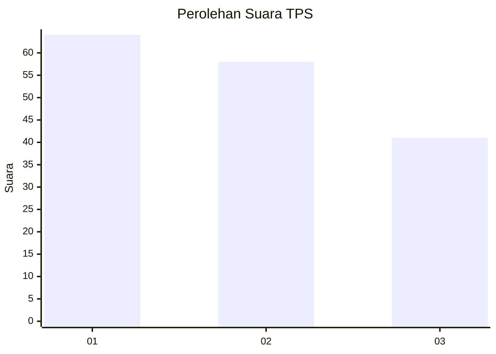
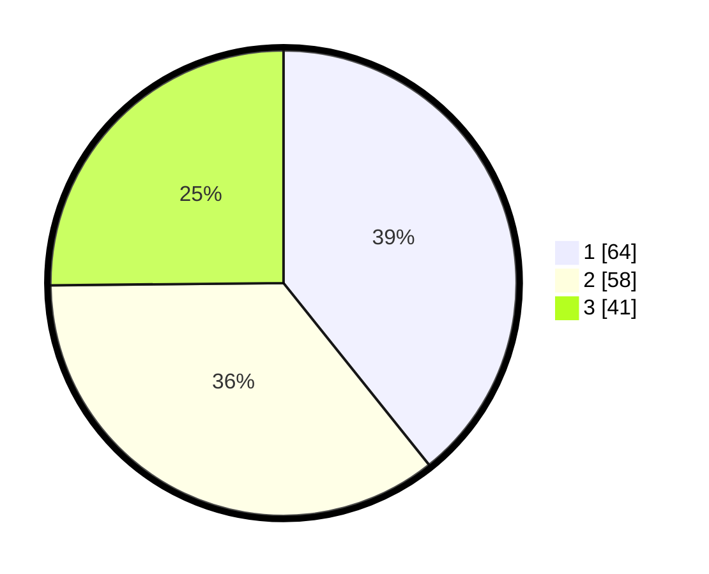

# Hasil

## Grafik

## Tabel

| No. | Nama Paslon    | Suara | Suara (raw) | Persentase |
|:--- |:-------------- | -----:| -----------:| ----------:|
| 1   | ANIES MUHAIMIN | 64    | [64][p-1]   | 39,26      |
| 2   | PRABOWO GIBRAN | 58    | [58][p-2]   | 35,58      |
| 3   | GANJAR MAHFUD  | 41    | [41][p-3]   | 25,15      |

[p-1]: https://github.com/gigit-pemilu/pemilu-2024-33-jawa-tengah/blob/main/pilpres/hitung-suara/sub/33-jawa-tengah/sub/27-pemalang/sub/12-comal/sub/1005-purwoharjo/sub/026-tps/sub/paslon-1.txt
[p-2]: https://github.com/gigit-pemilu/pemilu-2024-33-jawa-tengah/blob/main/pilpres/hitung-suara/sub/33-jawa-tengah/sub/27-pemalang/sub/12-comal/sub/1005-purwoharjo/sub/026-tps/sub/paslon-2.txt
[p-3]: https://github.com/gigit-pemilu/pemilu-2024-33-jawa-tengah/blob/main/pilpres/hitung-suara/sub/33-jawa-tengah/sub/27-pemalang/sub/12-comal/sub/1005-purwoharjo/sub/026-tps/sub/paslon-3.txt

## Foto C Plano

https://sirekap-obj-formc.kpu.go.id/004f/pemilu/ppwp/33/27/12/10/05/3327121005026-20240214-220708--fb98de0d-9185-4196-b25e-6cc77c6263fc.jpg

https://sirekap-obj-formc.kpu.go.id/004f/pemilu/ppwp/33/27/12/10/05/3327121005026-20240215-013347--c6f0bd3b-34d3-44ba-b7c6-c713169470eb.jpg

https://sirekap-obj-formc.kpu.go.id/004f/pemilu/ppwp/33/27/12/10/05/3327121005026-20240214-221042--d2bba0d8-ceb5-4031-a8ea-d3ab21446529.jpg

## Metadata

| Key        | Value               |
| ---------- | ------------------- |
| Time Stamp | 2024-02-16 14:30:33 |

