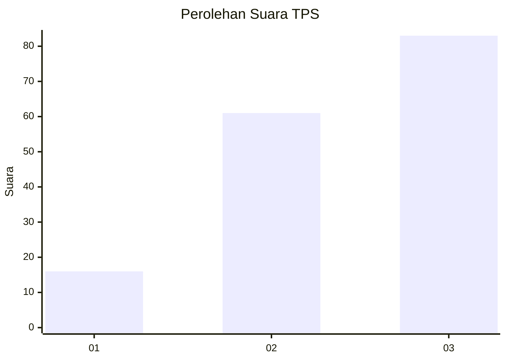
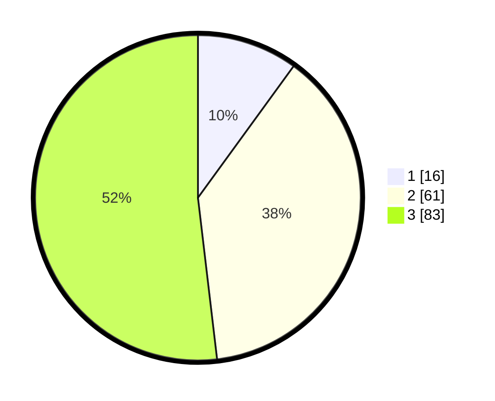

# Hasil

## Grafik

## Tabel

| No. | Nama Paslon    | Suara | Suara (raw) | Persentase |
|:--- |:-------------- | -----:| -----------:| ----------:|
| 1   | ANIES MUHAIMIN | 16    | [16][p-1]   | 10,00      |
| 2   | PRABOWO GIBRAN | 61    | [61][p-2]   | 38,13      |
| 3   | GANJAR MAHFUD  | 83    | [83][p-3]   | 51,88      |

[p-1]: https://github.com/gigit-pemilu/pemilu-2024-33-jawa-tengah/blob/main/pilpres/hitung-suara/sub/33-jawa-tengah/sub/27-pemalang/sub/13-ulujami/sub/2010-kaliprau/sub/009-tps/sub/paslon-1.txt
[p-2]: https://github.com/gigit-pemilu/pemilu-2024-33-jawa-tengah/blob/main/pilpres/hitung-suara/sub/33-jawa-tengah/sub/27-pemalang/sub/13-ulujami/sub/2010-kaliprau/sub/009-tps/sub/paslon-2.txt
[p-3]: https://github.com/gigit-pemilu/pemilu-2024-33-jawa-tengah/blob/main/pilpres/hitung-suara/sub/33-jawa-tengah/sub/27-pemalang/sub/13-ulujami/sub/2010-kaliprau/sub/009-tps/sub/paslon-3.txt

## Foto C Plano

https://sirekap-obj-formc.kpu.go.id/bebc/pemilu/ppwp/33/27/13/20/10/3327132010009-20240214-141606--8f2f1984-d47c-4236-a7d6-8d3c4c2ac009.jpg

https://sirekap-obj-formc.kpu.go.id/bebc/pemilu/ppwp/33/27/13/20/10/3327132010009-20240214-141703--d5c307ef-02a4-4213-9ed9-a493b534d17d.jpg

https://sirekap-obj-formc.kpu.go.id/bebc/pemilu/ppwp/33/27/13/20/10/3327132010009-20240214-141832--06813b99-f025-4c4b-8683-ca5e596ae6d9.jpg

## Metadata

| Key        | Value               |
| ---------- | ------------------- |
| Time Stamp | 2024-02-14 21:46:01 |

