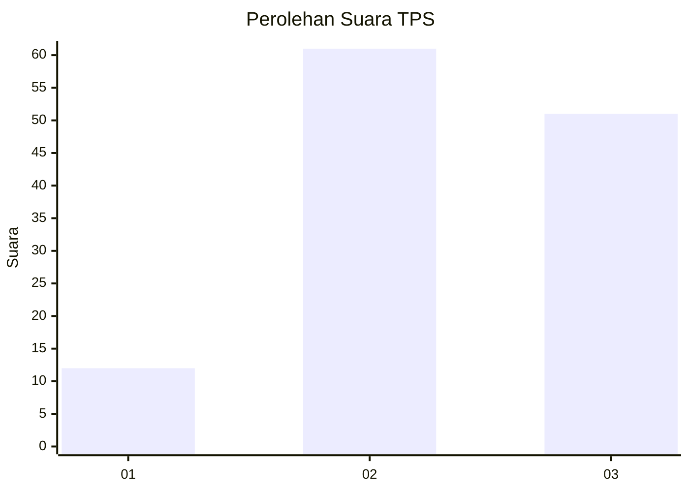
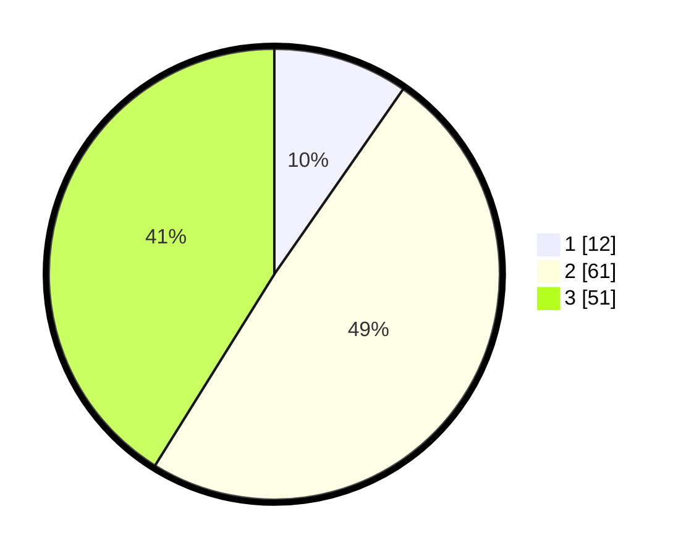

# Hasil

## Grafik

## Tabel

| No. | Nama Paslon    | Suara | Suara (raw) | Persentase |
|:--- |:-------------- | -----:| -----------:| ----------:|
| 1   | ANIES MUHAIMIN | 12    | [12][p-1]   | 9,68       |
| 2   | PRABOWO GIBRAN | 61    | [61][p-2]   | 49,19      |
| 3   | GANJAR MAHFUD  | 51    | [51][p-3]   | 41,13      |

[p-1]: https://github.com/gigit-pemilu/pemilu-2024/blob/main/pilpres/hitung-suara/sub/33-jawa-tengah/sub/27-pemalang/sub/14-warungpring/sub/2005-cibuyur/sub/026-tps/sub/paslon-1.txt
[p-2]: https://github.com/gigit-pemilu/pemilu-2024/blob/main/pilpres/hitung-suara/sub/33-jawa-tengah/sub/27-pemalang/sub/14-warungpring/sub/2005-cibuyur/sub/026-tps/sub/paslon-2.txt
[p-3]: https://github.com/gigit-pemilu/pemilu-2024/blob/main/pilpres/hitung-suara/sub/33-jawa-tengah/sub/27-pemalang/sub/14-warungpring/sub/2005-cibuyur/sub/026-tps/sub/paslon-3.txt

## Foto C Plano

https://sirekap-obj-formc.kpu.go.id/4250/pemilu/ppwp/33/27/14/20/05/3327142005026-20240214-212759--9d8ccaa4-5c2c-45a0-a0c4-3e3c30c1092e.jpg

https://sirekap-obj-formc.kpu.go.id/4250/pemilu/ppwp/33/27/14/20/05/3327142005026-20240214-141553--a72941ad-25f2-410a-b2b8-7d98303e60ee.jpg

https://sirekap-obj-formc.kpu.go.id/4250/pemilu/ppwp/33/27/14/20/05/3327142005026-20240214-141610--6b63523d-66b4-4324-ba17-16e7370eef1a.jpg

## Metadata

| Key        | Value               |
| ---------- | ------------------- |
| Time Stamp | 2024-02-17 17:30:00 |

