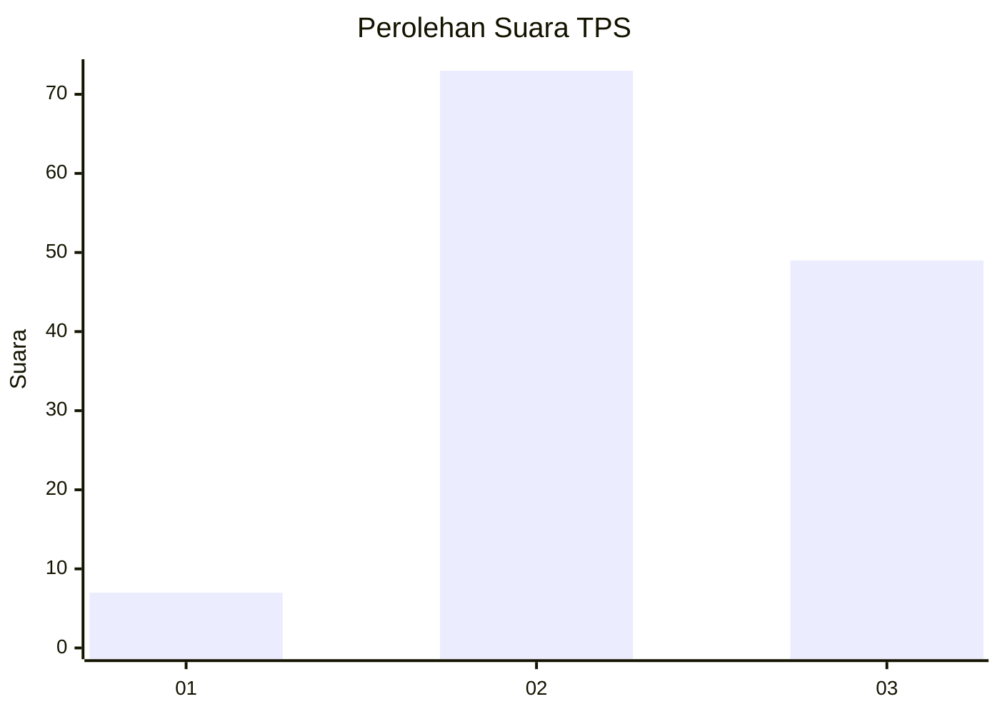
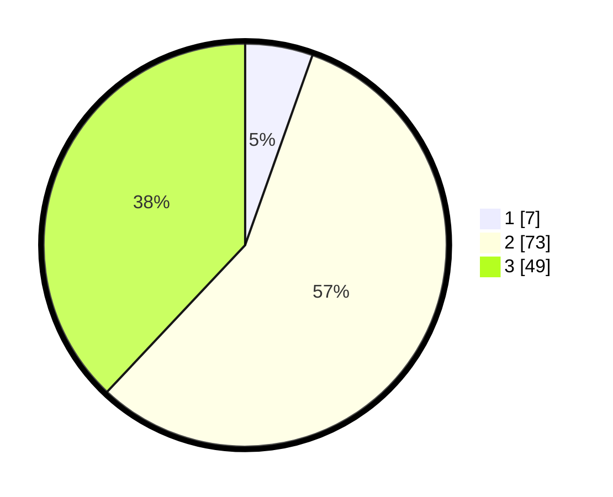

# Hasil

## Grafik

## Tabel

| No. | Nama Paslon    | Suara | Suara (raw) | Persentase |
|:--- |:-------------- | -----:| -----------:| ----------:|
| 1   | ANIES MUHAIMIN | 7     | [7][p-1]    | 5,43       |
| 2   | PRABOWO GIBRAN | 73    | [73][p-2]   | 56,59      |
| 3   | GANJAR MAHFUD  | 49    | [49][p-3]   | 37,98      |

[p-1]: https://github.com/gigit-pemilu/pemilu-2024/blob/main/pilpres/hitung-suara/sub/33-jawa-tengah/sub/28-tegal/sub/01-margasari/sub/2002-kaligayam/sub/005-tps/sub/paslon-1.txt
[p-2]: https://github.com/gigit-pemilu/pemilu-2024/blob/main/pilpres/hitung-suara/sub/33-jawa-tengah/sub/28-tegal/sub/01-margasari/sub/2002-kaligayam/sub/005-tps/sub/paslon-2.txt
[p-3]: https://github.com/gigit-pemilu/pemilu-2024/blob/main/pilpres/hitung-suara/sub/33-jawa-tengah/sub/28-tegal/sub/01-margasari/sub/2002-kaligayam/sub/005-tps/sub/paslon-3.txt

## Foto C Plano

https://sirekap-obj-formc.kpu.go.id/ec9a/pemilu/ppwp/33/28/01/20/02/3328012002005-20240217-120806--8ff8c267-53e0-4807-a785-d2d328978d1f.jpg

https://sirekap-obj-formc.kpu.go.id/ec9a/pemilu/ppwp/33/28/01/20/02/3328012002005-20240217-120943--39afd07a-f869-4a0d-80fd-921a9aca6872.jpg

https://sirekap-obj-formc.kpu.go.id/ec9a/pemilu/ppwp/33/28/01/20/02/3328012002005-20240215-010254--4288080d-c413-4807-87dc-3ad4936ec44b.jpg

## Metadata

| Key        | Value               |
| ---------- | ------------------- |
| Time Stamp | 2024-02-19 06:16:00 |

