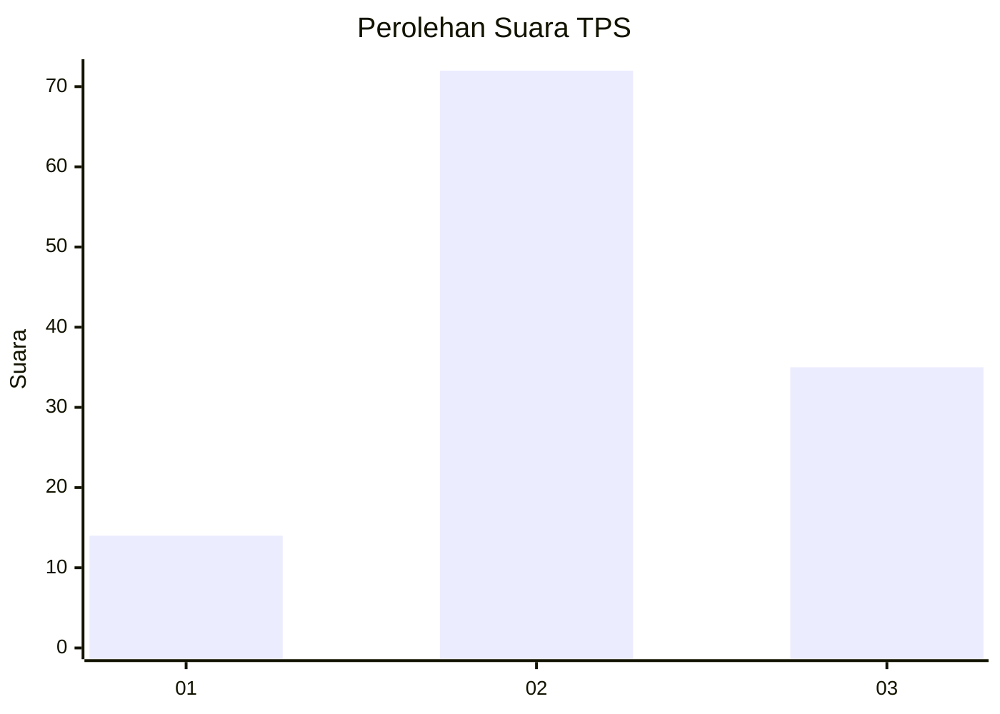
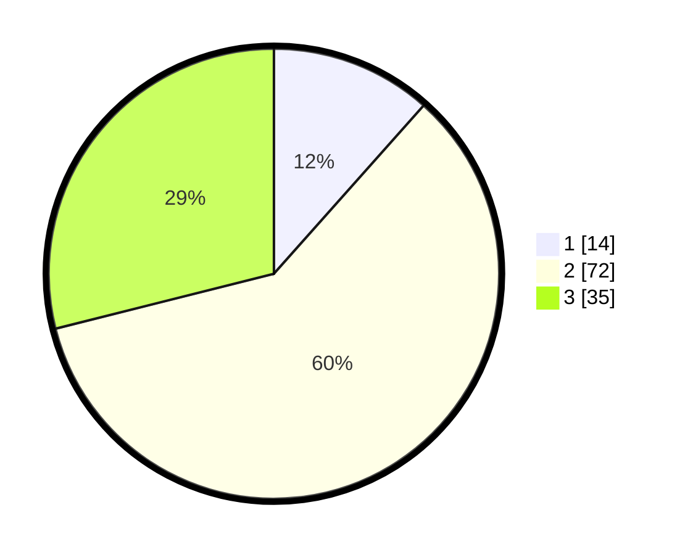

# Hasil

## Grafik

## Tabel

| No. | Nama Paslon    | Suara | Suara (raw) | Persentase |
|:--- |:-------------- | -----:| -----------:| ----------:|
| 1   | ANIES MUHAIMIN | 14    | [14][p-1]   | 11,57      |
| 2   | PRABOWO GIBRAN | 72    | [72][p-2]   | 59,50      |
| 3   | GANJAR MAHFUD  | 35    | [35][p-3]   | 28,93      |

[p-1]: https://github.com/gigit-pemilu/pemilu-2024-33-jawa-tengah/blob/main/pilpres/hitung-suara/sub/33-jawa-tengah/sub/28-tegal/sub/01-margasari/sub/2013-marga-ayu/sub/014-tps/sub/paslon-1.txt
[p-2]: https://github.com/gigit-pemilu/pemilu-2024-33-jawa-tengah/blob/main/pilpres/hitung-suara/sub/33-jawa-tengah/sub/28-tegal/sub/01-margasari/sub/2013-marga-ayu/sub/014-tps/sub/paslon-2.txt
[p-3]: https://github.com/gigit-pemilu/pemilu-2024-33-jawa-tengah/blob/main/pilpres/hitung-suara/sub/33-jawa-tengah/sub/28-tegal/sub/01-margasari/sub/2013-marga-ayu/sub/014-tps/sub/paslon-3.txt

## Foto C Plano

https://sirekap-obj-formc.kpu.go.id/ccf3/pemilu/ppwp/33/28/01/20/13/3328012013014-20240214-214958--3319b811-3421-4b39-a5c5-d8051bc954f8.jpg

https://sirekap-obj-formc.kpu.go.id/ccf3/pemilu/ppwp/33/28/01/20/13/3328012013014-20240214-230119--66c16335-3b98-42d0-ba39-7272fb00d868.jpg

https://sirekap-obj-formc.kpu.go.id/ccf3/pemilu/ppwp/33/28/01/20/13/3328012013014-20240215-003355--976cab02-1527-4ed7-816b-7328f07a89fb.jpg

## Metadata

| Key        | Value               |
| ---------- | ------------------- |
| Time Stamp | 2024-02-17 14:45:18 |

