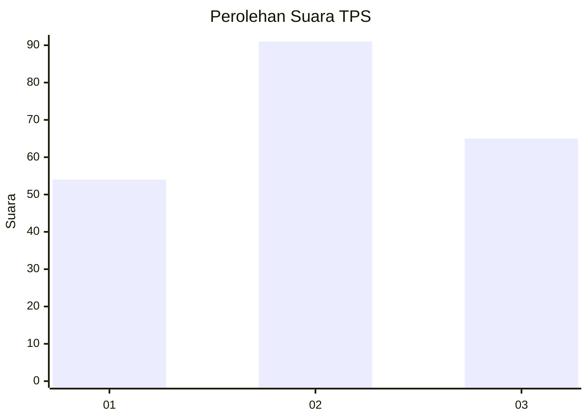
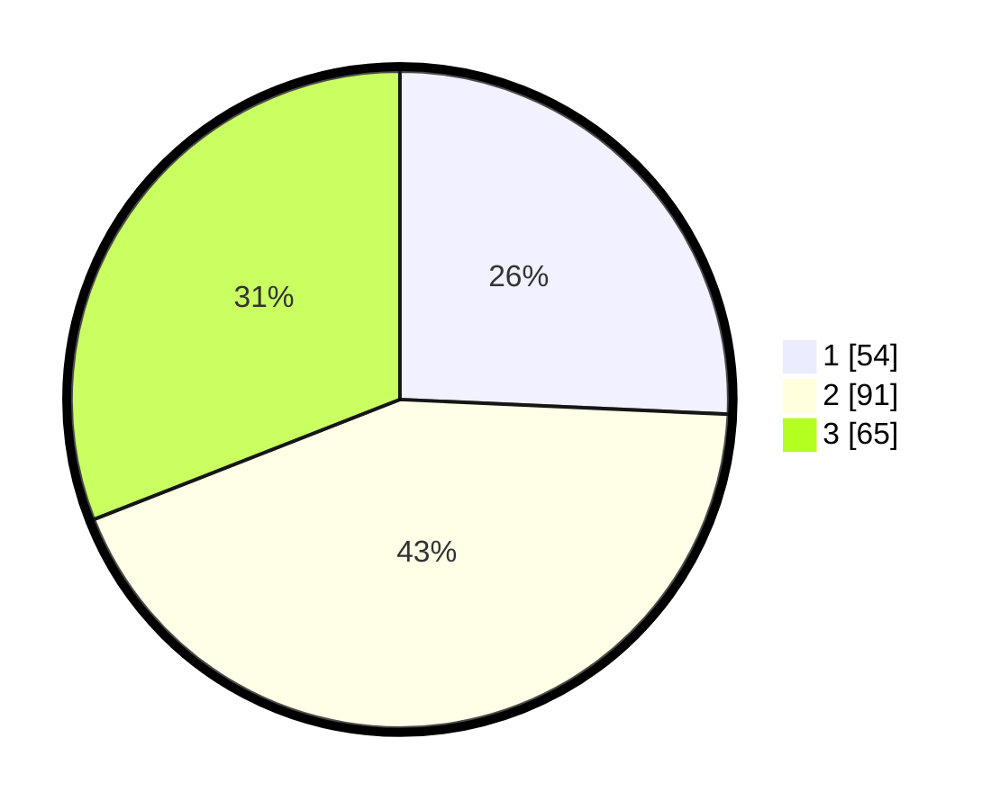

# Hasil

## Grafik

## Tabel

| No. | Nama Paslon    | Suara | Suara (raw) | Persentase |
|:--- |:-------------- | -----:| -----------:| ----------:|
| 1   | ANIES MUHAIMIN | 54    | [54][p-1]   | 25,71      |
| 2   | PRABOWO GIBRAN | 91    | [91][p-2]   | 43,33      |
| 3   | GANJAR MAHFUD  | 65    | [65][p-3]   | 30,95      |

[p-1]: https://github.com/gigit-pemilu/pemilu-2024/blob/main/pilpres/hitung-suara/sub/33-jawa-tengah/sub/28-tegal/sub/02-bumijawa/sub/2004-bumijawa/sub/004-tps/sub/paslon-1.txt
[p-2]: https://github.com/gigit-pemilu/pemilu-2024/blob/main/pilpres/hitung-suara/sub/33-jawa-tengah/sub/28-tegal/sub/02-bumijawa/sub/2004-bumijawa/sub/004-tps/sub/paslon-2.txt
[p-3]: https://github.com/gigit-pemilu/pemilu-2024/blob/main/pilpres/hitung-suara/sub/33-jawa-tengah/sub/28-tegal/sub/02-bumijawa/sub/2004-bumijawa/sub/004-tps/sub/paslon-3.txt

## Foto C Plano

https://sirekap-obj-formc.kpu.go.id/658f/pemilu/ppwp/33/28/02/20/04/3328022004004-20240218-204031--6de69991-4999-4f0d-8f8d-fe7daf76169b.jpg

https://sirekap-obj-formc.kpu.go.id/658f/pemilu/ppwp/33/28/02/20/04/3328022004004-20240218-210214--a0e937a3-b3db-4e99-96d6-bfcb9a86f28d.jpg

https://sirekap-obj-formc.kpu.go.id/658f/pemilu/ppwp/33/28/02/20/04/3328022004004-20240218-210839--e1b5836e-281c-4648-adb4-867920fd8997.jpg

## Metadata

| Key        | Value               |
| ---------- | ------------------- |
| Time Stamp | 2024-02-19 16:00:00 |

## DATA PEMILIH TETAP

Jumlah pemilih dalam DPT: **250**.
 * L: **632**.
 * P: **868**.

## DATA PENGGUNA HAK PILIH

Jumlah pengguna hak pilih dalam DPT: **206**.
 * L: **940**.
 * P: **907**.

Jumlah pengguna hak pilih dalam DPTb: **806**.
 * L: **2**.
 * P: **884**.

Jumlah pengguna hak pilih dalam DPK: **802**.
 * L: **888**.
 * P: **880**.

Jumlah pengguna hak pilih: **242**.
 * L: **444**.
 * P: **460**.

## JUMLAH SUARA SAH DAN TIDAK SAH

JUMLAH SELURUH SUARA SAH: **210**.

JUMLAH SUARA TIDAK SAH: **2**.

JUMLAH SELURUH SUARA SAH DAN SUARA TIDAK SAH: **212**.

