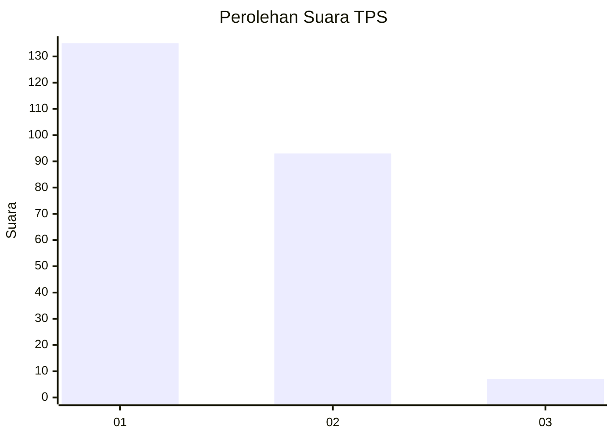
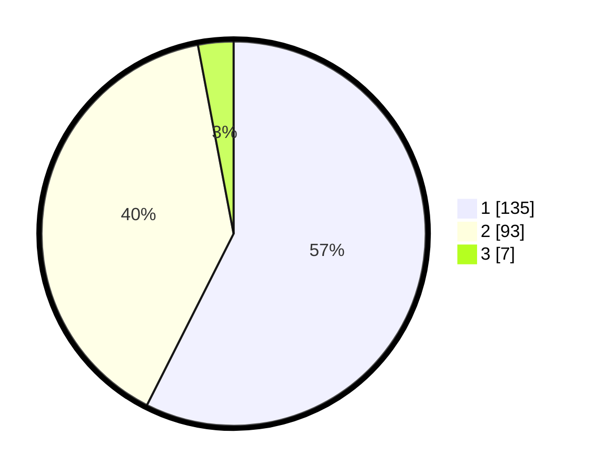

# Hasil

## Grafik

## Tabel

| No. | Nama Paslon    | Suara | Suara (raw) | Persentase |
|:--- |:-------------- | -----:| -----------:| ----------:|
| 1   | ANIES MUHAIMIN | 135   | [135][p-1]  | 57,45      |
| 2   | PRABOWO GIBRAN | 93    | [93][p-2]   | 39,57      |
| 3   | GANJAR MAHFUD  | 7     | [7][p-3]    | 2,98       |

[p-1]: https://github.com/gigit-pemilu/pemilu-2024/blob/main/pilpres/hitung-suara/sub/33-jawa-tengah/sub/28-tegal/sub/02-bumijawa/sub/2011-dukuhbenda/sub/002-tps/sub/paslon-1.txt
[p-2]: https://github.com/gigit-pemilu/pemilu-2024/blob/main/pilpres/hitung-suara/sub/33-jawa-tengah/sub/28-tegal/sub/02-bumijawa/sub/2011-dukuhbenda/sub/002-tps/sub/paslon-2.txt
[p-3]: https://github.com/gigit-pemilu/pemilu-2024/blob/main/pilpres/hitung-suara/sub/33-jawa-tengah/sub/28-tegal/sub/02-bumijawa/sub/2011-dukuhbenda/sub/002-tps/sub/paslon-3.txt

## Foto C Plano

https://sirekap-obj-formc.kpu.go.id/100f/pemilu/ppwp/33/28/02/20/11/3328022011002-20240214-212921--5088c060-57d2-4cda-ae0a-7f4867e0d1b6.jpg

https://sirekap-obj-formc.kpu.go.id/100f/pemilu/ppwp/33/28/02/20/11/3328022011002-20240222-123834--183e680a-51eb-43e4-a1f4-e050d4294493.jpg

https://sirekap-obj-formc.kpu.go.id/100f/pemilu/ppwp/33/28/02/20/11/3328022011002-20240214-213321--42594d52-78f9-4403-acbf-46561bd35e29.jpg

## Metadata

| Key        | Value               |
| ---------- | ------------------- |
| Time Stamp | 2024-02-26 11:00:00 |

