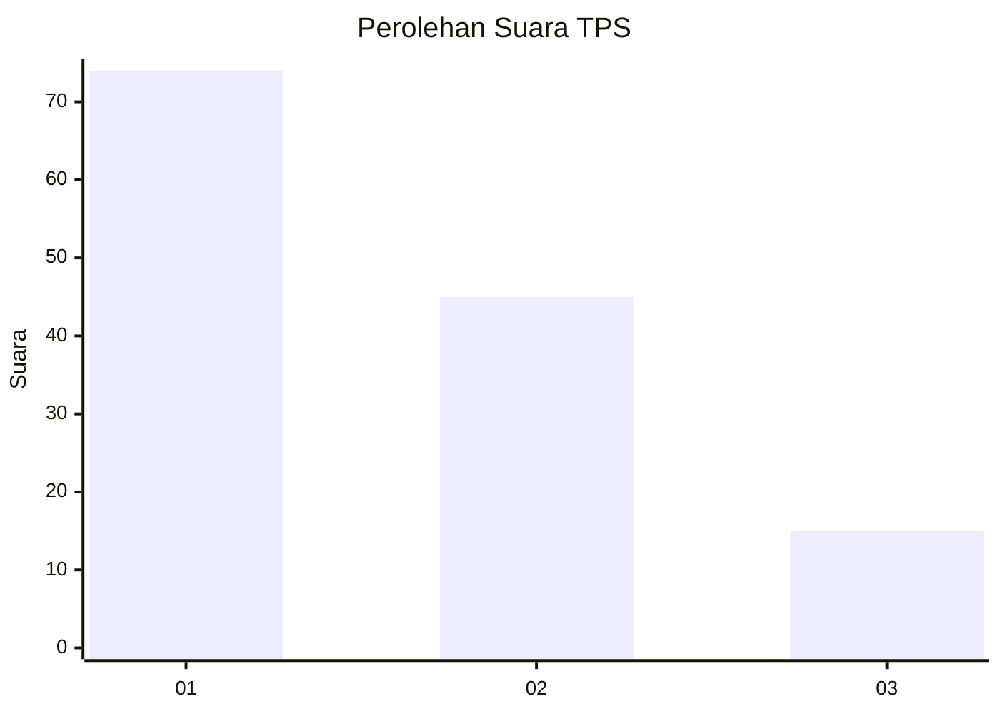
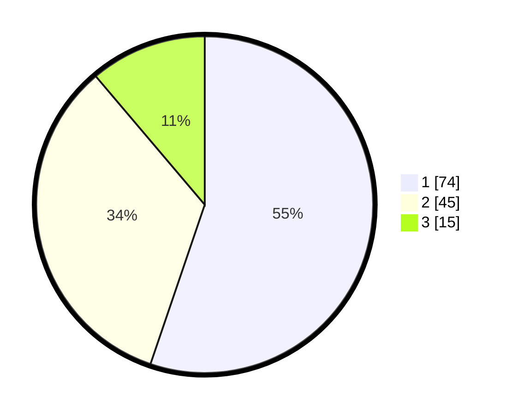

# Hasil

## Grafik

## Tabel

| No. | Nama Paslon    | Suara | Suara (raw) | Persentase |
|:--- |:-------------- | -----:| -----------:| ----------:|
| 1   | ANIES MUHAIMIN | 74    | [74][p-1]   | 55,22      |
| 2   | PRABOWO GIBRAN | 45    | [45][p-2]   | 33,58      |
| 3   | GANJAR MAHFUD  | 15    | [15][p-3]   | 11,19      |

[p-1]: https://github.com/gigit-pemilu/pemilu-2024/blob/main/pilpres/hitung-suara/sub/33-jawa-tengah/sub/28-tegal/sub/02-bumijawa/sub/2016-pagerkasih/sub/001-tps/sub/paslon-1.txt
[p-2]: https://github.com/gigit-pemilu/pemilu-2024/blob/main/pilpres/hitung-suara/sub/33-jawa-tengah/sub/28-tegal/sub/02-bumijawa/sub/2016-pagerkasih/sub/001-tps/sub/paslon-2.txt
[p-3]: https://github.com/gigit-pemilu/pemilu-2024/blob/main/pilpres/hitung-suara/sub/33-jawa-tengah/sub/28-tegal/sub/02-bumijawa/sub/2016-pagerkasih/sub/001-tps/sub/paslon-3.txt

## Foto C Plano

https://sirekap-obj-formc.kpu.go.id/bb4f/pemilu/ppwp/33/28/02/20/16/3328022016001-20240218-181053--75a40b9c-d907-4eee-8079-6adbb9fd767d.jpg

https://sirekap-obj-formc.kpu.go.id/bb4f/pemilu/ppwp/33/28/02/20/16/3328022016001-20240218-181413--b41a6849-a24f-4c40-9807-d9b850a6f03c.jpg

https://sirekap-obj-formc.kpu.go.id/bb4f/pemilu/ppwp/33/28/02/20/16/3328022016001-20240218-182230--bfacc30a-64cb-4c97-8f95-7c16be425021.jpg

## Metadata

| Key        | Value               |
| ---------- | ------------------- |
| Time Stamp | 2024-02-19 06:16:00 |

## DATA PEMILIH TETAP

Jumlah pemilih dalam DPT: **611**.
 * L: **723**.
 * P: **311**.

## DATA PENGGUNA HAK PILIH

Jumlah pengguna hak pilih dalam DPT: **781**.
 * L: **370**.
 * P: **590**.

Jumlah pengguna hak pilih dalam DPTb: **0**.
 * L: **0**.
 * P: **0**.

Jumlah pengguna hak pilih dalam DPK: **1**.
 * L: **1**.
 * P: **0**.

Jumlah pengguna hak pilih: **138**.
 * L: **60**.
 * P: **78**.

## JUMLAH SUARA SAH DAN TIDAK SAH

JUMLAH SELURUH SUARA SAH: **135**.

JUMLAH SUARA TIDAK SAH: **3**.

JUMLAH SELURUH SUARA SAH DAN SUARA TIDAK SAH: **138**.

