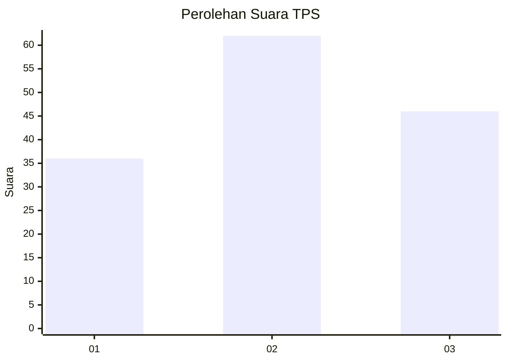
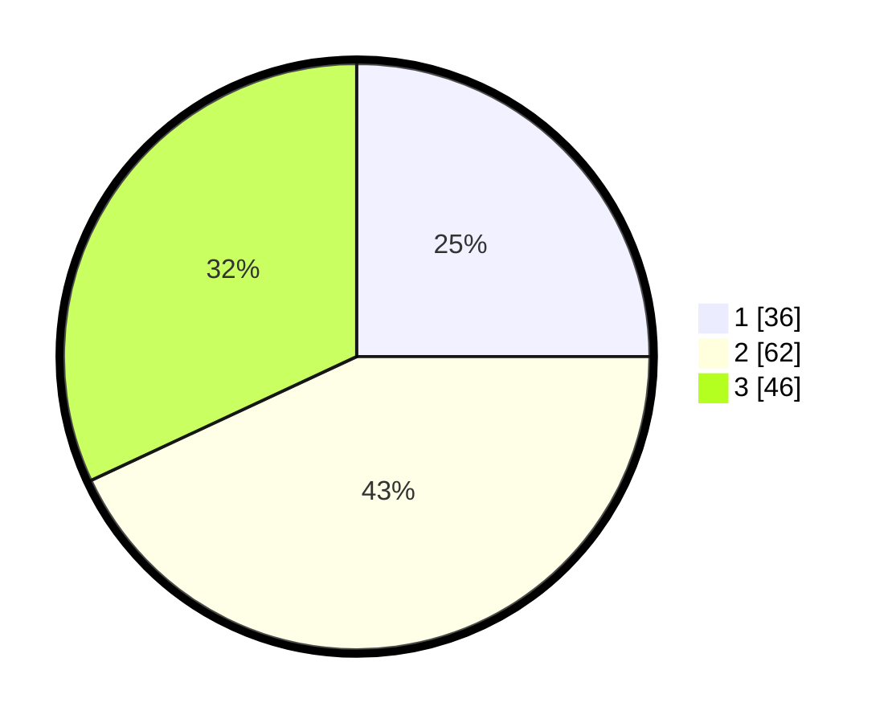

# Hasil

## Grafik

## Tabel

| No. | Nama Paslon    | Suara | Suara (raw) | Persentase |
|:--- |:-------------- | -----:| -----------:| ----------:|
| 1   | ANIES MUHAIMIN | 36    | [36][p-1]   | 25,00      |
| 2   | PRABOWO GIBRAN | 62    | [62][p-2]   | 43,06      |
| 3   | GANJAR MAHFUD  | 46    | [46][p-3]   | 31,94      |

[p-1]: https://github.com/gigit-pemilu/pemilu-2024/blob/main/pilpres/hitung-suara/sub/33-jawa-tengah/sub/28-tegal/sub/03-bojong/sub/2006-tuwel/sub/026-tps/sub/paslon-1.txt
[p-2]: https://github.com/gigit-pemilu/pemilu-2024/blob/main/pilpres/hitung-suara/sub/33-jawa-tengah/sub/28-tegal/sub/03-bojong/sub/2006-tuwel/sub/026-tps/sub/paslon-2.txt
[p-3]: https://github.com/gigit-pemilu/pemilu-2024/blob/main/pilpres/hitung-suara/sub/33-jawa-tengah/sub/28-tegal/sub/03-bojong/sub/2006-tuwel/sub/026-tps/sub/paslon-3.txt

## Foto C Plano

https://sirekap-obj-formc.kpu.go.id/4f91/pemilu/ppwp/33/28/03/20/06/3328032006026-20240214-215411--b6bf88cd-87af-48ab-806b-c0d48a78ccd3.jpg

https://sirekap-obj-formc.kpu.go.id/4f91/pemilu/ppwp/33/28/03/20/06/3328032006026-20240214-220139--b5b7c630-e7f0-4925-a6e5-bf08e5af4c86.jpg

https://sirekap-obj-formc.kpu.go.id/4f91/pemilu/ppwp/33/28/03/20/06/3328032006026-20240214-220343--9a599d08-4ffd-47dd-ae8e-51bbd5df82b1.jpg

## Metadata

| Key        | Value               |
| ---------- | ------------------- |
| Time Stamp | 2024-02-17 13:37:34 |

