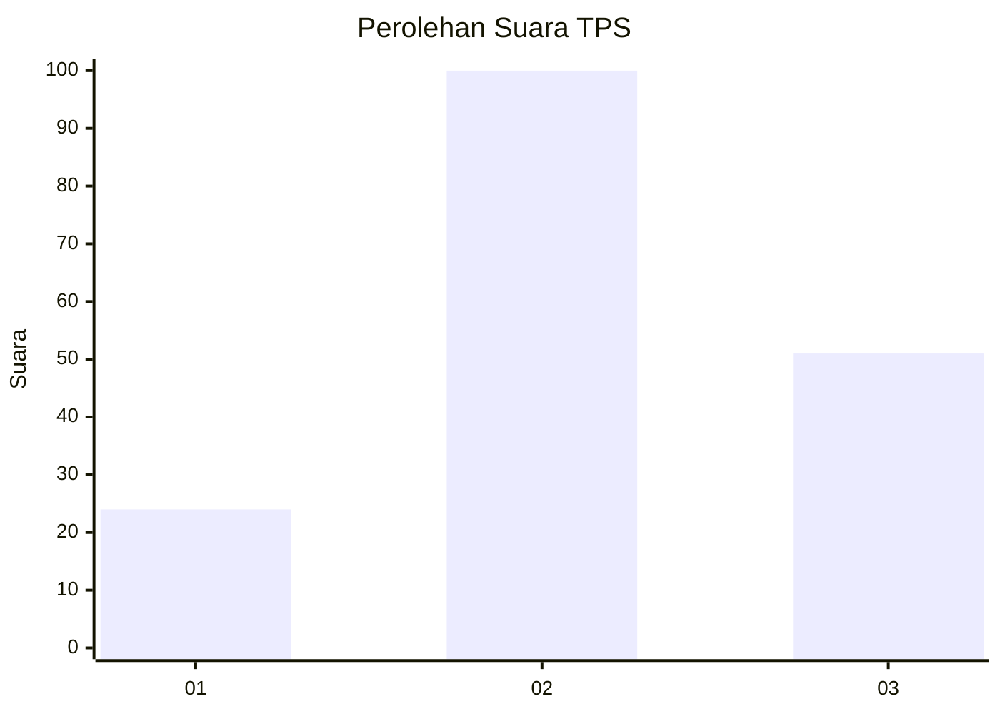
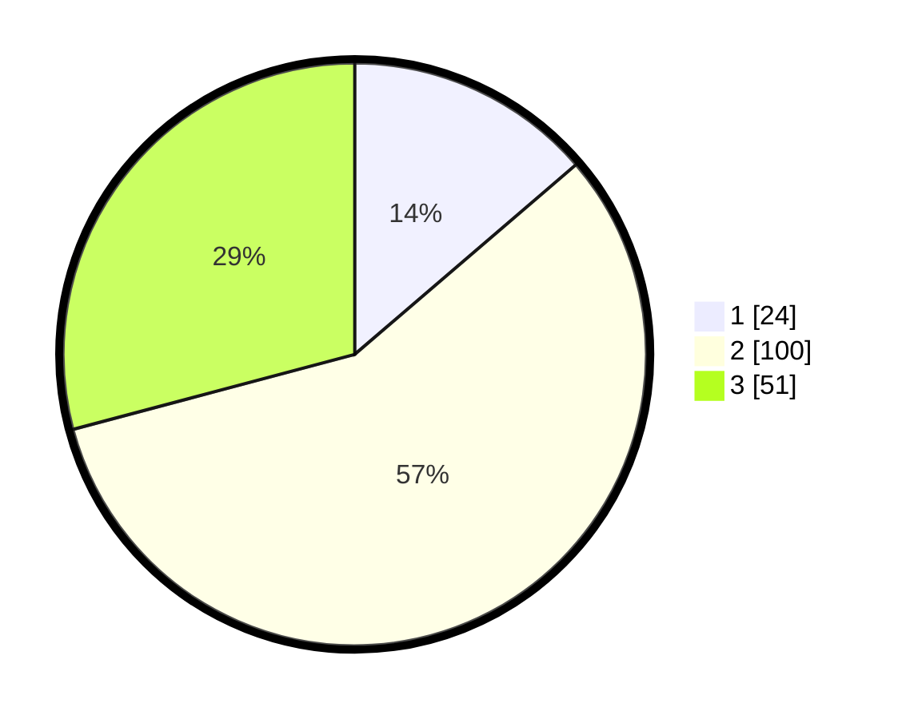

# Hasil

## Grafik

## Tabel

| No. | Nama Paslon    | Suara | Suara (raw) | Persentase |
|:--- |:-------------- | -----:| -----------:| ----------:|
| 1   | ANIES MUHAIMIN | 24    | [24][p-1]   | 13,71      |
| 2   | PRABOWO GIBRAN | 100   | [100][p-2]  | 57,14      |
| 3   | GANJAR MAHFUD  | 51    | [51][p-3]   | 29,14      |

[p-1]: https://github.com/gigit-pemilu/pemilu-2024/blob/main/pilpres/hitung-suara/sub/33-jawa-tengah/sub/28-tegal/sub/03-bojong/sub/2013-puncangluwuk/sub/001-tps/sub/paslon-1.txt
[p-2]: https://github.com/gigit-pemilu/pemilu-2024/blob/main/pilpres/hitung-suara/sub/33-jawa-tengah/sub/28-tegal/sub/03-bojong/sub/2013-puncangluwuk/sub/001-tps/sub/paslon-2.txt
[p-3]: https://github.com/gigit-pemilu/pemilu-2024/blob/main/pilpres/hitung-suara/sub/33-jawa-tengah/sub/28-tegal/sub/03-bojong/sub/2013-puncangluwuk/sub/001-tps/sub/paslon-3.txt

## Foto C Plano

https://sirekap-obj-formc.kpu.go.id/068c/pemilu/ppwp/33/28/03/20/13/3328032013001-20240215-000312--ee2cf32d-09e3-460d-80b6-ed9da64fcf92.jpg

https://sirekap-obj-formc.kpu.go.id/068c/pemilu/ppwp/33/28/03/20/13/3328032013001-20240215-000039--d3faaa49-431b-4920-84cc-a01687c35ee9.jpg

https://sirekap-obj-formc.kpu.go.id/068c/pemilu/ppwp/33/28/03/20/13/3328032013001-20240215-000245--a710a156-3c5b-4d07-af24-5849a960380c.jpg

## Metadata

| Key        | Value               |
| ---------- | ------------------- |
| Time Stamp | 2024-02-17 16:00:02 |

