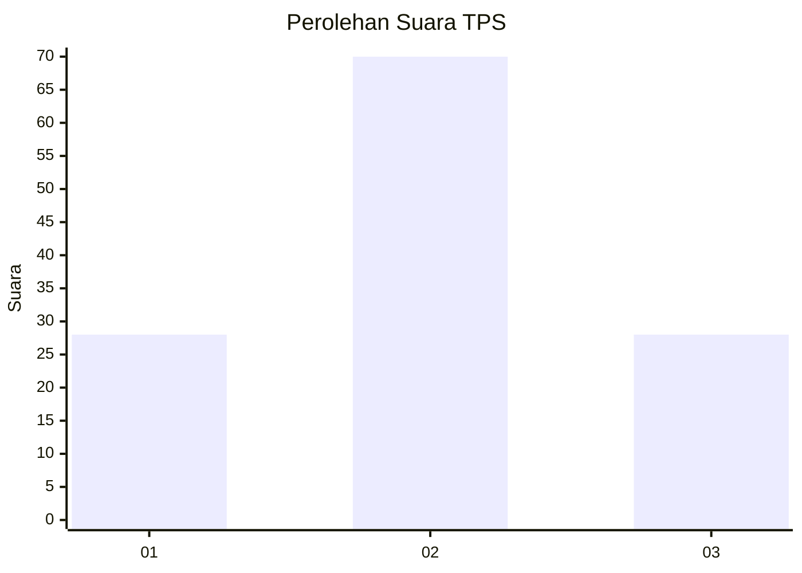
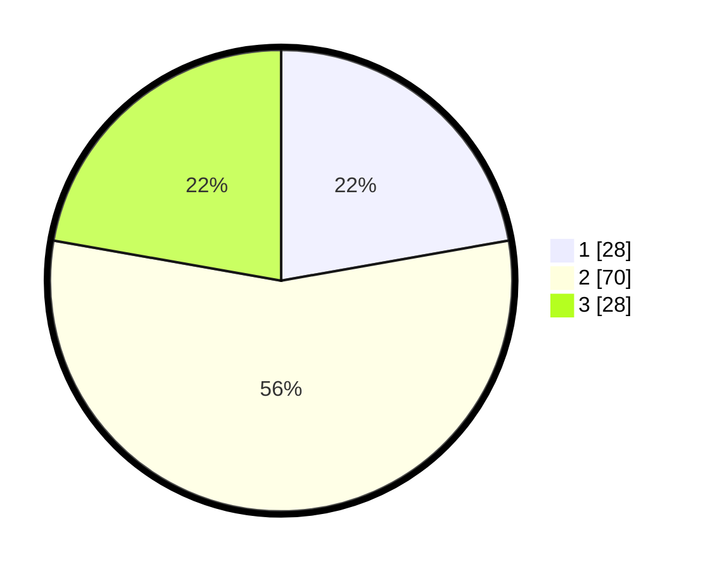

# Hasil

## Grafik

## Tabel

| No. | Nama Paslon    | Suara | Suara (raw) | Persentase |
|:--- |:-------------- | -----:| -----------:| ----------:|
| 1   | ANIES MUHAIMIN | 28    | [28][p-1]   | 22,22      |
| 2   | PRABOWO GIBRAN | 70    | [70][p-2]   | 55,56      |
| 3   | GANJAR MAHFUD  | 28    | [28][p-3]   | 22,22      |

[p-1]: https://github.com/gigit-pemilu/pemilu-2024/blob/main/pilpres/hitung-suara/sub/33-jawa-tengah/sub/28-tegal/sub/03-bojong/sub/2015-kalijambu/sub/005-tps/sub/paslon-1.txt
[p-2]: https://github.com/gigit-pemilu/pemilu-2024/blob/main/pilpres/hitung-suara/sub/33-jawa-tengah/sub/28-tegal/sub/03-bojong/sub/2015-kalijambu/sub/005-tps/sub/paslon-2.txt
[p-3]: https://github.com/gigit-pemilu/pemilu-2024/blob/main/pilpres/hitung-suara/sub/33-jawa-tengah/sub/28-tegal/sub/03-bojong/sub/2015-kalijambu/sub/005-tps/sub/paslon-3.txt

## Foto C Plano

https://sirekap-obj-formc.kpu.go.id/d153/pemilu/ppwp/33/28/03/20/15/3328032015005-20240214-221141--70013b32-52cc-49b3-bf62-acf88ecf5f6e.jpg

https://sirekap-obj-formc.kpu.go.id/d153/pemilu/ppwp/33/28/03/20/15/3328032015005-20240214-220159--28787879-ecac-43f2-9ed7-d53afa8229f2.jpg

https://sirekap-obj-formc.kpu.go.id/d153/pemilu/ppwp/33/28/03/20/15/3328032015005-20240214-220357--41ac3843-81e4-43c1-a508-bcfb5ec5e6e0.jpg

## Metadata

| Key        | Value               |
| ---------- | ------------------- |
| Time Stamp | 2024-02-17 13:37:34 |

