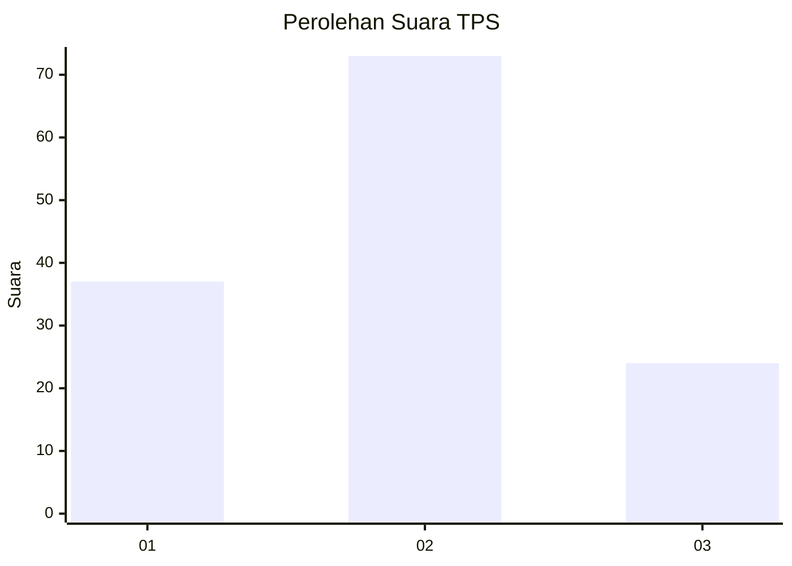
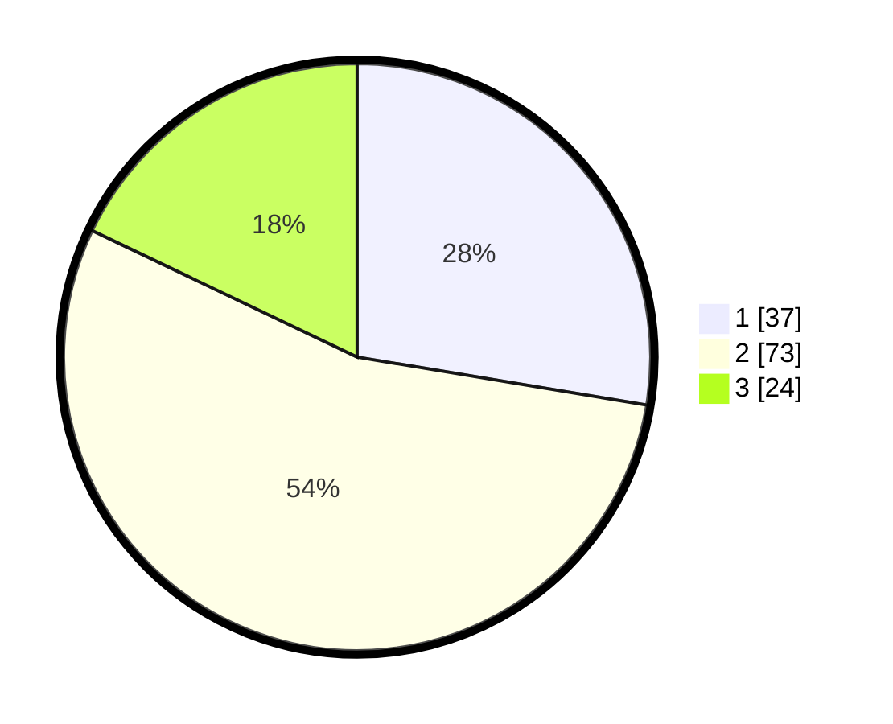

# Hasil

## Grafik

## Tabel

| No. | Nama Paslon    | Suara | Suara (raw) | Persentase |
|:--- |:-------------- | -----:| -----------:| ----------:|
| 1   | ANIES MUHAIMIN | 37    | [37][p-1]   | 27,61      |
| 2   | PRABOWO GIBRAN | 73    | [73][p-2]   | 54,48      |
| 3   | GANJAR MAHFUD  | 24    | [24][p-3]   | 17,91      |

[p-1]: https://github.com/gigit-pemilu/pemilu-2024/blob/main/pilpres/hitung-suara/sub/33-jawa-tengah/sub/28-tegal/sub/03-bojong/sub/2016-danasari/sub/010-tps/sub/paslon-1.txt
[p-2]: https://github.com/gigit-pemilu/pemilu-2024/blob/main/pilpres/hitung-suara/sub/33-jawa-tengah/sub/28-tegal/sub/03-bojong/sub/2016-danasari/sub/010-tps/sub/paslon-2.txt
[p-3]: https://github.com/gigit-pemilu/pemilu-2024/blob/main/pilpres/hitung-suara/sub/33-jawa-tengah/sub/28-tegal/sub/03-bojong/sub/2016-danasari/sub/010-tps/sub/paslon-3.txt

## Foto C Plano

https://sirekap-obj-formc.kpu.go.id/7698/pemilu/ppwp/33/28/03/20/16/3328032016010-20240214-225240--841dcb2c-6a9f-4d43-be94-f461a6b8c032.jpg

https://sirekap-obj-formc.kpu.go.id/7698/pemilu/ppwp/33/28/03/20/16/3328032016010-20240221-160054--25de2445-3023-49fe-81f2-e32c8e6250f4.jpg

https://sirekap-obj-formc.kpu.go.id/7698/pemilu/ppwp/33/28/03/20/16/3328032016010-20240214-225412--f1f54cc6-5514-4ee9-b097-9e1ef54775a3.jpg

## Metadata

| Key        | Value               |
| ---------- | ------------------- |
| Time Stamp | 2024-02-21 17:00:00 |

