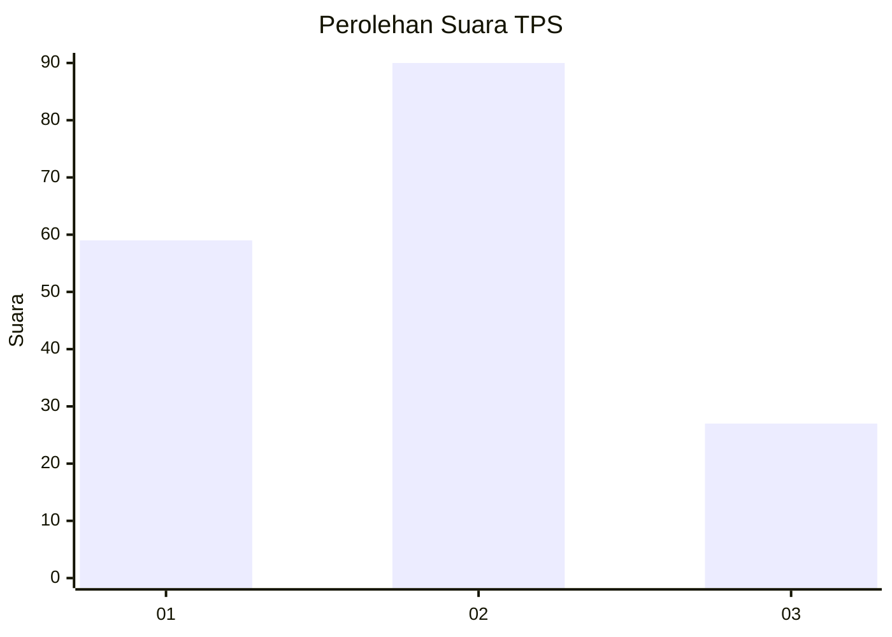
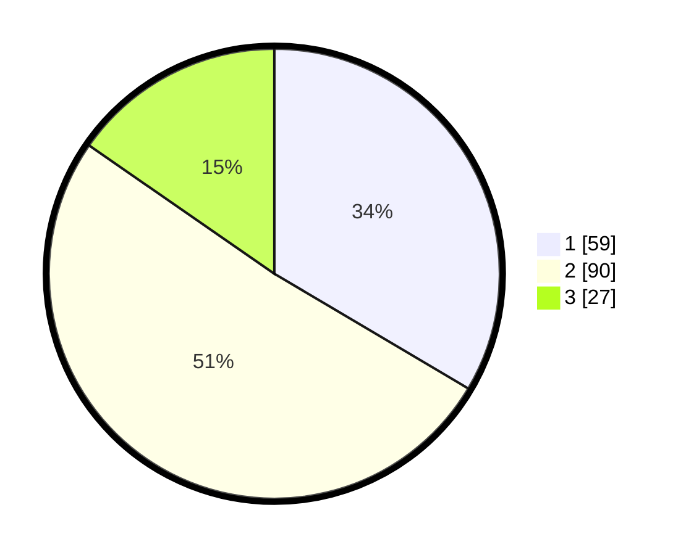

# Hasil

## Grafik

## Tabel

| No. | Nama Paslon    | Suara | Suara (raw) | Persentase |
|:--- |:-------------- | -----:| -----------:| ----------:|
| 1   | ANIES MUHAIMIN | 59    | [59][p-1]   | 33,52      |
| 2   | PRABOWO GIBRAN | 90    | [90][p-2]   | 51,14      |
| 3   | GANJAR MAHFUD  | 27    | [27][p-3]   | 15,34      |

[p-1]: https://github.com/gigit-pemilu/pemilu-2024/blob/main/pilpres/hitung-suara/sub/33-jawa-tengah/sub/28-tegal/sub/04-balapulang/sub/2001-cenggini/sub/005-tps/sub/paslon-1.txt
[p-2]: https://github.com/gigit-pemilu/pemilu-2024/blob/main/pilpres/hitung-suara/sub/33-jawa-tengah/sub/28-tegal/sub/04-balapulang/sub/2001-cenggini/sub/005-tps/sub/paslon-2.txt
[p-3]: https://github.com/gigit-pemilu/pemilu-2024/blob/main/pilpres/hitung-suara/sub/33-jawa-tengah/sub/28-tegal/sub/04-balapulang/sub/2001-cenggini/sub/005-tps/sub/paslon-3.txt

## Foto C Plano

https://sirekap-obj-formc.kpu.go.id/d14c/pemilu/ppwp/33/28/04/20/01/3328042001005-20240224-122141--2405f2f3-228a-473c-b698-152d549a5bda.jpg

https://sirekap-obj-formc.kpu.go.id/d14c/pemilu/ppwp/33/28/04/20/01/3328042001005-20240224-122231--e2d40e31-a18b-4e63-88be-332c4987e8ca.jpg

https://sirekap-obj-formc.kpu.go.id/d14c/pemilu/ppwp/33/28/04/20/01/3328042001005-20240224-122305--1fe5b3ec-b4eb-4c14-bcf3-ed5729df0d79.jpg

## Metadata

| Key        | Value               |
| ---------- | ------------------- |
| Time Stamp | 2024-02-24 22:31:28 |

## DATA PEMILIH TETAP

Jumlah pemilih dalam DPT: **269**.
 * L: **440**.
 * P: **129**.

## DATA PENGGUNA HAK PILIH

Jumlah pengguna hak pilih dalam DPT: **786**.
 * L: **86**.
 * P: **402**.

Jumlah pengguna hak pilih dalam DPTb: **6**.
 * L: **0**.
 * P: **4**.

Jumlah pengguna hak pilih dalam DPK: **5**.
 * L: **2**.
 * P: **3**.

Jumlah pengguna hak pilih: **192**.
 * L: **88**.
 * P: **404**.

## JUMLAH SUARA SAH DAN TIDAK SAH

JUMLAH SELURUH SUARA SAH: **176**.

JUMLAH SUARA TIDAK SAH: **816**.

JUMLAH SELURUH SUARA SAH DAN SUARA TIDAK SAH: **192**.

