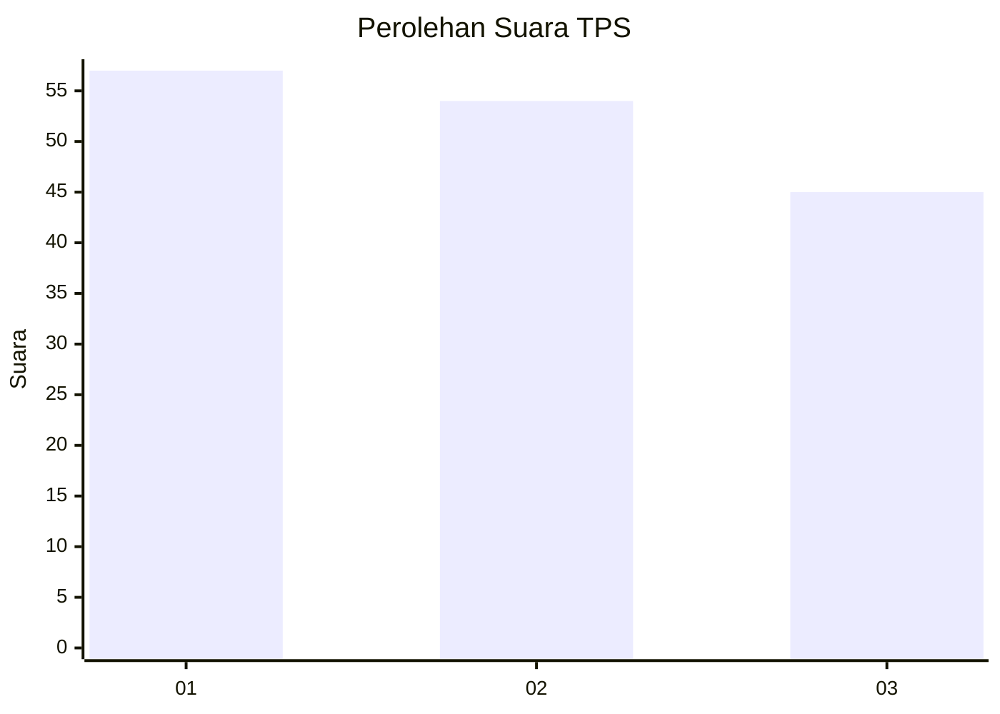
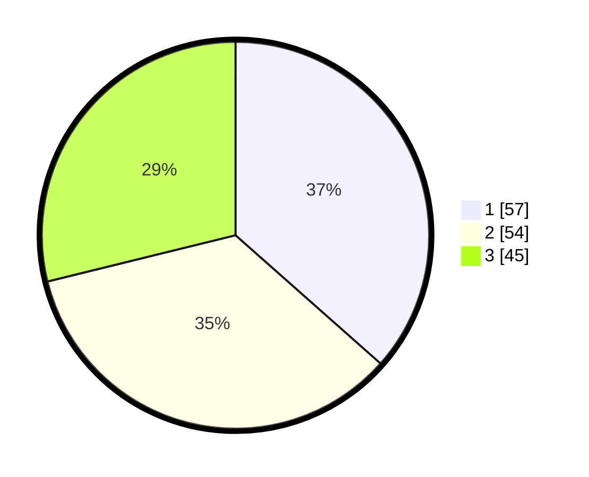

# Hasil

## Grafik

## Tabel

| No. | Nama Paslon    | Suara | Suara (raw) | Persentase |
|:--- |:-------------- | -----:| -----------:| ----------:|
| 1   | ANIES MUHAIMIN | 57    | [57][p-1]   | 36,54      |
| 2   | PRABOWO GIBRAN | 54    | [54][p-2]   | 34,62      |
| 3   | GANJAR MAHFUD  | 45    | [45][p-3]   | 28,85      |

[p-1]: https://github.com/gigit-pemilu/pemilu-2024/blob/main/pilpres/hitung-suara/sub/33-jawa-tengah/sub/28-tegal/sub/04-balapulang/sub/2001-cenggini/sub/012-tps/sub/paslon-1.txt
[p-2]: https://github.com/gigit-pemilu/pemilu-2024/blob/main/pilpres/hitung-suara/sub/33-jawa-tengah/sub/28-tegal/sub/04-balapulang/sub/2001-cenggini/sub/012-tps/sub/paslon-2.txt
[p-3]: https://github.com/gigit-pemilu/pemilu-2024/blob/main/pilpres/hitung-suara/sub/33-jawa-tengah/sub/28-tegal/sub/04-balapulang/sub/2001-cenggini/sub/012-tps/sub/paslon-3.txt

## Foto C Plano

https://sirekap-obj-formc.kpu.go.id/e864/pemilu/ppwp/33/28/04/20/01/3328042001012-20240223-172209--01427255-21e1-446d-a036-fcd5eaead034.jpg

https://sirekap-obj-formc.kpu.go.id/e864/pemilu/ppwp/33/28/04/20/01/3328042001012-20240223-173502--c039de0c-2223-4392-a7c7-181f30341155.jpg

https://sirekap-obj-formc.kpu.go.id/e864/pemilu/ppwp/33/28/04/20/01/3328042001012-20240223-172632--59fe818b-7903-4cc2-bc7c-65e642bc8341.jpg

## Metadata

| Key        | Value               |
| ---------- | ------------------- |
| Time Stamp | 2024-02-24 22:31:28 |

## DATA PEMILIH TETAP

Jumlah pemilih dalam DPT: **295**.
 * L: **255**.
 * P: **144**.

## DATA PENGGUNA HAK PILIH

Jumlah pengguna hak pilih dalam DPT: **570**.
 * L: **62**.
 * P: **103**.

Jumlah pengguna hak pilih dalam DPTb: **887**.
 * L: **888**.
 * P: **887**.

Jumlah pengguna hak pilih dalam DPK: **0**.
 * L: **8**.
 * P: **88**.

Jumlah pengguna hak pilih: **20**.
 * L: **862**.
 * P: **204**.

## JUMLAH SUARA SAH DAN TIDAK SAH

JUMLAH SELURUH SUARA SAH: **156**.

JUMLAH SUARA TIDAK SAH: **15**.

JUMLAH SELURUH SUARA SAH DAN SUARA TIDAK SAH: **471**.

