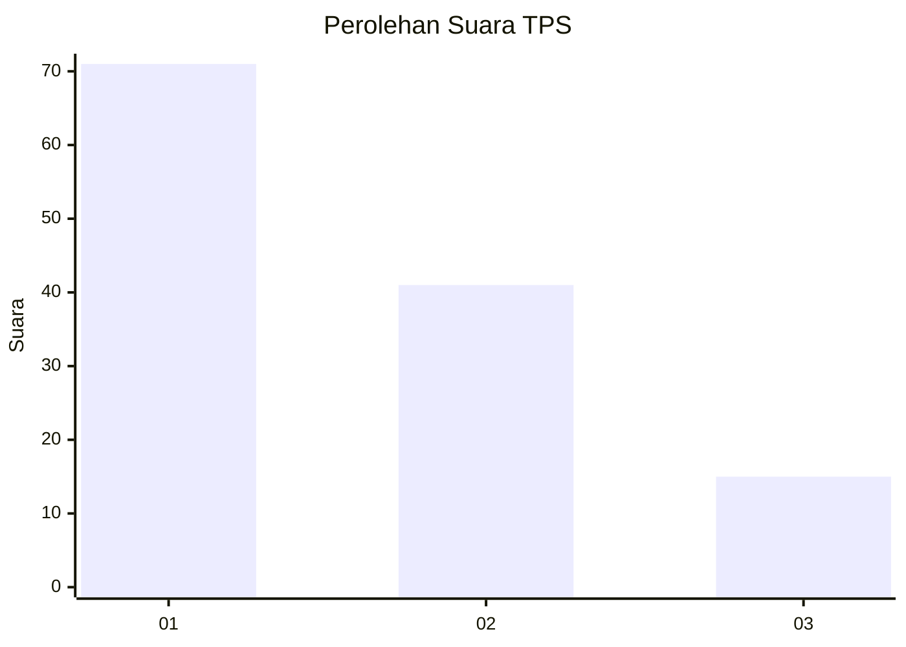
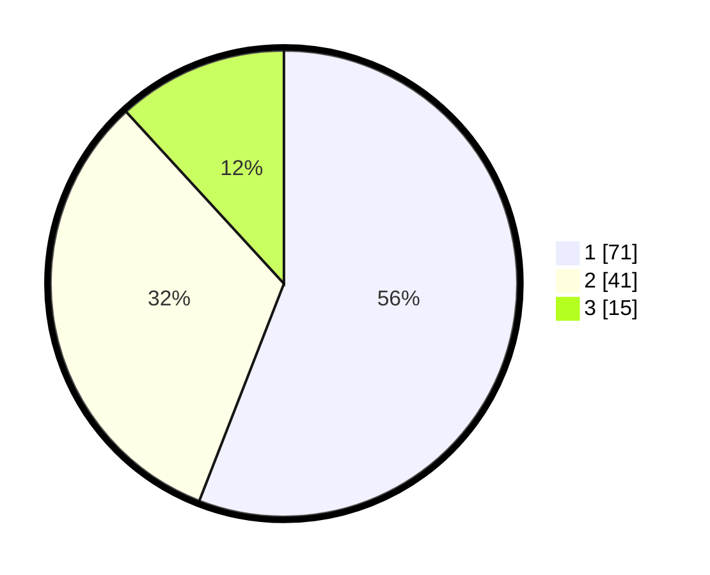

# Hasil

## Grafik

## Tabel

| No. | Nama Paslon    | Suara | Suara (raw) | Persentase |
|:--- |:-------------- | -----:| -----------:| ----------:|
| 1   | ANIES MUHAIMIN | 71    | [71][p-1]   | 55,91      |
| 2   | PRABOWO GIBRAN | 41    | [41][p-2]   | 32,28      |
| 3   | GANJAR MAHFUD  | 15    | [15][p-3]   | 11,81      |

[p-1]: https://github.com/gigit-pemilu/pemilu-2024/blob/main/pilpres/hitung-suara/sub/33-jawa-tengah/sub/28-tegal/sub/04-balapulang/sub/2007-danareja/sub/006-tps/sub/paslon-1.txt
[p-2]: https://github.com/gigit-pemilu/pemilu-2024/blob/main/pilpres/hitung-suara/sub/33-jawa-tengah/sub/28-tegal/sub/04-balapulang/sub/2007-danareja/sub/006-tps/sub/paslon-2.txt
[p-3]: https://github.com/gigit-pemilu/pemilu-2024/blob/main/pilpres/hitung-suara/sub/33-jawa-tengah/sub/28-tegal/sub/04-balapulang/sub/2007-danareja/sub/006-tps/sub/paslon-3.txt

## Foto C Plano

https://sirekap-obj-formc.kpu.go.id/1327/pemilu/ppwp/33/28/04/20/07/3328042007006-20240214-225213--5a072de4-159c-4bd1-8926-54b68ed0f759.jpg

https://sirekap-obj-formc.kpu.go.id/1327/pemilu/ppwp/33/28/04/20/07/3328042007006-20240214-204734--c19a0966-2bb7-4448-b146-632a3f2c90d7.jpg

https://sirekap-obj-formc.kpu.go.id/1327/pemilu/ppwp/33/28/04/20/07/3328042007006-20240214-204928--1547fbe4-c5b9-46ee-a1e2-d21998dae32a.jpg

## Metadata

| Key        | Value               |
| ---------- | ------------------- |
| Time Stamp | 2024-02-15 12:00:28 |

