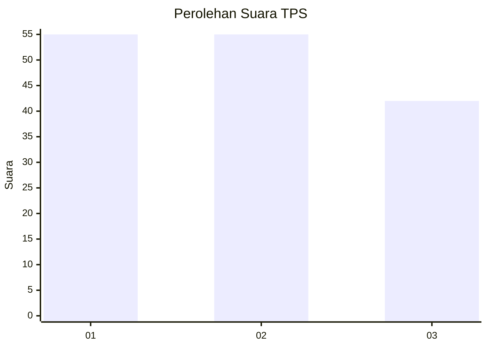
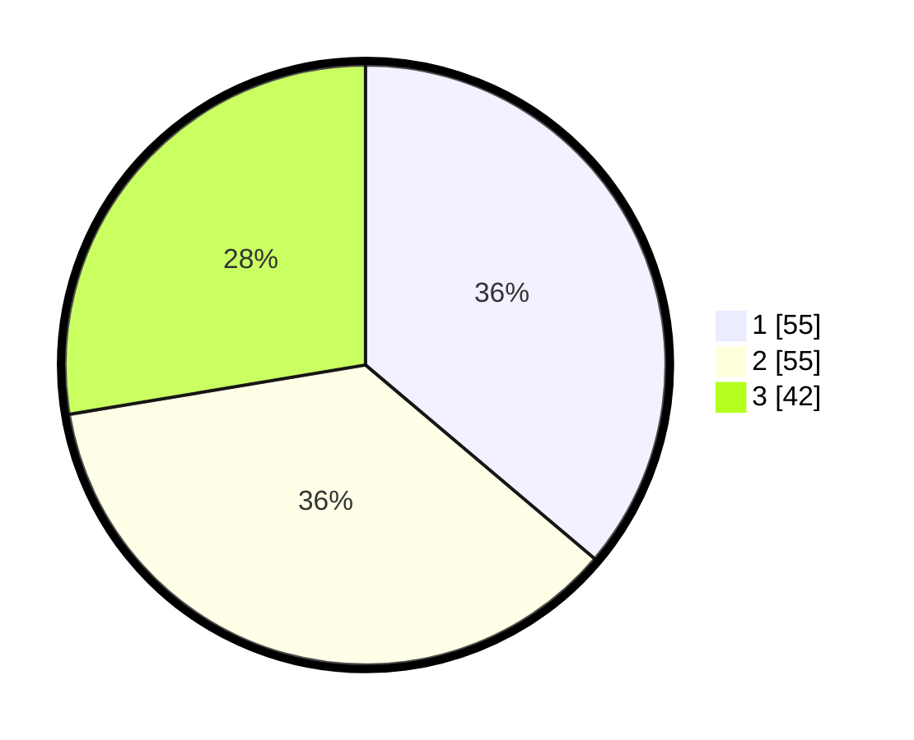

# Hasil

## Grafik

## Tabel

| No. | Nama Paslon    | Suara | Suara (raw) | Persentase |
|:--- |:-------------- | -----:| -----------:| ----------:|
| 1   | ANIES MUHAIMIN | 55    | [55][p-1]   | 36,18      |
| 2   | PRABOWO GIBRAN | 55    | [55][p-2]   | 36,18      |
| 3   | GANJAR MAHFUD  | 42    | [42][p-3]   | 27,63      |

[p-1]: https://github.com/gigit-pemilu/pemilu-2024-33-jawa-tengah/blob/main/pilpres/hitung-suara/sub/33-jawa-tengah/sub/28-tegal/sub/04-balapulang/sub/2018-balapulang-wetan/sub/001-tps/sub/paslon-1.txt
[p-2]: https://github.com/gigit-pemilu/pemilu-2024-33-jawa-tengah/blob/main/pilpres/hitung-suara/sub/33-jawa-tengah/sub/28-tegal/sub/04-balapulang/sub/2018-balapulang-wetan/sub/001-tps/sub/paslon-2.txt
[p-3]: https://github.com/gigit-pemilu/pemilu-2024-33-jawa-tengah/blob/main/pilpres/hitung-suara/sub/33-jawa-tengah/sub/28-tegal/sub/04-balapulang/sub/2018-balapulang-wetan/sub/001-tps/sub/paslon-3.txt

## Foto C Plano

https://sirekap-obj-formc.kpu.go.id/d115/pemilu/ppwp/33/28/04/20/18/3328042018001-20240223-202900--3702e2b3-2439-44f0-a005-cb2016b01256.jpg

https://sirekap-obj-formc.kpu.go.id/d115/pemilu/ppwp/33/28/04/20/18/3328042018001-20240223-203257--778e2ab2-477f-4e36-a650-30d43d58643d.jpg

https://sirekap-obj-formc.kpu.go.id/d115/pemilu/ppwp/33/28/04/20/18/3328042018001-20240223-203443--c9c4f9ef-a2e3-45b1-b02f-1949b01ec3b5.jpg

## Metadata

| Key        | Value               |
| ---------- | ------------------- |
| Time Stamp | 2024-02-24 22:31:28 |

## DATA PEMILIH TETAP

Jumlah pemilih dalam DPT: **0**.
 * L: **0**.
 * P: **0**.

## DATA PENGGUNA HAK PILIH

Jumlah pengguna hak pilih dalam DPT: **555**.
 * L: **555**.
 * P: **705**.

Jumlah pengguna hak pilih dalam DPTb: **200**.
 * L: **2**.
 * P: **222**.

Jumlah pengguna hak pilih dalam DPK: **86**.
 * L: **3**.
 * P: **3**.

Jumlah pengguna hak pilih: **272**.
 * L: **93**.
 * P: **122**.

## JUMLAH SUARA SAH DAN TIDAK SAH

JUMLAH SELURUH SUARA SAH: **212**.

JUMLAH SUARA TIDAK SAH: **0**.

JUMLAH SELURUH SUARA SAH DAN SUARA TIDAK SAH: **212**.

